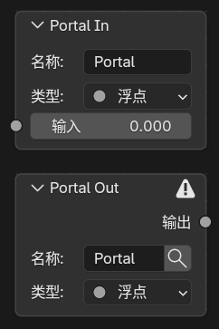
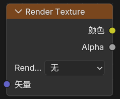
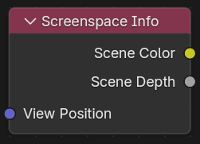
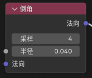
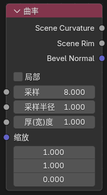
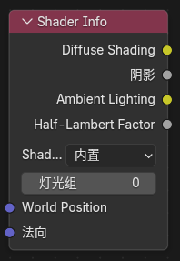

# 主要扩展节点

## 概述

Blender 5.1 NPR Port 添加了大量新的着色器节点，分为三大类：

1. **Eevee 通用辅助节点** - 提供渲染信息和工具节点
2. **Eevee 物体材质节点** - 用于物体着色的专用节点
3. **Filter 域节点** - 用于全屏滤镜的节点

## Eevee 通用辅助节点

### Render Info

#### 入口

`Add > Input > Render Info`

#### 输出

- `Frag Coord`：屏幕空间坐标（xy归一化到0-1，z为深度）

- `Width`：渲染区域宽度（像素值）

- `Height`：渲染区域高度（像素值）

#### 作用

提供当前 Eevee 渲染窗口的坐标和像素尺寸。

---

### Scene Time

#### 入口

`Add > Input > Scene Time`

#### 输入

- `Scale`：用于缩放帧数的数值

#### 输出

- `Frame`：当前帧数

- `Seconds`：当前帧对应的秒数

- `Timeline`：0-1映射的场景时间（从开始帧到结束帧）

- `Scaled Frame`：当前帧除以 Scale 后的结果

#### 作用

提供当前场景时间相关的数值输出，用于时间控制和动画同步。

---

### Screen Derivative

#### 入口

`Add > Utilities > Math > Screen Derivative`

#### 功能

获得屏幕之间相邻像素之间的差异：

- `DDX`：X方向的屏幕空间导数

- `DDY`：Y方向的屏幕空间导数

- `DDXY`：DDX和DDY的组合（DDX + DDY）

!!! tip "用途"
    屏幕导数信息通常用于流纹理、各向异性计算和屏幕空间效果。

---

### Portal In / Portal Out

#### 入口

- `Add > Layout > Portal In`
- `Add > Layout > Portal Out`

#### 功能说明

这是一组用来整理节点连线的"传送门"节点。

#### 工作方式

- `Portal In`：在当前节点树里存一个有名字、有类型的值

- `Portal Out`：在同一节点树内按名字把这个值取出来继续使用

#### 其他特性

- 新建 `Portal In` 时会自动生成唯一名称

- `Portal Out` 上带有放大镜按钮，可快速跳转到对应的 `Portal In` 位置

#### 限制

- 只在同一个 shader node tree 内识别

- 不支持跨节点树

- 不支持跨节点组自动穿透

- 同名输入应只保留一个来源

!!! example "使用场景"
    Portal 节点适合在复杂节点树中整理连线，避免长距离、复杂的连接关系。

---

## Eevee 物体材质节点

### Render Texture

#### 入口

`Add > Texture > Render Texture`

#### 作用

读取前面在场景里配置好的 `Render Textures` 条目。

#### 输入输出

- 输入：`Vector`（UV坐标或采样位置）

- 输出：`Color`（纹理颜色）、`Alpha`（透明度值）

---

### Screenspace Info

#### 入口

`Add > Input > Screenspace Info`

#### 输入输出

- 输入：`View Position`（摄像机空间位置）

- 输出：`Scene Color`（场景观看颜色）、`Scene Depth`（场景深度值）

#### 作用

获得当前的渲染缓冲颜色或深度的内容

#### 使用说明

- 渲染设置中需要打开`Raytracing`

- 材质选项`Render Method`选择`Dithered`

- 材质选项打开`Raytraced Transmission`

- `View Position`默认输入为:`position`变换到摄像机空间,再反转z轴

!!! warning "性能提示"
    Screenspace Info 依赖光线追踪，会对性能有影响。

---

### World Environment

#### 入口

`Add > Input > World Environment`

#### 输入输出

- 输入：`Direction`（采样方向）

- 输出：`Color`（环境颜色）

#### 作用

直接采样 `Eevee` 的世界环境颜色，不依赖屏幕背后是否还有几何。

#### 说明

- 读取世界环境光照探头颜色，可在世界环境中调整分辨率

- `Direction` 不连接时，默认使用当前表面的视线方向

- `Direction` 连接后，可以按指定方向采样世界环境

---

### World To Tangent

#### 入口

`Add > Utilities > Vector > World To Tangent`

#### 输入输出

- 输入：`Vector`（世界空间方向）

- 输出：`Vector`（切线空间方向）

#### 作用

把一个世界空间方向向量转换到当前表面的切线空间。

#### 说明

- 主要用于把世界空间方向改写成以 `Tangent / Bitangent / Normal` 为基底的局部方向

- 节点面板中可指定 `UV Map`，该 UV 的切线会作为转换基底

---

### Bevel

#### 入口

`Add > Input > Bevel`

#### 输入输出

- 输入：`Radius`（倒角半径）、`Normal`（表面法线提示）

- 输出：`Normal`（倒角后的近似法线）

#### 面板选项

- `Samples`（采样次数越高质量越好，性能消耗越大）

#### 作用

在 `Eevee` 中生成近似的倒角法线，用来让硬边看起来更圆润。

#### 说明

- `Cycles` 仍然使用官方原本的真实几何倒角算法

- `Eevee` 这里使用的是同物体屏幕空间近似

- 结果依赖当前视角、深度缓冲和可见邻域，不等同于 `Cycles` 的真实 `Bevel`

---

### Curvature

#### 入口

`Add > Input > Curvature`

#### 输入

- `Samples`：采样点数

- `Sample Radius`：采样半径：控制更新方位的大小

- `Thickness`：取值和取值上下限之间的凹面上限

- `Scale`：曲率值的缩放比例

#### 输出

- `Scene Curvature`：根据屏幕空间提取的曲率值

- `Scene Rim`：边缘光（rim light）效果

#### 面板选项

- `Local`: 忽略其他物体深度

#### 作用

移植的Goo Engine中的曲率节点，提供曲率和边缘光输出

---

### Shader Info

#### 入口

`Add > Input > Shader Info`

#### 输入

- `World Position`：世界空间位置（黑财默使用当前炫置）

- `Normal`：表面法线（黑财默使用云性法线）

#### 输出

- `Diffuse Shading`：兰伯特光照

- `Shadow`：遮蔽阴影

- `Ambient Lighting`：环境间接光（来自世界环境+光照探针）

- `Half-Lambert Factor`：半兰伯特光照

#### 阴影模式说明

- `Built-in` 默认模式，使用 Eevee 原本的阴影计算

- `Soft Filtered` 把黑白抖动阴影变成更平滑的灰度半影

- `Lightgroup` 支持灯光组过滤

---

### Light Info

#### 入口

`Add > Input > Light Info`

#### 功能说明

读取指定灯光信息

#### 固定输出

- `Color`：灯光颜色

- `Power`：灯光强度

- `Type`：灯光类型

  - `-1`：没有指定灯光
  - `0`：Point（点光源）
  - `1`：Sun（平行光）
  - `2`：Spot（聚光灯）
  - `3`：Area（面光源）

#### 按灯光类型自动出现的输出

- `Position`：灯光世界位置（点光源、聚光灯、面光源）

- `Direction`：灯光方向（平行光、聚光灯、面光源）

- `Radius`：灯光半径（点光源、聚光灯、面光源）

- `Spot Size`：灯光尺寸（聚光灯）

- `Sun Angle`：太阳角度（平行光）

#### 说明

- 如果你要做逐灯处理，应该使用 `NPR Tree` 里的 `For Each Light`。

---

### Scene Color

#### 入口

`Add > Input > Scene Color`

仅在 `Filter` 域下可用。

#### 作用

读取 Eevee 当前场景缓冲，可在节点面板中切换 `Source`：

- `Color`：读取渲染的最终场景颜色

- `Depth`：读取线性深度值

- `Normal`：读取渲染法线

- `Shadow`：读取阴影遮罩（0-1灰度）

- `Position`：读取世界空间坐标

#### 输入输出

- 输入：`Vector`

- 输出：`Color`、`Alpha`

#### 说明

- `Shadow` 输出可直接用于 Toon 分层、阈值处理和过滤效果

- `Position` 可用于屏幕空间计算和深度相关的特效

- 本节点仅在 `Filter` 域材质中可用，通常在滤镜处理中读取场景缓冲数据
