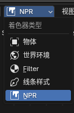
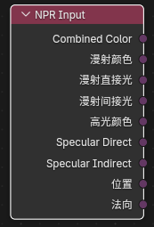
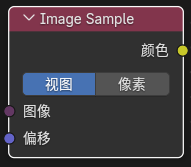
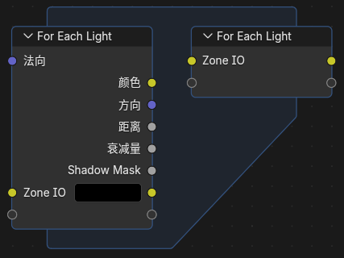

# NPR Tree 工作流

## 基本概念

`NPR Tree` 是挂在普通物体材质之后进行颜色后处理的节点树，能够以颜色的形式对着色器的输出进行风格化处理。

这是Blender 5.1 NPR Port的核心工作流，允许在基础着色完成后进行NPR特效处理。

## 挂接方式

1. 在普通物体材质中保留正常的 `Material Output` 和基础表面着色。

2. 选中 `Material Output` 节点。

3. 在它的 `NPR Tree` 属性里新建或指定一个节点组。

4. 需要编辑这棵树时，在 Shader Editor 顶部把 `Shader Type` 切到 `NPR`。

## 重要说明

- 材质的渲染方式需要设置为 `抖动(延迟渲染)` 模式

- 可以使用 `Ctrl + Tab` 在物体材质和NPR之间快速切换

!!! warning "必需配置"
    必须将材质的 Render Method 设为 Dithered（抖动），才能使用 NPR Tree 功能。

## NPR Input 节点

### 作用

读取 NPR 渲染阶段提供的输入缓冲。

### 输出说明

- `Combined Color`：合成之后的最终颜色

- `Diffuse Color`：漫射颜色

- `Diffuse Direct`：漫射直接光（来自灯光）

- `Diffuse Indirect`：漫射间接光（光线追踪，探针）

- `Specular Color`：高光颜色

- `Specular Direct`：高光直接反射

- `Specular Indirect`：间接反射光

- `Position`：世界空间位置

- `Normal`：着色法线

### 使用建议

这些输出本质上更接近图像句柄/纹理句柄，适合：

- 继续交给 `Image Sample` 做邻域采样
- 接到其他支持这类输入的 NPR 节点上继续处理

---

## NPR Refraction 节点

### 作用

读取折射相关缓冲，类似于 `Screenspace Info`

### 输出说明

- `Combined Color`：折射事件的最终颜色

- `Position`：折射位置的世界坐标

### 使用方法

参考 `Screenspace Info` 节点的使用说明。

---

## Image Sample 节点

### 入口

`Add > Utilities > Image Sample`

### 输入输出

- 输入：`Image`（图像句柄）、`Offset`（采样偏移）

- 输出：`Color`（采样结果颜色）

### 作用

对 `NPR Input` / `NPR Refraction` 之类输出的图像句柄做采样。

### 偏移模式选项

- `View`：按视空间偏移

- `Pixel`：按像素偏移

!!! tip "应用场景"
    使用 Image Sample 可以实现邻域采样、模糊效果、边缘检测等屏幕空间后处理。

---

## For Each Light 节点

### 入口

`Add > Utilities > For Each Light`

### 功能说明

它会按当前影响表面的灯光逐个执行内部逻辑，每次循环输出一个灯光的信息。

### 内置可用信息

`For Each Light Input` 当前提供：

- 输入：`Normal`（表面法线）

- 输出：
  - `Color`（灯光颜色）
  - `Direction`（灯光方向）
  - `Distance`（灯光距离）
  - `Attenuation`（灯光衰减）
  - `Shadow Mask`（阴影遮罩）

### 高级用法

此外还支持在区域输入/输出上增添自定义 socket，用于在逐灯循环内部传递你自己的中间量。

!!! example "典型用法"
    For Each Light 常用于实现逐兰伯特光照计算、多光源Toon着色、自定义阴影处理等效果。

---

## 内置 NPR 节点组资产

### 概述

当前版本已经把 Blender 4.4 NPR 版本中的一批常用节点组，迁移并整理成了 5.1 可用的资产包。

### 主要节点组

- **Cavity** - 空腔阴影

- **Co-Planar Edge Detection** - 共面边检测

- **Curvature** - 曲率效果

- **Kuwahara** - Kuwahara滤镜（油画效果）

- **Shading Models** - 着色模型集合

- **Surface Curvature** - 表面曲率

### 资产使用说明

- 这些节点组已经按 Blender 5.1 的格式迁移

- 由于重复区域节点名称修改了，4.4 npr原型的工程需要自己重新连接重复区域相关的节点

### 访问方式

在 Shader Editor 中使用 `Add > Node Group` 访问这些预设资产。

!!! note "兼容性说明"
    从老版本项目升级时，需要手动重新连接相关节点，因为内部结构有所变化。

---

## 工作流示例

### 基础 Toon 着色

1. 使用 `NPR Input` 获取基础着色结果
2. 用 `For Each Light` 处理每个灯光
3. 使用阈值或斜坡处理实现分层效果
4. 最后输出到 NPR Output

### 屏幕空间效果

1. 使用 `Image Sample` 提取邻域信息
2. 实现边缘检测或轮廓效果
3. 和基础着色进行混合

### 多灯光组合

1. 用 `For Each Light` 分别处理不同灯光
2. 对每个灯光应用不同的处理规则
3. 累加或混合结果

---

## 常见问题

### Q: NPR Tree 和普通着色器的关系是什么？

A: NPR Tree 是后处理层，它接收普通着色器的输出作为输入，然后进行风格化处理。两者配合使用才能得到完整的NPR效果。

### Q: 能否同时使用多个 NPR Tree？

A: 目前每个物体只能附加一个 NPR Tree。如需复杂效果，应在单个 NPR Tree 内组织多个节点操作。

### Q: NPR Tree 支持哪些着色器节点？

A: NPR Tree 中可以使用大部分着色器节点，特别是 `Curvature` 和 `Raycast` 等新增节点也被支持。
