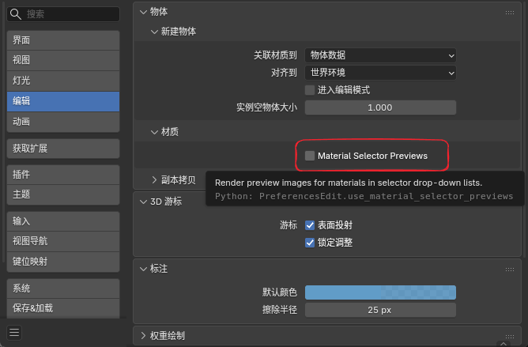
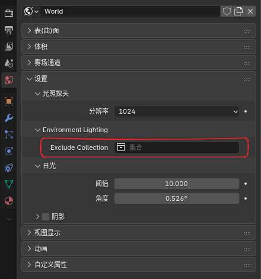

# 界面与工作流补充

## 1. 材质选择器预览开关

### 作用

控制材质下拉列表/搜索列表中是否渲染材质预览图。

这个开关主要用于在材质很多时，减少展开材质选择器时生成预览图的卡顿。

### 入口

`Edit > Preferences > Editing > Objects > Materials > Material Selector Previews`

### 行为说明

| 状态 | 效果 |
|------|------|
| 开启 | 材质选择器会按当前逻辑显示材质预览图 |
| 关闭 | 材质选择器会退回普通材质图标，不再在下拉列表里触发材质预览渲染 |

默认值为**开启**。

### 应用范围

- ✅ 影响 `template_ID(...)` 这类材质选择器下拉列表中的材质预览显示

- ❌ 不影响 `Material Properties` 面板中的大预览球

- ❌ 不影响材质本身的正常渲染结果

!!! tip "性能优化"
    当项目中有大量材质时，关闭该选项可以显著提升选择器响应速度。

---

## 2. 世界环境排除

### 功能说明

允许选择一个集合，选定集合内的物体不受世界环境影响。

### 入口配置

在 Scene 属性中找到相关选项。

### 使用方法

1. 选择要排除的物体集合

2. 这些物体将不再受世界HDRI和世界环境光的影响

3. 适合用于特殊场景物体、UI元素或需要独立光照处理的对象

### 应用场景

- UI/HUD 元素独立渲染
- 特殊效果物体的独立控制
- 复杂场景中对环境光的精细控制

!!! example "实际用途"
    在游戏UI或特殊效果中，经常需要让某些物体不受环境光影响，这个功能就很有用。

---

## 3. Lightgroup ID（灯光组编号）

### 作用

为 Eevee 灯光指定一个整数灯光组编号，供 `Shader Info` 节点做分组过滤。

### 入口

`Light Data > Light > Lightgroup ID`

### 配置说明

| 项目 | 说明 |
|------|------|
| 默认值 | `0` |
| 用于 | `Shader Info` 节点的灯光过滤 |
| 范围 | 任意非负整数 |

### 行为说明

- `Shader Info` 节点的 `Lightgroup` 设为 `0` 时，只会计算 `Lightgroup ID = 0` 的灯光

- 如果某个 `Shader Info` 节点设置为其他整数值，则只有相同编号的灯光会参与该节点计算

- 这个分组过滤当前只影响 `Shader Info` 节点，不会改动 Eevee 普通材质主通道的默认灯光结果

### 使用示例

假设你有多个灯光，想分别控制它们对不同物体的影响：

1. 关键灯（Key Light）设为 Lightgroup ID = 1
2. 填充灯（Fill Light）设为 Lightgroup ID = 2  
3. 在材质中使用两个 `Shader Info` 节点，分别设为不同的 Lightgroup
4. 这样可以独立控制不同灯光的效果

!!! tip "灯光组最佳实践"
    使用灯光组织可以更灵活地控制复杂场景中多灯光的影响，特别是在NPR风格化中很有用。

---

## 4. 启动图版本标识

### 作用

在启动图右上角的版本文字后追加当前 NPR 构建标识与构建日期，方便区分自定义构建版本。

### 显示格式

- 格式: `版本号 + npr post + 构建日期`

- 示例: `5.1.0 npr post 2026-03-27`

### 用途

- 快速识别当前使用的是否为NPR Port版本
- 跟踪特定版本的功能和修复
- 便于团队环境中的版本管理

---

## Eevee 与 Cycles 的区别

### NPR Port 对渲染引擎的支持

| 功能 | Eevee | Cycles |
|------|-------|--------|
| Scene Render Textures | ✅ 支持 | ❌ 不支持 |
| Filter Materials | ✅ 支持 | ❌ 不支持 |
| NPR Tree | ✅ 支持 | ❌ 不支持 |
| 新着色器节点 | ✅ 支持 | ⚠️ 部分支持 |
| 性能 | ⚡ 快速 | 🐢 精确但慢 |

!!! warning "重要提醒"
    **大部分NPR Port功能是 Eevee 专用，不支持 Cycles。**

    如需使用NPR特性，请确保项目采用 Eevee 作为渲染引擎。

---

## 快速参考表

### 常用快捷键

| 快捷键 | 功能 |
|--------|------|
| `Ctrl + Tab` | 在物体材质和NPR之间快速切换 |

### 常见属性入口

| 功能 | 位置 |
|------|------|
| Render Textures | Scene Properties > Render Textures |
| Filter Materials | Scene Properties > Filter Materials |
| NPR Tree | Material Output > NPR Tree Property |
| Lightgroup ID | Light Data > Light > Lightgroup ID |
| 材质预览开关 | Edit > Preferences > Editing > Objects > Materials |
| 世界环境排除 | Scene Properties > World Environment Exclude |

### 着色器节点类型速查

| 类型 | 访问路径 | 用途 |
|------|---------|------|
| Render Info | Input > Render Info | 获取渲染信息 |
| Scene Time | Input > Scene Time | 时间控制 |
| Shader Info | Input > Shader Info | 光照信息 |
| NPR Input | Input > NPR Input | NPR输入缓冲 |
| Image Sample | Utilities > Image Sample | 邻域采样 |
| For Each Light | Utilities > For Each Light | 逐灯处理 |

---

## 常见问题与解决方案

### Q: 为什么我的NPR Tree没有工作？

A: 检查以下几点：
1. 确认使用的是 Eevee 渲染引擎
2. 材质的 Render Method 必须设为 Dithered（抖动）
3. 在 Material Output 节点中正确设置了 NPR Tree 属性

### Q: Filter Materials 不显示效果？

A: 
1. 确认使用的是 Filter 域材质
2. 在 Shader Editor 中把 Shader Type 切换到 Filter
3. 检查 Execution Stage 的执行顺序

### Q: 如何优化渲染性能？

A: 
- 关闭不必要的 Render Textures
- 减少 Portal / Image Sample 的使用
- 在 Lightgroup 中合理组织灯光，避免过多的灯光计算
- 关闭材质选择器预览（如有性能问题）

### Q: 能否在 Cycles 中使用这些功能？

A: 不能。NPR Port 的大部分功能为 Eevee 专用设计。如需高质量NPR效果，请使用 Eevee 加贴图法线贴图、环境光遮蔽等优化手段。

---

## 相关资源

- [Blender 官方文档](https://docs.blender.org/)
- [Eevee 渲染引擎指南](https://docs.blender.org/manual/en/latest/render/eevee/index.html)
- [着色器节点参考](https://docs.blender.org/manual/en/latest/render/shader_nodes/index.html)
