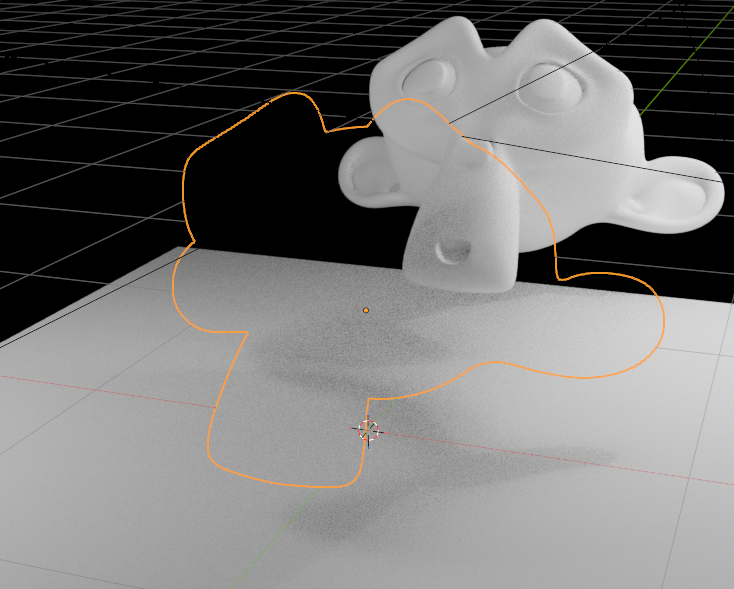
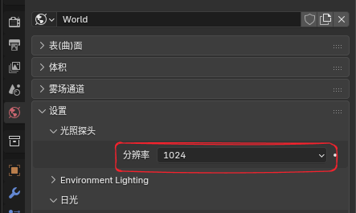
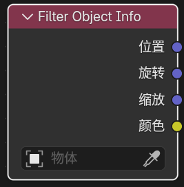

# Extended Shader Nodes

## 1. General Eevee Utility Nodes

### Render Info

#### Entry

`Add > Input > Render Info`

	
	 

#### Outputs

- `Frag Coord`: Screen-space coordinate (`xy` normalized to 0-1, `z` is depth)

- `Width`: Render region width

- `Height`: Render region height

#### Purpose

Provides the coordinate and pixel size of the current Eevee render window.

### Scene Time

#### Entry

`Add > Input > Scene Time`

	
	 

#### Input

- `Scale`: Value used to scale frame numbers

#### Outputs

- `Frame`: Current frame number

- `Seconds`: Seconds corresponding to the current frame

- `Timeline`: Scene time remapped to 0-1 from start frame to end frame

- `Scaled Frame`: Current frame divided by `Scale`

### Screen Derivative

#### Entry

`Add > Utilities > Math > Screen Derivative`

	
	 

#### Feature

Gets differences between neighboring pixels in screen space:

- `DDX`: Screen-space derivative in the X direction

- `DDY`: Screen-space derivative in the Y direction

- `DDXY`: Combination of `DDX` and `DDY` (`DDX + DDY`)

### Portal In / Portal Out

#### Entry

- `Add > Layout > Portal In`

- `Add > Layout > Portal Out`

	
	 

#### Feature Description

These are “portal” nodes used to organize node links.

Their workflow can be understood as:

- `Portal In`: Store a named, typed value in the current node tree

- `Portal Out`: Retrieve that value later by name within the same node tree

#### Other Notes

- Creating a new `Portal In` automatically generates a unique name.

- `Portal Out` has a magnifier button that can jump to the matching `Portal In` location.

#### Limits

- Only recognized inside the same shader node tree.

- Does not support crossing different node trees.

- Does not automatically pass through node groups.

- Inputs with the same name should keep only one source.

## 2. Eevee Object Material Nodes

### Render Texture

#### Entry

`Add > Texture > Render Texture`

	
	 

#### Purpose

Reads a `Render Textures` entry configured earlier in the scene.

#### Inputs / Outputs

- Input: `Vector`

- Outputs: `Color`, `Alpha`

### Screenspace Info

#### Entry

`Add > Input > Screenspace Info`

	
	 

#### Inputs / Outputs

- Input: `View Position` (camera-space position)

- Outputs: `Scene Color` (scene color), `Scene Depth` (scene depth)

#### Purpose

Gets the contents of the current render buffer color or depth.

	
	 

#### Usage Notes

- `Raytracing` must be enabled in render settings

- Set material `Render Method` to `Dithered`

- Enable `Raytraced Transmission` in material options

- The default `View Position` input is `position` transformed into camera space, then with the z-axis inverted

	
	 

### World Environment

#### Entry

`Add > Input > World Environment`

	
	 

#### Inputs / Outputs

- Input: `Direction` (sampling direction)

- Output: `Color` (environment color)

#### Purpose

Directly samples the `Eevee` world environment color without depending on whether any geometry exists behind the screen.

#### Notes

- Reads the world lighting probe color; probe resolution can be adjusted in the world environment

	
	 

- If `Direction` is not connected, the current surface view direction is used by default

- If `Direction` is connected, the world environment can be sampled in the specified direction

### World To Tangent

#### Entry

`Add > Utilities > Vector > World To Tangent`

	
	 

#### Inputs / Outputs

- Input: `Vector` (world-space direction)

- Output: `Vector` (tangent-space direction)

#### Purpose

Converts a world-space direction vector into the tangent space of the current surface.

#### Notes

- A `UV Map` can be specified in the node panel, and the tangent of that UV is used as the transform basis.

### Basis Transform

#### Entry

`Add > Utilities > Vector > Basis Transform`

	
	 

#### Inputs / Outputs

- Input: `Vector` (point, direction, or normal to transform)

- Input: `Origin` (origin of the custom basis, used only in `Point` mode)

- Input: `X Axis`, `Y Axis`, `Z Axis` (custom basis axes)

- Output: `Vector` (transformed result)

#### Purpose

Uses `origin + three basis axes` inside material nodes to perform custom coordinate-system transforms. This is useful when there is no matrix input type available and you still need to process points, direction vectors, or normals.

#### Panel Options

- `Direction`

    - `To Basis`: Interpret the input from world / current coordinates into the custom basis

    - `From Basis`: Convert the input from custom basis coordinates back to external coordinates

- `Type`

    - `Point`: Includes `Origin` translation

    - `Vector`: Only transforms direction and length, without translation

    - `Normal`: Transforms following normal rules and normalizes before output

- `Basis Input`

    - `XYZ`: Use all three input axes directly

    - `XY` / `XZ` / `YZ`: Use only two axes; the third axis is generated automatically by cross product

- `Orthonormalize`

    - When enabled, input axes are orthogonalized and normalized. This is more suitable for tangent space or local orientation bases

    - When disabled, input axis lengths are preserved, which can be used for basis transforms with scaling

- `Fallback`

    - `Pass Through`: Output the original input when the basis degenerates

    - `Zero`: Output `0, 0, 0` when the basis degenerates

### SDF Primitive

#### Entry

`Add > Texture > SDF Primitive`

	
	 

#### Output

- `Distance`

#### Purpose

Generates signed distance field (SDF) base shapes directly inside material nodes. It is useful for procedural masks, silhouettes, shape transitions, and as the starting point for boolean-style combinations.

#### Main Modes

- 3D shapes: `Sphere`, `Box`, `Torus`, `Cone`, `Point Cone`, `Cylinder`, `Point Cylinder`, `Capsule / Line`, `Octahedron`, `Hex Prism`, `Hex Prism Incircle`, `Plane`, `Solid Angle`, `Pyramid`, `Disc`, `3D Circle`
- 2D shapes: `Circle`, `Rectangle`, `Ellipse`, `Triangle`, `Pentagon`, `Hexagon`, `Isosceles Triangle`, `Trapezoid`, `Rhombus`
- Stylized 2D shapes: `Star`, `Heart`, `Pie`, `Arc`, `Moon`, `Vesica`, `Cross`, `Rounded X`, `Horseshoe`, `Round Joint`, `Flat Joint`
- Curve / segment shapes: `Line`, `Corner`, `Quadratic Bezier`, `Point Triangle`, `Quad`, `Parabola`, `Parabola Segment`, `Uneven Capsule`

#### Input Notes

- The fixed base input is `Vector`
- Other sockets are shown and renamed dynamically per mode. Common parameters include `Size`, `Radius`, `Angle`, `Roundness`, `Linewidth`, `Point` to `Point_003`, and `Value1` to `Value4`
- The node panel provides `Mode` and `Invert`

#### Usage Notes

- The output is a distance value, not a color
- It is typically combined with nodes such as `Math`, `ColorRamp`, `Map Range`, and `SDF Operator` to turn the field into a mask or final shape
- `Invert` flips the inside / outside relationship directly, which is useful for turning the same shape into a hole or shell

### SDF Operator

#### Entry

`Add > Converter > SDF Operator`

	
	 

#### Output

- `Distance`

#### Purpose

Combines, trims, and reshapes one or two SDF distance fields so multiple primitives can be assembled into more complex results.

#### Main Operations

- Single-input operations: `Dilate`, `Onion`, `Annular`, `Mask`, `Flatten`, `Invert`, `Hermite Pulse`
- Two-input operations: `Blend`, `Exclusion XOR`, `Divide`, `Pipe`, `Engrave`, `Groove`, `Tongue`
- Union family: `Union`, `Smooth Union`, `Round Union`, `Columns Union`, `Stairs Union`, `Chamfer Union`
- Intersection family: `Intersect`, `Smooth Intersect`, `Round Intersect`, `Columns Intersect`, `Stairs Intersect`, `Chamfer Intersect`
- Difference family: `Difference`, `Smooth Difference`, `Round Difference`, `Columns Difference`, `Stairs Difference`, `Chamfer Difference`

#### Input Notes

- Base inputs include `Distance`, `Distance_001`, `Value`, `Value_001`, and `Count`
- The visible socket names and counts change automatically with `Operation`
- `Mask` exposes an extra `Invert` toggle

#### Usage Notes

- A common workflow is to build several shapes with `SDF Primitive`, then combine them with `SDF Operator` through union, intersection, or difference
- `Smooth`, `Round`, `Chamfer`, `Stairs`, and `Columns` are useful for more stylized boolean transitions
- The node still outputs a distance value, so it usually needs a threshold, color remap, or alpha control afterward

### SDF Vector Operator

#### Entry

`Add > Utilities > Vector > SDF Vector Operator`

	
	 

#### Outputs

- `Vector`

- `Position`

- `Value`

#### Purpose

Preprocesses the coordinate, UV, or vector domain used by SDF workflows. Instead of generating a distance field directly, it rewrites the sampling space before the data reaches `SDF Primitive`.

That makes it useful for workflows such as:

- mirror or repeat the domain first
- then generate the primitive in that modified space
- then combine the resulting distance fields with `SDF Operator`

#### Main Operation Groups

- `Plane Reflect`, `Mirror`, `Polar`, `Repeat Infinite`, `Repeat Infinite Mirror`, `Repeat Finite`, `Octant`
  - These modes handle reflection, symmetry, radial segmentation, and repeated spatial cells

- `Swizzle`, `Rotate`, `Spin`, `Extrude`, `Twist`, `Swirl`, `Pinch Inflate`, `Radial Shear`, `Bend`
  - These modes reorder or deform the coordinate system itself

- `UV Rotate`, `UV Scale`, `UV Grid`, `UV Random Rotate`, `UV Random Flip`, `UV Tileset`
  - These modes are focused on UV tiling, local UV transforms, and per-cell variation

- `Map -1-1`, `Map -0.5-0.5`, `Map 0-1`
  - These modes quickly convert between normalized UV ranges and the centered ranges often used in SDF setups

#### Mode Reference

- `Plane Reflect`
  - Reflects the domain using a custom plane normal and offset
  - `Value` can be used as a helper mask for which side of the plane is active

- `Mirror`
  - Mirrors space across an axis-aligned plane controlled by the selected `Axis`
  - `Spacing` controls the reference interval
  - `Position` exposes an auxiliary mirrored / cell position

- `Polar`
  - Rewrites planar space into repeated angular sectors around the origin
  - Useful for radial motifs, petals, emblems, and gear-like repetition

- `Repeat Infinite`
  - Repeats the domain endlessly using `Spacing`

- `Repeat Infinite Mirror`
  - Repeats endlessly while mirroring every second cell, which helps neighboring boundaries line up more naturally

- `Repeat Finite`
  - Similar to infinite repeat, but constrained by `Count`

- `Octant`
  - Folds the domain into an octant / symmetric wedge for quick symmetrical constructions

- `Swizzle`
  - Reorders axis channels such as `XYZ`, `XZY`, or `YZX`

- `Rotate`
  - Rotates the domain around the selected main axis

- `Spin`
  - Applies an axis-based spin style coordinate offset
  - Useful for rotational motifs and axial distortion

- `Extrude`
  - Turns a 2D distance domain into a thickness along the third axis
  - `Value` outputs an internal-distance helper value

- `Twist`
  - Twists the domain along the chosen axis

- `Swirl`
  - Creates a vortex-like distortion around a center
  - `Center`, `Offset`, `Strength`, and `Radius` control the affected region

- `Pinch Inflate`
  - Compresses or inflates space around a central region

- `Radial Shear`
  - Applies radial shear, useful for stronger rotational distortion patterns

- `Bend`
  - Bends the domain along the selected axis

- `UV Rotate`
  - Rotates UV coordinates around `Center`

- `UV Scale`
  - Scales UV coordinates around the UV center

- `UV Grid`
  - Splits 0-1 UV space into a regular grid
  - `Vector` outputs the local UV inside the current cell
  - `Position` outputs the cell coordinate for downstream indexing or randomization

- `UV Random Rotate`
  - Uses the input `Position` to pick a 90-degree random rotation per cell

- `UV Random Flip`
  - Uses the input `Position` to randomly flip or rotate each cell

- `UV Tileset`
  - Remaps the current UV into a sub-tile inside a larger texture sheet
  - `Index` picks the tile, `Padding` controls margins, and `Scale` adjusts tile-space zoom

- `Map -1-1`
  - Remaps `0-1` UV into `-1 to 1`

- `Map -0.5-0.5`
  - Remaps `0-1` UV into `-0.5 to 0.5`

- `Map 0-1`
  - Remaps a centered SDF-style range back into standard UV space

### Bevel

#### Entry

`Add > Input > Bevel`

	
	 

#### Inputs / Outputs

- Input: `Radius` (bevel radius), `Normal` (surface normal hint)

- Output: `Normal` (approximated beveled normal)

#### Panel Option

- `Samples` (higher sample counts improve quality but cost more performance)

#### Purpose

Generates an approximate beveled normal in `Eevee` so hard edges can look smoother.

#### Notes

- `Cycles` still uses the original true geometric bevel algorithm

- `Eevee` here uses a same-object screen-space approximation

- The result depends on the current view, depth buffer, and visible neighborhood, and is not equivalent to the true `Bevel` in `Cycles`

### Curvature

#### Entry

`Add > Input > Curvature`

	
	 

#### Inputs

- `Samples`

- `Sample Radius`

- `Thickness`

- `Scale`

#### Outputs

- `Scene Curvature`: Curvature extracted from screen space

- `Scene Rim`: Rim-light style edge output

#### Panel Option

- `Local`: Ignore depth from other objects

#### Notes

A curvature node ported from Goo Engine that provides curvature and rim outputs.

### Shader Info

#### Entry

`Add > Input > Shader Info`

	
	 

#### Inputs

- `World Position`: World-space position (defaults to the current position)

- `Normal`: Surface normal (defaults to the current smooth normal)

#### Outputs

- `Diffuse Shading`: Lambert lighting

- `Shadow`: Shadow mask

- `Ambient Lighting`: Indirect ambient light from the world environment and lighting probes

- `Half-Lambert Factor`: Half-Lambert lighting term

#### Notes

- `Shadow`

    - Supports selectable shadow modes

    - `Built-in`: Default mode, using Eevee's original shadow calculation

    - `Soft Filtered`: Turns binary dithered shadows into smoother grayscale penumbra

- The node panel includes a `Lightgroup` property

    - Only lights with the same `Lightgroup ID` participate in this `Shader Info` node's direct lighting and shadow evaluation

	
	 

- The current implementation excludes the world sun from these outputs so HDRIs or “sun” contributions embedded in the world environment do not contaminate the direct result.

### Light Info

#### Entry

`Add > Input > Light Info`

	
	 

#### Feature Description

Reads information from a specified light.

#### Fixed Outputs

- `Color`: Light color

- `Power`: Light intensity

- `Type`: Light type

    - `-1`: No light specified

    - `0`: Point

    - `1`: Sun

    - `2`: Spot

    - `3`: Area

#### Outputs That Appear Depending on Light Type

- `Position`: Light world position

- `Direction`: Light direction

- `Radius`: Light radius

- `Spot Size`: Spot light size

- `Sun Angle`: Sun angle

#### Notes

- For per-light processing, use `For Each Light` inside `NPR Tree` instead.

### Filter Object Info

#### Entry

`Add > Input > Filter Object Info`

	
	 

Available only in the `Filter` domain.

#### Purpose

Reads the world-space transform and viewport display color of a chosen object, so filter materials can react to a controller object or scene helper.

This is useful for object-driven masks, directional gradients, moving focal effects, or passing a custom color control into a full-screen filter.

#### Node Setting

- `Object`: Choose which object the node should read

#### Outputs

- `Location`: Chosen object world-space location

- `Rotation`: Chosen object world-space Euler rotation in radians

- `Scale`: Chosen object world-space scale

- `Color`: Chosen object viewport display color

#### Notes

- This reads the explicitly selected object, not the object currently being filtered on screen

- If no object is assigned, the node falls back to `0` for location / rotation / color and `1` for scale

### Scene Color

#### Entry

`Add > Input > Scene Color`

	
	 

Available only in the `Filter` domain.

#### Purpose

Reads the current Eevee scene buffer. The `Source` can be switched in the node panel:

- `Color`: Reads the final rendered scene color

- `Depth`: Reads linear depth

- `Normal`: Reads rendered normals

- `Position`: Reads world-space positions

#### Inputs / Outputs

- Input: `Vector`

- Outputs: `Color`, `Alpha`
