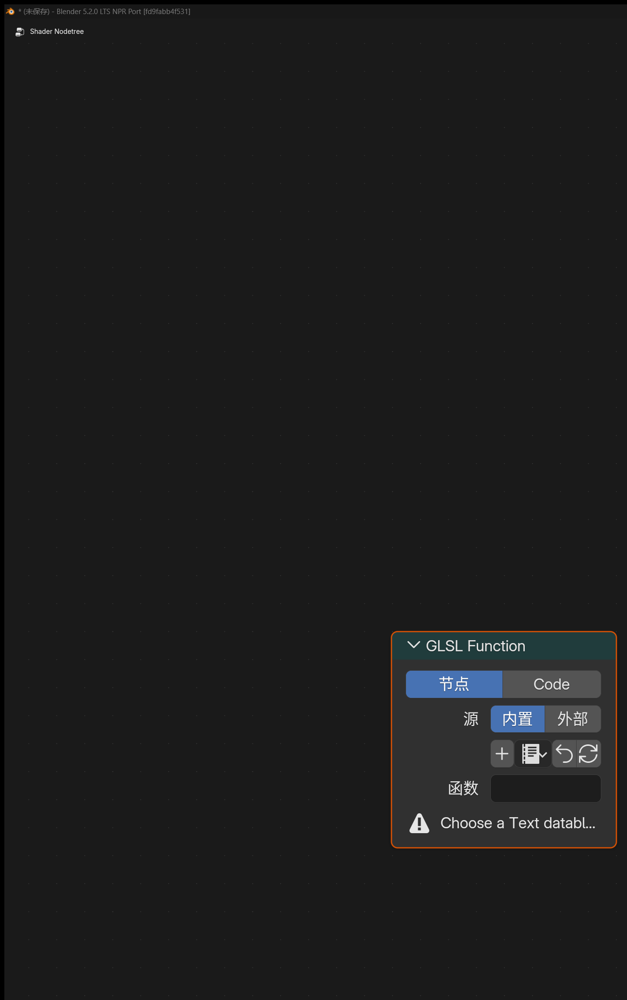

# Extended Shader Nodes

## 1. Filter-Domain Nodes

### Filter Object Info

#### Entry

`Add > Input > Filter Object Info`

Available only in the `Filter` domain.

<div align="center">
	
	<br>
</div>

#### Purpose

Reads the world-space transform and viewport display color of a chosen object, making it easier to drive full-screen filters from scene helpers or controller objects.

#### Node Setting

- `Object`

#### Outputs

- `Location`
- `Rotation`
- `Scale`
- `Color`

#### Notes

- `Location`: world-space location of the chosen object
- `Rotation`: world-space Euler rotation in radians
- `Scale`: world-space scale of the chosen object
- `Color`: viewport display color of the chosen object
- If no object is assigned, the node falls back to `0` for location / rotation / color and `1` for scale

### Filter Mask

#### Entry

`Add > Input > Filter Mask`

Available only in the `Filter` domain.

<div align="center">
	
	<br>
</div>

#### Purpose

Uses Eevee `Cryptomatte` object information to build fast object masks for filter materials.

#### Output

- `Mask`

#### Panel Options

- `Mode`
  - `Single Object`
  - `Object List`
  - `Collection`

#### Notes

- `Single Object` is useful for one controller object
- `Object List` is useful when a manual object set is needed, and can be filled from the current selection
- `Collection` is useful when the mask should follow a collection hierarchy
- The output is a `0-1` float mask that can be used with `Mix`, thresholds, AOV writing, or any other filter logic
- Only renderable geometry objects are supported

### Scene Color

#### Entry

`Add > Input > Scene Color`

Available only in the `Filter` domain.

<div align="center">
	
	<br>
</div>

#### Purpose

Reads the current Eevee scene buffer. The `Source` can be switched in the node panel:

- `Color`
- `Depth`
- `Normal`
- `Position`

#### Inputs / Outputs

- Input: `Vector`
- Outputs: `Color`, `Alpha`

#### Notes

- `Color`: read the resolved scene color
- `Depth`: read linear scene depth
- `Normal`: read scene normals
- `Position`: read the world-space position pass
- If `Vector` is not connected, the node samples with the `Window` output of the `Texture Coordinate` node

## 2. General Eevee Utility Nodes

### Render Info

#### Entry

`Add > Input > Render Info`

<div align="center">
	
	<br>
</div>

#### Outputs

- `Frag Coord`
- `Width`
- `Height`

#### Purpose

Provides the coordinate and pixel size of the current Eevee render window.

#### Notes

- `Frag Coord.xy` is normalized screen UV in `0-1`
- `Frag Coord.z` is the current fragment depth
- `Width` / `Height` are the current render-region pixel dimensions

### Scene Time

#### Entry

`Add > Input > Scene Time`

<div align="center">
	
	<br>
</div>

#### Input

- `Scale`

#### Outputs

- `Frame`
- `Seconds`
- `Timeline`
- `Scaled Frame`

#### Purpose

Provides time-related values from the current scene.

### Screen Derivative

#### Entry

`Add > Utilities > Math > Screen Derivative`

<div align="center">
	
	<br>
</div>

#### Feature

Gets the difference between neighboring pixels in screen space:

- `DDX`
- `DDY`
- `DDXY`

where `DDXY` means `DDX + DDY`.

### Portal In / Portal Out

#### Entry

- `Add > Layout > Portal In`
- `Add > Layout > Portal Out`

<div align="center">
	
	<br>
</div>

#### Feature Description

These are “portal” nodes used to organize node links.

#### Notes

- `Portal In`: stores a named, typed value in the current node tree
- `Portal Out`: retrieves that value later by name inside the same node tree
- Creating a new `Portal In` generates a unique name automatically
- `Portal Out` includes a magnifier button that jumps to the matching `Portal In`
- Portals are only recognized inside the same shader node tree and do not automatically pass through node groups

## 3. Eevee Object Material Nodes

### Render Texture

#### Entry

`Add > Texture > Render Texture`

<div align="center">
	
	<br>
</div>

#### Purpose

Reads a `Render Textures` entry configured in the scene.

#### Inputs / Outputs

- Input: `Vector`
- Outputs: `Color`, `Alpha`

### Screenspace Info

#### Entry

`Add > Input > Screenspace Info`

<div align="center">
	
	<br>
</div>

#### Inputs / Outputs

- Input: `View Position`
- Outputs: `Scene Color`, `Scene Depth`

#### Purpose

Reads color or depth from the current render buffer.

#### Usage Notes

- `Raytracing` must be enabled in render settings
- Material `Render Method` must be set to `Dithered`
- `Raytraced Transmission` must be enabled
- The default `View Position` input transforms the current position into camera space and then flips the `Z` axis

### World Environment

#### Entry

`Add > Input > World Environment`

<div align="center">
	
	<br>
</div>

#### Inputs / Outputs

- Input: `Direction`
- Output: `Color`

#### Purpose

Directly samples the `Eevee` world environment color without depending on whether geometry exists behind the screen.

#### Notes

- If `Direction` is not connected, the current surface view direction is used
- If `Direction` is connected, the world environment is sampled in that direction
- The result is closer to Eevee environment / probe lighting than to a screen-space buffer

### Light Probe Color

#### Entry

`Add > Input > Light Probe Color`

#### Inputs / Outputs

- Input: `Direction`
- Outputs: `Reflection`, `Irradiance`, `Combined`

#### Purpose

Reads the currently available Eevee lighting-probe result directly, splitting it into reflection, irradiance, and combined outputs.

### World To Tangent

#### Entry

`Add > Utilities > Vector > World To Tangent`

<div align="center">
	
	<br>
</div>

#### Inputs / Outputs

- Input: `Vector`
- Output: `Vector`

#### Purpose

Converts a world-space direction vector into the tangent space of the current surface.

#### Notes

- A `UV Map` can be chosen in the node panel, and the tangent of that UV is used as the basis
- This is useful for anisotropic direction control, tangent-space flow, and local scan-direction effects

### GLSL Function

#### Entry

`Add > Script > GLSL Function`

Available in both `Eevee` object materials and `NPR Tree`.

<div align="center">
	
	<br>
</div>

#### Purpose

Injects a user-authored GLSL function into the current `Eevee / NPR` material compile path. This is useful for custom math nodes, procedural textures, SDF logic, screen-space effects, and porting parts of external GLSL / HLSL code.

#### Basic Workflow

1. Prepare a GLSL function in the `Text Editor` or point the node to an external `.glsl` file.
2. Add a `GLSL Function` node.
3. Choose the source and the target function in the node panel.
4. Refresh the node after editing the source.
5. Explicitly select the exported function name in `Function`.

#### Supported Boundary Types

- Input parameters: `float`, `int`, `bool`, `vec2`, `vec3`, `vec4`, `sampler2D`
- Output parameters: `out float`, `out int`, `out bool`, `out vec2`, `out vec3`, `out vec4`
- Return values: `void`, `float`, `int`, `bool`, `vec2`, `vec3`, `vec4`

#### Important Notes

- `Function` is not auto-selected and must be chosen explicitly
- `sampler2D` appears as a `Closure` input
- `sampler2D` can be connected to `Image to Closure` or a compatible `Closure Output`
- `Closure Output -> sampler2D` currently guarantees only the direct `texture(tex, uv)` path
- If the function depends on `textureLod`, `textureGrad`, `textureSize`, or `texelFetch`, prefer driving it with `Image to Closure`
- `@glsl_meta` supports `default`, `min`, `max`, `hide_value`, and `subtype`
- `@glsl_meta default=` also accepts expressions such as `glsl_position()`, `normalize(glsl_normal())`, or `glsl_ambient_lighting()`
- Expression defaults are recommended only for `float / vec2 / vec3 / vec4` inputs and should not directly reference other exported parameters
- Only `vec3 / vec4` inputs explicitly marked with `subtype=color` become color sockets
- `vec3 + subtype=color` enters GLSL as `rgb` with `alpha = 1.0`
- `vec4 + subtype=color` keeps full `rgba`
- Exported boundary types do not currently support `mat*`, `struct`, or `array`
- `int / bool` boundaries are useful for mode switches, enums, and `lightgroup_id` style parameters
- Built-in geometry helpers are available in the function body: `glsl_position()`, `glsl_normal()`, `glsl_true_normal()`, `glsl_incoming()`
- Built-in ambient-light helper: `glsl_ambient_lighting()`
- Built-in direct-light helpers: `GLSLLight`, `glsl_light_count()`, `glsl_light_get(light_index)`, `glsl_light_shadow(light_index, shading_normal)`
- `GLSLLight.lightgroup_id` maps directly to the light data panel `Lightgroup ID`
- `GLSLLight.attenuation` is a base attenuation term for custom per-light models; it does not include `NdotL`, toon ramps, Blinn-Phong, GGX, shadows, or material-side Fresnel / metallic / roughness behavior
- Recommended diffuse pattern: `light.diffuse_color * light.attenuation * max(dot(N, light.vector), 0.0) * glsl_light_shadow(...)`
- Recommended specular pattern: `light.specular_color * light.attenuation * custom_spec_term * glsl_light_shadow(...)`

#### Example: `mode` Debug Mapping

If you want one `GLSL Function` node to switch between helper outputs with a single `mode` parameter, this mapping is the current reference:

| `mode` | Helper / Field |
| --- | --- |
| `0` | `glsl_position()` |
| `1` | `glsl_normal()` |
| `2` | `glsl_true_normal()` |
| `3` | `glsl_incoming()` |
| `4` | `glsl_ambient_lighting()` |
| `5` | `glsl_light_count()` |
| `6` | `light.valid` |
| `7` | `light.type` |
| `8` | `light.lightgroup_id` |
| `9` | `light.vector` |
| `10` | `light.position` |
| `11` | `light.direction` |
| `12` | `light.distance` |
| `13` | `light.diffuse_color` |
| `14` | `light.specular_color` |
| `15` | `light.attenuation` |
| `16` | `glsl_light_shadow(i, N)` |

#### Example: Filter by `lightgroup_id`

You can filter Eevee direct lights inside `GLSL Function` by reading `GLSLLight.lightgroup_id`.

```glsl
vec4 lightgroup_lambert(vec3 albedo, int target_lightgroup_id)
{
  vec3 N = normalize(glsl_normal());
  vec3 result = vec3(0.0);

  for (int i = 0; i < glsl_light_count(); i++) {
    GLSLLight light = glsl_light_get(i);
    if (!light.valid || light.lightgroup_id != target_lightgroup_id) {
      continue;
    }

    float NdotL = max(dot(N, light.vector), 0.0);
    if (NdotL <= 0.0) {
      continue;
    }

    float shadow = glsl_light_shadow(i, N);
    result += albedo * light.diffuse_color * light.attenuation * NdotL * shadow;
  }

  return vec4(result, 1.0);
}
```

### Image to Closure

#### Entry

`Add > Texture > Image to Closure`

Available in both `Eevee` object materials and `NPR Tree`.

<div align="center">
	
	<br>
</div>

#### Output

- `Closure`

#### Purpose

Wraps a regular image as a closure-backed source for `sample2D` workflows.

#### Node Settings

- `Image`
- `Interpolation`
- `Extension`

#### Usage Notes

- This node does not expose a normal image socket; the image is selected directly in the node panel
- It is an adapter for `sampler2D` workflows, not a replacement for `Image Texture`
- Prefer it when a function needs image-resource specific sampling behavior

### Basis Transform

#### Entry

`Add > Utilities > Vector > Basis Transform`

<div align="center">
	
	<br>
</div>

#### Purpose

Transforms points, vectors, or normals to or from a custom basis defined by `Origin + axis inputs`.

#### Inputs / Outputs

- Inputs: `Vector`, `Origin`, `X Axis`, `Y Axis`, `Z Axis`
- Output: `Vector`

#### Panel Options

- `Direction`
  - `To Basis`
  - `From Basis`
- `Vector Type`
  - `Point`
  - `Vector`
  - `Normal`
- `Basis Input`
  - `XY`
  - `XZ`
  - `YZ`
  - `XYZ`
- `Orthonormalize`
- `Fallback`

#### Notes

- `Point` mode uses `Origin` as the translation reference, while `Vector` and `Normal` only transform direction
- `Basis Input` can derive the missing axis from two supplied axes, or use explicit `XYZ`
- `Orthonormalize` helps stabilize imperfect or non-orthogonal input axes
- Useful for local basis projection, procedural texture orientation, anisotropic direction control, and custom normal-space conversion

### Twirl

#### Entry

`Add > Utilities > Vector > Twirl`

<div align="center">
	
	<br>
</div>

#### Inputs / Outputs

- Inputs: `Vector`, `Center`, `Amount`
- Output: `Vector`

#### Purpose

Twists the input coordinate field around a chosen center. This is useful for Goo Engine style swirls, distorted UVs, and radial deformations.

### Water Ripples

#### Entry

`Add > Texture > Water Ripples`

<div align="center">
	
	<br>
</div>

#### Inputs / Outputs

- Inputs: `Vector`, `Time`, `Scale`, `Intensity`, `Speed`, `Detail`, `Bias`
- Outputs: `Distorted Vector`, `Mask`

#### Panel Options

- `Mode`
  - `Drops`
  - `Ripples`
  - `Flow`
  - `Caustic`

#### Purpose

Generates procedural ripple distortion and a ripple mask.

### Hex Grid Texture

#### Entry

`Add > Texture > Hex Grid Texture`

<div align="center">
	
	<br>
</div>

#### Inputs

- `Vector`
- `Scale`
- `Size`
- `Radius`
- `Roundness`

#### Outputs

- `Value`
- `Color`
- `Hex Coords`
- `Position`
- `Cell UV`
- `Cell ID`

#### Panel Options

- `Coordinate Mode`
  - `XY Position`
  - `Hex Position`
- `Value Mode`
  - `Hexagons`
  - `SDF Hexagons`
  - `Dots`
- `Direction`
  - `Horizontal`
  - `Vertical`
  - `Horizontal Tiled`
  - `Vertical Tiled`
- `Clamp`

#### Purpose

Generates a hex-grid texture that can be used for honeycomb patterns, cell partitioning, SDF masks, and hex-coordinate based lookups.

### SDF Primitive

#### Entry

`Add > Texture > SDF Primitive`

<div align="center">
	
	<br>
</div>

#### Output

- `Distance`

#### Purpose

Generates signed-distance-field base shapes directly inside material nodes.

### SDF Operator

#### Entry

`Add > Converter > SDF Operator`

<div align="center">
	
	<br>
</div>

#### Output

- `Distance`

#### Purpose

Combines, trims, and reshapes one or two SDF distance fields.

### SDF Vector Operator

#### Entry

`Add > Utilities > Vector > SDF Vector Operator`

<div align="center">
	
	<br>
</div>

#### Outputs

- `Vector`
- `Position`
- `Value`

#### Purpose

Preprocesses coordinate, UV, or vector domains before they are fed into `SDF Primitive`.

## 4. Goo Engine / NPR-Oriented Input Nodes

### Bevel

#### Entry

`Add > Input > Bevel`

<div align="center">
	
	<br>
</div>

#### Inputs / Outputs

- Inputs: `Radius`, `Normal`
- Output: `Normal`

#### Purpose

Generates an approximate beveled normal in `Eevee` so hard edges can look smoother.

### Curvature

#### Entry

`Add > Input > Curvature`

<div align="center">
	
	<br>
</div>

#### Inputs

- `Samples`
- `Sample Radius`
- `Thickness`
- `Scale`

#### Outputs

- `Scene Curvature`
- `Scene Rim`

#### Panel Options

- `Local`
- `Sample Radius`
  - `Pixel`
  - `View`

#### Notes

- `Local` tries to keep the evaluation focused on the current object
- In `Pixel` mode, `Sample Radius` is interpreted in pixels and therefore changes with render resolution
- In `View` mode, `Sample Radius` is interpreted relative to the view, which helps keep rim width more consistent between viewport and final render
- This is still a screen-space node, so the result depends on camera view, resolution, and sampling radius

### Shader Info

#### Entry

`Add > Input > Shader Info`

<div align="center">
	
	<br>
</div>

#### Inputs

- `World Position`
- `Normal`
- `Exponent`

#### Outputs

- `Diffuse Shading`
- `Shadow`
- `Ambient Lighting`
- `Half-Lambert Factor`
- `Blinn-Phong Factor`

#### Meaning of Each Output

- `Diffuse Shading`: the summed Lambert diffuse term from valid lights, clamped to `0-1`
- `Shadow`: switchable shadow evaluation output
- `Ambient Lighting`: probe / environment indirect-light contribution
- `Half-Lambert Factor`: summed half-Lambert diffuse term, clamped to `0-1`
- `Blinn-Phong Factor`: averaged Blinn-Phong highlight factor weighted by each light's specular channel, clamped to `0-1`

#### Notes

- `Shadow Mode`
  - `Built-in`
  - `Soft Filtered`
- `Soft Filtered` samples a local neighborhood around the current surface to rebuild smoother gray penumbra from Eevee's dithered black/white shadow result
- `Blinn-Phong Factor` does not automatically include shadow; multiply it with `Shadow` when needed
- `Exponent` controls highlight sharpness and defaults to `16`
- The node panel includes a `Lightgroup` control
- Only lights with the same `Lightgroup ID` participate in this `Shader Info` node
- World-sun style interference is excluded from these direct-light outputs

### Light Info

#### Entry

`Add > Input > Light Info`

<div align="center">
	
	<br>
</div>

#### Feature Description

Reads information from a selected light.

#### Fixed Outputs

- `Color`
- `Power`
- `Type`

`Type` is an integer socket with the following values:

- `-1`: no light assigned
- `0`: Point
- `1`: Sun
- `2`: Spot
- `3`: Area

#### Outputs That Appear by Light Type

- `Position`
- `Direction`
- `Radius`
- `Spot Size`
- `Sun Angle`

Current behavior depends on the selected light type:

- `Point`: `Position`, `Radius`
- `Sun`: `Direction`, `Sun Angle`
- `Spot`: `Position`, `Direction`, `Radius`, `Spot Size`
- `Area`: `Position`, `Direction`, `Radius`

#### Notes

- For per-light processing, use `For Each Light` in the `NPR Tree`

## 5. Built-In Node Enhancements

### Color Ramp (OKLab Mode)

#### Entry

`Add > Converter > Color Ramp`

<div align="center">
	
	<br>
</div>

#### Purpose

`Color Ramp` now supports an `OKLab` blend mode, giving more stable and perceptually smoother color transitions.

#### Notes

- The old standalone `OKLab Color Ramp` node has been merged back into `Color Ramp`
- Existing node setups should now use the `OKLab` mode on `Color Ramp` directly
