# Extended Shader Nodes

## 1. Filter-Domain Nodes

### Filter Object Info

#### Entry

`Add > Input > Filter Object Info`

Available only in the `Filter` domain.

<div align="center">
	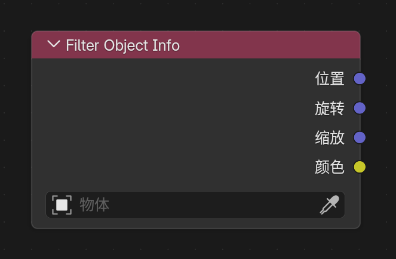
	<br>
</div>

#### Purpose

Reads the world-space transform and viewport display color of a chosen object, making it easier to drive full-screen filters from scene helpers or controller objects.

#### Node Setting

- `Object`

#### Outputs

- `Location`
- `Rotation`
- `Scale`
- `Color`

#### Notes

- `Location`: world-space location of the chosen object
- `Rotation`: world-space Euler rotation in radians
- `Scale`: world-space scale of the chosen object
- `Color`: viewport display color of the chosen object
- If no object is assigned, the node falls back to `0` for location / rotation / color and `1` for scale

### Filter Mask

#### Entry

`Add > Input > Filter Mask`

Available only in the `Filter` domain.

<div align="center">
	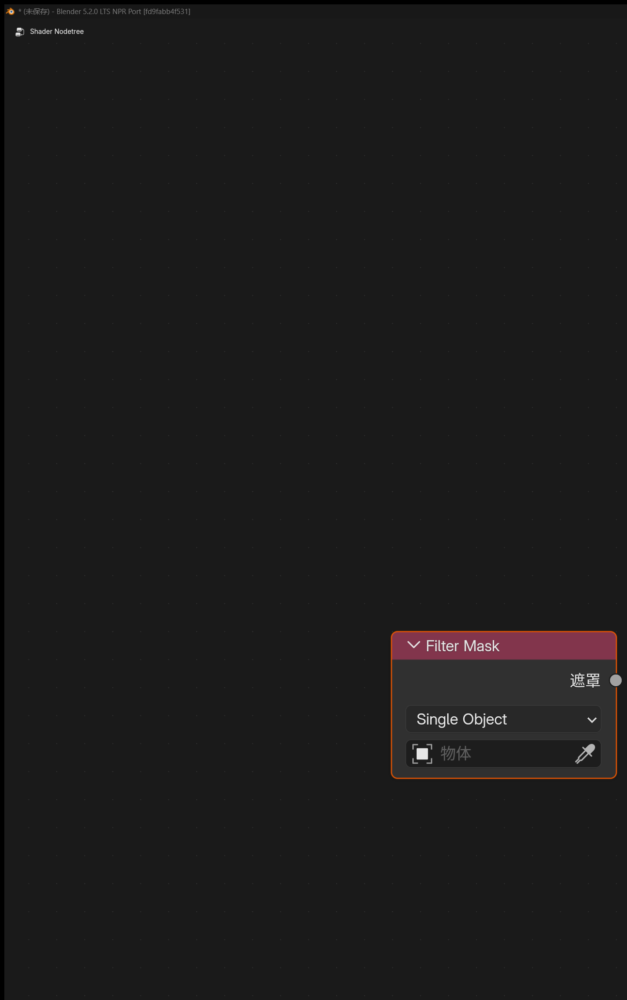
	<br>
</div>

#### Purpose

Uses Eevee `Cryptomatte` object information to build fast object masks for filter materials.

#### Output

- `Mask`

#### Panel Options

- `Mode`
  - `Single Object`
  - `Object List`
  - `Collection`

#### Notes

- `Single Object` is useful for one controller object
- `Object List` is useful when a manual object set is needed, and can be filled from the current selection
- `Collection` is useful when the mask should follow a collection hierarchy
- The output is a `0-1` float mask that can be used with `Mix`, thresholds, AOV writing, or any other filter logic
- Only renderable geometry objects are supported

### Scene Color

#### Entry

`Add > Input > Scene Color`

Available only in the `Filter` domain.

<div align="center">
	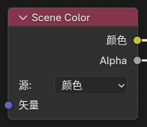
	<br>
</div>

#### Purpose

Reads the current Eevee scene buffer. The `Source` can be switched in the node panel:

- `Color`
- `Depth`
- `Normal`
- `Position`

#### Inputs / Outputs

- Input: `Vector`
- Outputs: `Color`, `Alpha`

#### Notes

- `Color`: read the resolved scene color
- `Depth`: read linear scene depth
- `Normal`: read scene normals
- `Position`: read the world-space position pass
- If `Vector` is not connected, the node samples with the `Window` output of the `Texture Coordinate` node
- When `Vector` is connected, `Color / Depth / Normal / Position` use the same screen-UV offset sampling semantics; `Position` reconstructs the world position for the offset pixel from its depth and screen coordinate

## 2. General Eevee Utility Nodes

### Render Info

#### Entry

`Add > Input > Render Info`

<div align="center">
	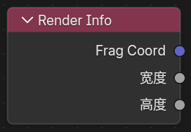
	<br>
</div>

#### Outputs

- `Frag Coord`
- `Width`
- `Height`

#### Purpose

Provides the coordinate and pixel size of the current Eevee render window.

#### Notes

- `Frag Coord.xy` is normalized screen UV in `0-1`
- `Frag Coord.z` is the current fragment depth
- `Width` / `Height` are the current render-region pixel dimensions

### Scene Time

#### Entry

`Add > Input > Scene Time`

<div align="center">
	
	<br>
</div>

#### Input

- `Scale`

#### Outputs

- `Frame`
- `Seconds`
- `Timeline`
- `Scaled Frame`

#### Purpose

Provides time-related values from the current scene.

### Screen Derivative

#### Entry

`Add > Utilities > Math > Screen Derivative`

<div align="center">
	
	<br>
</div>

#### Feature

Gets the difference between neighboring pixels in screen space:

- `DDX`
- `DDY`
- `DDXY`

where `DDXY` means `DDX + DDY`.

### Portal In / Portal Out

#### Entry

- `Add > Layout > Portal In`
- `Add > Layout > Portal Out`

<div align="center">
	
	<br>
</div>

#### Feature Description

These are “portal” nodes used to organize node links.

#### Notes

- `Portal In`: stores a named, typed value in the current node tree
- `Portal Out`: retrieves that value later by name inside the same node tree
- Creating a new `Portal In` generates a unique name automatically
- `Portal Out` includes a magnifier button that jumps to the matching `Portal In`
- Portals are only recognized inside the same shader node tree and do not automatically pass through node groups

## 3. Eevee Object Material Nodes

### Outline Control

#### Entry

`Add > Output > Outline Control`

Available in `Eevee` object materials and `NPR Tree`.

#### Inputs

- `Line Color`
- `Line Alpha`
- `Line Width`
- `Depth Threshold`
- `Normal Threshold`
- `Outline ID`

#### Purpose

Writes outline parameters for Eevee's built-in screen-space outline pass.

#### Basic Workflow

1. Add `Outline Control` to a material that should contribute outlines.
2. Use `Line Color`, `Line Alpha`, and `Line Width` to control the visible stroke.
3. Use `Depth Threshold` and `Normal Threshold` to tune silhouette edges versus internal edge detection.
4. Keep `Render Properties > Outline` enabled globally.
5. Enable `View Layer Properties > Passes > Data > Outline` when the outline result should be available as a separate pass.

#### Notes

- This is an auxiliary output node; it does not replace `Material Output`
- `Line Alpha` is multiplied with `Line Color.a`, and together they determine final opacity
- If `Line Width <= 0` or the final alpha resolves to `0`, nothing is written
- `Outline ID = 0` uses automatic grouping from the object resource ID
- `Outline ID > 0` can be used to force multiple objects or surfaces into the same outline group
- `Depth Threshold` is more related to depth discontinuity edges, while `Normal Threshold` is more related to internal edges from normal variation
- Objects in Holdout collections no longer write `Outline Control` parameters and no longer contribute Freestyle / marked-edge outline seeds

#### Suggested Images

- `images/placeholder_outline_control.png`
  - Suggested content: the `Outline Control` node with a representative parameter setup

### Render Texture

#### Entry

`Add > Texture > Render Texture`

<div align="center">
	
	<br>
</div>

#### Purpose

Reads a `Render Textures` entry configured in the scene.

#### Inputs / Outputs

- Input: `Vector`
- Outputs: `Color`, `Alpha`

### Screenspace Info

#### Entry

`Add > Input > Screenspace Info`

<div align="center">
	
	<br>
</div>

#### Inputs / Outputs

- Input: `View Position`
- Outputs: `Scene Color`, `Scene Depth`

#### Purpose

Reads color or depth from the current render buffer.

#### Usage Notes

- `Raytracing` must be enabled in render settings
- Material `Render Method` must be set to `Dithered`
- `Raytraced Transmission` must be enabled
- The default `View Position` input transforms the current position into camera space and then flips the `Z` axis

### World Environment

#### Entry

`Add > Input > World Environment`

<div align="center">
	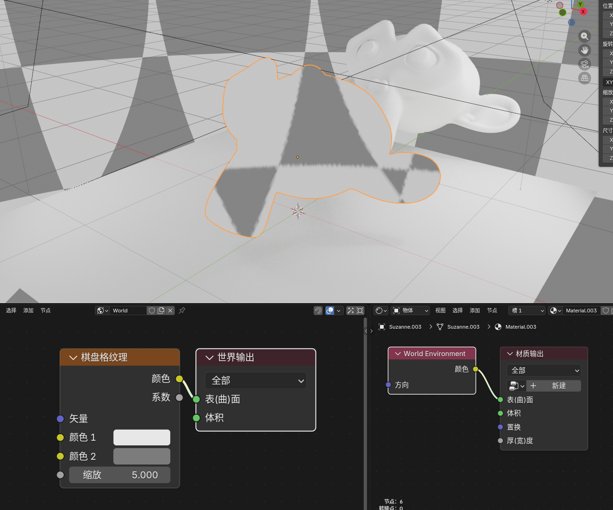
	<br>
</div>

#### Inputs / Outputs

- Input: `Direction`
- Output: `Color`

#### Purpose

Directly samples the `Eevee` world environment color without depending on whether geometry exists behind the screen.

#### Notes

- If `Direction` is not connected, the current surface view direction is used
- If `Direction` is connected, the world environment is sampled in that direction
- The result is closer to Eevee environment / probe lighting than to a screen-space buffer

### Light Probe Color

#### Entry

`Add > Input > Light Probe Color`

#### Inputs / Outputs

- Input: `Direction`
- Outputs: `Reflection`, `Irradiance`, `Combined`

#### Purpose

Reads the currently available Eevee lighting-probe result directly, splitting it into reflection, irradiance, and combined outputs.

### World To Tangent

#### Entry

`Add > Utilities > Vector > World To Tangent`

<div align="center">
	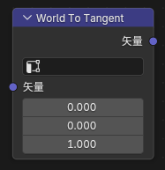
	<br>
</div>

#### Inputs / Outputs

- Input: `Vector`
- Output: `Vector`

#### Purpose

Converts a world-space direction vector into the tangent space of the current surface.

#### Notes

- A `UV Map` can be chosen in the node panel, and the tangent of that UV is used as the basis
- This is useful for anisotropic direction control, tangent-space flow, and local scan-direction effects

### GLSL Function

#### Entry

`Add > Script > GLSL Function`

Available in both `Eevee` object materials and `NPR Tree`.

<div align="center">
	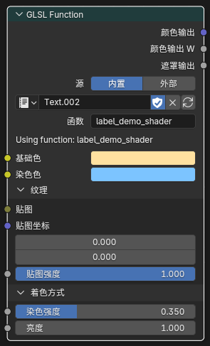
	<br>
</div>

#### Purpose

Injects a user-authored GLSL function into the current `Eevee / NPR` material compile path. This is useful for custom math nodes, procedural textures, SDF logic, screen-space effects, and porting parts of external GLSL / HLSL code.

#### Basic Workflow

1. Prepare a GLSL function in the `Text Editor` or point the node to an external `.glsl` file.
2. Add a `GLSL Function` node.
3. Choose the source and the target function in the node panel.
4. Refresh the node after editing the source.
5. Explicitly select the exported function name in `Function`.

#### Example Project

- GLSL Function example `.blend` project:
  [Google Drive](https://drive.google.com/file/d/1dHtj8ZHMT9s2rPHAzfXm7gE7SbQqj-GT/view?usp=sharing)
- This file is intended as a ready-made reference scene for the current `GLSL Function` workflow and node setup.

#### Supported Boundary Types

- Input parameters: `float`, `int`, `bool`, `vec2`, `vec3`, `vec4`, `sampler2D`
- Output parameters: `out float`, `out int`, `out bool`, `out vec2`, `out vec3`, `out vec4`
- Return values: `void`, `float`, `int`, `bool`, `vec2`, `vec3`, `vec4`

#### Important Notes

- `Function` is not auto-selected and must be chosen explicitly
- `sampler2D` appears as a `Closure` input
- `sampler2D` can be connected to `Image to Closure` or a compatible `Closure Output`
- `Closure Output -> sampler2D` currently guarantees only the direct `texture(tex, uv)` path
- If the function depends on `textureLod`, `textureGrad`, `textureSize`, or `texelFetch`, prefer driving it with `Image to Closure`
- `@glsl_meta` supports `default`, `min`, `max`, `hide_value`, `subtype`, `label`, `description`, and one-level panel groups
- Supported `subtype` values for `float`: `none`, `unsigned`, `percentage`, `factor`, `mass`, `angle`, `time`, `time_absolute`, `distance`, `wavelength`
- Supported `subtype` values for `vec2 / vec3 / vec4`: `none`, `factor`, `percentage`, `translation`, `direction`, `velocity`, `acceleration`, `euler`, `xyz`
- `subtype=color` is additionally supported for `vec3` and `vec4`
- `@glsl_meta default=` also accepts expressions such as `glsl_position()`, `normalize(glsl_normal())`, or `glsl_ambient_lighting()`
- When `@glsl_meta default=` uses an expression, an unconnected socket evaluates that expression, while a connected socket uses the link value and hides the static value field automatically
- Expression defaults are recommended only for `float / vec2 / vec3 / vec4` inputs and should not directly reference other exported parameters
- `label="..."` sets the socket display name in the node UI, supports quoted single-line text with spaces, and does not change the GLSL parameter name or socket identifier
- `description="..."` adds a tooltip description to an input socket and supports quoted single-line text with spaces
- `@panel "Name" closed=true|false` groups following inputs into one-level collapsible panels and must be closed with `@end_panel`
- Panels support one level only; empty `param:` rows can be used inside a panel for grouping without changing defaults
- `sampler2D` can use `label`, `description`, and panel grouping, but does not support `default / min / max / hide_value / subtype`
- Only `vec3 / vec4` inputs explicitly marked with `subtype=color` become color sockets
- `vec3 + subtype=color` enters GLSL as `rgb` with `alpha = 1.0`
- `vec4 + subtype=color` keeps full `rgba`
- Refreshing or recompiling the node preserves the `w` component of `vec4` inputs instead of degrading them to `vec3 / rgb`
- Exported boundary types do not currently support `mat*`, `struct`, or `array`
- `int / bool` boundaries are useful for mode switches, enums, and `lightgroup_id` style parameters
- Built-in geometry helpers are available in the function body: `glsl_position()`, `glsl_normal()`, `glsl_true_normal()`, `glsl_incoming()`
- Built-in ambient-light helper: `glsl_ambient_lighting()`
- Built-in direct-light helpers: `GLSLLight`, `glsl_light_count()`, `glsl_light_get(light_index)`, `glsl_light_shadow(light_index, shading_normal)`
- `GLSLLight.lightgroup_id` maps directly to the light data panel `Lightgroup ID`
- `GLSLLight.attenuation` is a base attenuation term for custom per-light models; it does not include `NdotL`, toon ramps, Blinn-Phong, GGX, shadows, or material-side Fresnel / metallic / roughness behavior
- If the light node tree uses `Light Shader Output`, `glsl_light_get(i).diffuse_color`, `glsl_light_get(i).specular_color`, and `glsl_light_get(i).attenuation` read the Light Shader evaluated color and attenuation
- `Light Shader Output` affects only those color / attenuation fields; `type`, `index`, `lightgroup_id`, `vector`, `position`, `direction`, and `distance` still come from raw Eevee light data
- Without a Light Shader output, `GLSLLight` keeps the normal Eevee light-access behavior
- These direct-light helpers target Eevee object materials and `NPR Tree` Surface/Fragment paths; `Filter`, `World`, volume, probe / indirect lighting are not stable public helper semantics
- Recommended diffuse pattern: `light.diffuse_color * light.attenuation * max(dot(N, light.vector), 0.0) * glsl_light_shadow(...)`
- Recommended specular pattern: `light.specular_color * light.attenuation * custom_spec_term * glsl_light_shadow(...)`

#### Example: Parameter Meta with Descriptions and Panels

`label="..."` is shown as the socket name. `description="..."` is shown as the input socket tooltip. `@panel` groups many inputs into one-level collapsible panels on the node.

```glsl
/* @glsl_meta v1
base_color: label="Base Color" default=vec3(1.0) subtype=color description="Base surface color"

@panel Specular closed=true
specular: label="Specular Strength" default=0.5 min=0.0 max=1.0 subtype=factor description="Specular strength"
roughness: label="Roughness" default=0.45 min=0.0 max=1.0 subtype=factor description="Highlight roughness"
@end_panel

@panel Texture closed=true
tex: label="Texture" description="Texture closure used by texture(tex, uv)"
uv: label="Coordinates" default=vec2(0.0) description="Texture coordinates"
@end_panel
*/
vec4 annotated_shader(vec3 base_color, float specular, float roughness, sampler2D tex, vec2 uv)
{
  vec3 tex_color = texture(tex, uv).rgb;
  vec3 color = mix(base_color, tex_color, specular * (1.0 - roughness));
  return vec4(color, 1.0);
}
```

- `label` and `description` affect UI only and do not change socket identifiers, default synchronization, or GLSL calls
- `out` parameters support `label` only; other meta properties are still input-only
- `sampler2D` can use `label`, `description`, and panel grouping, but does not support `default / min / max / hide_value / subtype`
- Panels support one level only, cannot be nested, and must be closed explicitly with `@end_panel`

#### Example: `mode` Debug Mapping

If you want one `GLSL Function` node to switch between helper outputs with a single `mode` parameter, this mapping is the current reference:

| `mode` | Helper / Field |
| --- | --- |
| `0` | `glsl_position()` |
| `1` | `glsl_normal()` |
| `2` | `glsl_true_normal()` |
| `3` | `glsl_incoming()` |
| `4` | `glsl_ambient_lighting()` |
| `5` | `glsl_light_count()` |
| `6` | `light.valid` |
| `7` | `light.type` |
| `8` | `light.lightgroup_id` |
| `9` | `light.vector` |
| `10` | `light.position` |
| `11` | `light.direction` |
| `12` | `light.distance` |
| `13` | `light.diffuse_color` |
| `14` | `light.specular_color` |
| `15` | `light.attenuation` |
| `16` | `glsl_light_shadow(i, N)` |

#### Example: Filter by `lightgroup_id`

You can filter Eevee direct lights inside `GLSL Function` by reading `GLSLLight.lightgroup_id`.

Function name suggestion: `lightgroup_lambert`. This version also demonstrates `subtype=color`, `int` / `bool` defaults, `description`, `min` / `max`, `subtype=factor`, and `@panel`:

```glsl
/* @glsl_meta v1
albedo: default=vec3(1.0) subtype=color description="Diffuse albedo for the selected light group"
target_lightgroup_id: default=0 description="Only lights with this Lightgroup ID are included"

@panel Shading closed=false
use_shadow: default=true description="Apply glsl_light_shadow to selected lights"
shadow_strength: default=1.0 min=0.0 max=1.0 subtype=factor description="Blend from unshadowed to fully shadowed direct light"
ambient_floor: default=0.0 min=0.0 max=1.0 subtype=factor description="Small constant fill after lightgroup filtering"
@end_panel
*/
vec4 lightgroup_lambert(vec3 albedo,
                        int target_lightgroup_id,
                        bool use_shadow,
                        float shadow_strength,
                        float ambient_floor)
{
  vec3 N = normalize(glsl_normal());
  vec3 result = vec3(0.0);
  float shadow_mix = clamp(shadow_strength, 0.0, 1.0);

  for (int i = 0; i < glsl_light_count(); i++) {
    GLSLLight light = glsl_light_get(i);
    if (!light.valid) {
      continue;
    }
    if (light.lightgroup_id != target_lightgroup_id) {
      continue;
    }

    float NdotL = max(dot(N, light.vector), 0.0);
    if (NdotL <= 0.0) {
      continue;
    }

    float shadow = use_shadow ? glsl_light_shadow(i, N) : 1.0;
    shadow = mix(1.0, shadow, shadow_mix);
    result += albedo *
              light.diffuse_color *
              light.attenuation *
              NdotL *
              shadow;
  }

  result += albedo * clamp(ambient_floor, 0.0, 1.0);
  return vec4(result, 1.0);
}
```

Notes:

- `target_lightgroup_id` maps directly to the light data panel's `Lightgroup ID`
- To exclude one light group instead, change the test to `if (light.lightgroup_id == target_lightgroup_id) continue;`
- `use_shadow`, `shadow_strength`, and `ambient_floor` show common boolean input, factor range, and panel grouping patterns
- This filtering only affects the per-light model you write in this function; it does not change Eevee's regular material lighting path

#### Example: PBR-Style Direct Light + Ambient Light

This example shows how the current `GLSL Function` workflow can combine:

- Geometry helpers: `glsl_normal()`, `glsl_true_normal()`, `glsl_incoming()`
- Ambient-light helper: `glsl_ambient_lighting()`
- Per-light helpers: `glsl_light_count()`, `glsl_light_get(i)`, `glsl_light_shadow(i, N)`

Function name suggestion: `pbr_lit`. This version groups common surface parameters in the `Surface` panel and exposes built-in helpers as expression defaults that can still be overridden by connected sockets:

```glsl
/* @glsl_meta v1
base_color: default=vec3(0.8, 0.72, 0.6) subtype=color description="Base surface albedo"

@panel Surface closed=false
roughness: default=0.45 min=0.04 max=1.0 subtype=factor description="Microfacet roughness"
metallic: default=0.0 min=0.0 max=1.0 subtype=factor description="Metallic blend amount"
ao: default=1.0 min=0.0 max=1.0 subtype=factor description="Ambient occlusion multiplier"
@end_panel

@panel Builtin Helpers closed=true
normal_ws: default=normalize(glsl_normal()) hide_value=true description="Optional world-space shading normal override"
view_ws: default=normalize(glsl_incoming()) hide_value=true description="Optional world-space view direction override"
ambient_light: default=glsl_ambient_lighting() subtype=color hide_value=true description="Optional ambient lighting override"
@end_panel
*/
float saturate1(float x)
{
  return clamp(x, 0.0, 1.0);
}

float pow5(float x)
{
  float x2 = x * x;
  return x2 * x2 * x;
}

vec3 fresnel_schlick(float cos_theta, vec3 F0)
{
  return F0 + (vec3(1.0) - F0) * pow5(1.0 - saturate1(cos_theta));
}

float distribution_ggx(float NdotH, float roughness)
{
  float a = roughness * roughness;
  float a2 = a * a;
  float nh2 = NdotH * NdotH;
  float denom = nh2 * (a2 - 1.0) + 1.0;
  return a2 / max(3.14159265 * denom * denom, 1e-6);
}

float geometry_schlick_ggx(float NdotV, float roughness)
{
  float r = roughness + 1.0;
  float k = (r * r) / 8.0;
  return NdotV / max(NdotV * (1.0 - k) + k, 1e-6);
}

float geometry_smith(float NdotV, float NdotL, float roughness)
{
  return geometry_schlick_ggx(NdotV, roughness) *
         geometry_schlick_ggx(NdotL, roughness);
}

vec4 pbr_lit(vec3 base_color,
             float roughness,
             float metallic,
             float ao,
             vec3 normal_ws,
             vec3 view_ws,
             vec3 ambient_light)
{
  vec3 N = normalize(normal_ws);
  vec3 Ng = normalize(glsl_true_normal());
  vec3 V = normalize(view_ws);

  if (dot(N, Ng) < 0.0) {
    N = Ng;
  }

  roughness = clamp(roughness, 0.04, 1.0);
  metallic = clamp(metallic, 0.0, 1.0);
  ao = clamp(ao, 0.0, 1.0);

  vec3 F0 = mix(vec3(0.04), base_color, metallic);

  vec3 direct_diffuse = vec3(0.0);
  vec3 direct_specular = vec3(0.0);

  for (int i = 0; i < glsl_light_count(); i++) {
    GLSLLight light = glsl_light_get(i);
    vec3 L = normalize(light.vector);
    vec3 H = normalize(V + L);

    float NdotL = saturate1(dot(N, L));
    float NdotV = saturate1(dot(N, V));
    float NdotH = saturate1(dot(N, H));
    float VdotH = saturate1(dot(V, H));

    if (NdotL <= 1e-5 || NdotV <= 1e-5) {
      continue;
    }

    float shadow = glsl_light_shadow(i, N);

    vec3 F = fresnel_schlick(VdotH, F0);
    float D = distribution_ggx(NdotH, roughness);
    float G = geometry_smith(NdotV, NdotL, roughness);

    vec3 specular_brdf = (D * G * F) / max(4.0 * NdotV * NdotL, 1e-5);
    vec3 kd = (vec3(1.0) - F) * (1.0 - metallic);
    vec3 diffuse_brdf = kd * base_color / 3.14159265;

    direct_diffuse += diffuse_brdf *
                      light.diffuse_color *
                      light.attenuation *
                      NdotL *
                      shadow;

    direct_specular += specular_brdf *
                       light.specular_color *
                       light.attenuation *
                       NdotL *
                       shadow;
  }

  vec3 ambient = ambient_light * base_color * (1.0 - metallic) * ao;
  vec3 color = ambient + direct_diffuse + direct_specular;
  return vec4(max(color, vec3(0.0)), 1.0);
}
```

Notes:

- `normal_ws`, `view_ws`, and `ambient_light` use expression defaults; unconnected sockets call the built-in helpers, while connected sockets use the external override
- `hide_value=true` is useful for helper override inputs so the node does not show a misleading static default value

### GLSL Script Expression

#### Entry

`Add > Script > GLSL Script Expression`

Available in both `Eevee` object materials and `NPR Tree`.

<div align="center">
	
	<br>
</div>

#### Purpose

Evaluates one single-line GLSL expression and publishes it as a `Result` output. This is useful for simple math, color mixing, vector recomposition, and debugging formulas without creating a separate Text data-block or external `.glsl` file.

#### Node Settings

- `Output Type`
  - `Float`
  - `Vector`
  - `Color`
- `Expression`: the single GLSL expression assigned to `Result`
- `Variables`: a manually maintained list of input variables; each variable becomes a node input socket
- Each variable can be `Float`, `Vector`, or `Color`

#### Basic Workflow

1. Add a `GLSL Script Expression` node.
2. Set `Output Type`.
3. Add variables in the `Variables` panel, then set each variable name and type.
4. Reference those variable names directly from `Expression`.
5. Connect `Result` to the downstream node chain.

#### Example

```glsl
mix(base_color, tint_color, clamp(mask, 0.0, 1.0))
```

Matching variables:

- `base_color`: `Color`
- `tint_color`: `Color`
- `mask`: `Float`
- `Output Type`: `Color`

#### Limits

- Only one expression is allowed; `;`, `{}`, preprocessor directives, and multi-statement blocks are rejected
- Assignment, increment / decrement, control flow, declarations, and comments are rejected
- The expression is numeric GLSL only; strings, samplers, texture sampling functions, and image load/store are not supported
- `GLSL Function` helpers such as `glsl_position()`, `glsl_normal()`, and `glsl_light_get()` cannot be called directly
- Variable names are normalized to valid GLSL identifiers; reserved words, `gl_` prefixes, and internal helper names are avoided automatically
- Use `GLSL Function` instead when a node needs functions, textures, direct-light helpers, `sampler2D`, or complex control flow

### Image to Closure

#### Entry

`Add > Texture > Image to Closure`

Available in both `Eevee` object materials and `NPR Tree`.

<div align="center">
	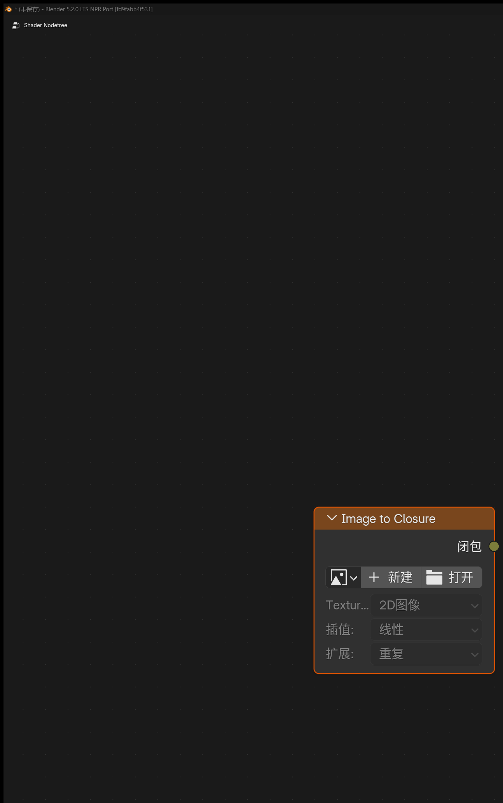
	<br>
</div>

#### Output

- `Closure`

#### Purpose

Wraps a regular image as a closure-backed source for `sampler2D`, mainly for feeding `GLSL Function(sampler2D)` inputs while keeping the same wiring style as procedural `Closure Output` sources.

#### Node Settings

- `Image`
- `Interpolation`
- `Extension`

#### Usage Notes

- This node does not expose a normal image socket; the image is selected directly in the node panel
- It is an adapter for `sampler2D` workflows, not a replacement for `Image Texture`
- Prefer it when a function needs image-resource specific sampling behavior

### Basis Transform

#### Entry

`Add > Utilities > Vector > Basis Transform`

<div align="center">
	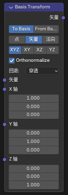
	<br>
</div>

#### Purpose

Transforms points, vectors, or normals to or from a custom basis defined by `Origin + axis inputs`.

#### Inputs / Outputs

- Inputs: `Vector`, `Origin`, `X Axis`, `Y Axis`, `Z Axis`
- Output: `Vector`

#### Panel Options

- `Direction`
  - `To Basis`
  - `From Basis`
- `Vector Type`
  - `Point`
  - `Vector`
  - `Normal`
- `Basis Input`
  - `XY`
  - `XZ`
  - `YZ`
  - `XYZ`
- `Orthonormalize`
- `Fallback`

#### Notes

- `Point` mode uses `Origin` as the translation reference, while `Vector` and `Normal` only transform direction
- `Basis Input` can derive the missing axis from two supplied axes, or use explicit `XYZ`
- `Orthonormalize` helps stabilize imperfect or non-orthogonal input axes
- Useful for local basis projection, procedural texture orientation, anisotropic direction control, and custom normal-space conversion

### Twirl

#### Entry

`Add > Utilities > Vector > Twirl`

<div align="center">
	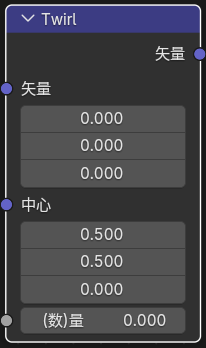
	<br>
</div>

#### Inputs / Outputs

- Inputs: `Vector`, `Center`, `Amount`
- Output: `Vector`

#### Purpose

Twists the input coordinate field around a chosen center. This is useful for Goo Engine style swirls, distorted UVs, and radial deformations.

### Water Ripples

#### Entry

`Add > Texture > Water Ripples`

<div align="center">
	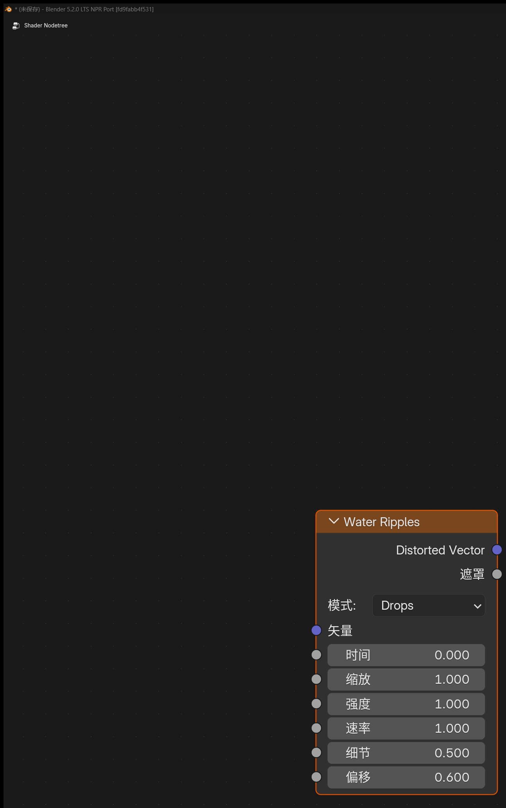
	<br>
</div>

#### Inputs / Outputs

- Inputs: `Vector`, `Time`, `Scale`, `Intensity`, `Speed`, `Detail`, `Bias`
- Outputs: `Distorted Vector`, `Mask`

#### Panel Options

- `Mode`
  - `Drops`
  - `Ripples`
  - `Flow`
  - `Caustic`

#### Purpose

Generates procedural ripple distortion and a ripple mask.

### Hex Grid Texture

#### Entry

`Add > Texture > Hex Grid Texture`

<div align="center">
	
	<br>
</div>

#### Inputs

- `Vector`
- `Scale`
- `Size`
- `Radius`
- `Roundness`

#### Outputs

- `Value`
- `Color`
- `Hex Coords`
- `Position`
- `Cell UV`
- `Cell ID`

#### Panel Options

- `Coordinate Mode`
  - `XY Position`
  - `Hex Position`
- `Value Mode`
  - `Hexagons`
  - `SDF Hexagons`
  - `Dots`
- `Direction`
  - `Horizontal`
  - `Vertical`
  - `Horizontal Tiled`
  - `Vertical Tiled`
- `Clamp`

#### Purpose

Generates a hex-grid texture that can be used for honeycomb patterns, cell partitioning, SDF masks, and hex-coordinate based lookups.

### SDF Primitive

#### Entry

`Add > Texture > SDF Primitive`

<div align="center">
	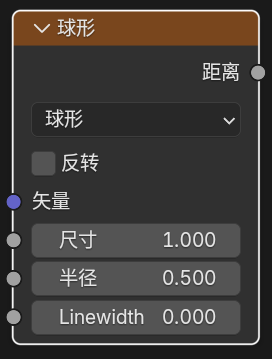
	<br>
</div>

#### Output

- `Distance`

#### Purpose

Generates signed-distance-field base shapes directly inside material nodes.

### SDF Operator

#### Entry

`Add > Converter > SDF Operator`

<div align="center">
	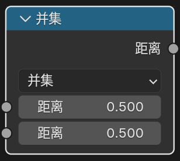
	<br>
</div>

#### Output

- `Distance`

#### Purpose

Combines, trims, and reshapes one or two SDF distance fields.

### SDF Vector Operator

#### Entry

`Add > Utilities > Vector > SDF Vector Operator`

<div align="center">
	
	<br>
</div>

#### Outputs

- `Vector`
- `Position`
- `Value`

#### Purpose

Preprocesses coordinate, UV, or vector domains before they are fed into `SDF Primitive`.

## 4. Goo Engine / NPR-Oriented Input Nodes

### Bevel

#### Entry

`Add > Input > Bevel`

<div align="center">
	
	<br>
</div>

#### Inputs / Outputs

- Inputs: `Radius`, `Normal`
- Output: `Normal`

#### Purpose

Generates an approximate beveled normal in `Eevee` so hard edges can look smoother.

### Curvature

#### Entry

`Add > Input > Curvature`

<div align="center">
	
	<br>
</div>

#### Inputs

- `Samples`
- `Sample Radius`
- `Thickness`
- `Scale`

#### Outputs

- `Scene Curvature`
- `Scene Rim`

#### Panel Options

- `Local`
- `Sample Radius`
  - `Pixel`
  - `View`

#### Notes

- `Local` tries to keep the evaluation focused on the current object
- In `Pixel` mode, `Sample Radius` is interpreted in pixels and therefore changes with render resolution
- In `View` mode, `Sample Radius` is interpreted relative to the view, which helps keep rim width more consistent between viewport and final render
- This is still a screen-space node, so the result depends on camera view, resolution, and sampling radius

### Shader Info

#### Entry

`Add > Input > Shader Info`

<div align="center">
	
	<br>
</div>

#### Inputs

- `World Position`
- `Normal`
- `Exponent`

#### Outputs

- `Diffuse Shading`
- `Shadow`
- `Ambient Lighting`
- `Half-Lambert Factor`
- `Blinn-Phong Factor`

#### Meaning of Each Output

- `Diffuse Shading`: the summed Lambert diffuse term from valid lights, clamped to `0-1`
- `Shadow`: switchable shadow evaluation output
- `Ambient Lighting`: probe / environment indirect-light contribution
- `Half-Lambert Factor`: summed half-Lambert diffuse term, clamped to `0-1`
- `Blinn-Phong Factor`: averaged Blinn-Phong highlight factor weighted by each light's specular channel, clamped to `0-1`

#### Notes

- `Shadow Mode`
  - `Built-in`
  - `Soft Filtered`
- `Soft Filtered` samples a local neighborhood around the current surface to rebuild smoother gray penumbra from Eevee's dithered black/white shadow result
- `Blinn-Phong Factor` does not automatically include shadow; multiply it with `Shadow` when needed
- `Exponent` controls highlight sharpness and defaults to `16`
- The node panel includes a `Lightgroup` control
- Only lights with the same `Lightgroup ID` participate in this `Shader Info` node
- World-sun style interference is excluded from these direct-light outputs

### Light Info

#### Entry

`Add > Input > Light Info`

<div align="center">
	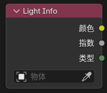
	<br>
</div>

#### Feature Description

Reads information from a selected light.

#### Fixed Outputs

- `Color`
- `Power`
- `Type`

`Type` is an integer socket with the following values:

- `-1`: no light assigned
- `0`: Point
- `1`: Sun
- `2`: Spot
- `3`: Area

#### Outputs That Appear by Light Type

- `Position`
- `Direction`
- `Radius`
- `Spot Size`
- `Sun Angle`

Current behavior depends on the selected light type:

- `Point`: `Position`, `Radius`
- `Sun`: `Direction`, `Sun Angle`
- `Spot`: `Position`, `Direction`, `Radius`, `Spot Size`
- `Area`: `Position`, `Direction`, `Radius`

#### Notes

- For per-light processing, use `For Each Light` in the `NPR Tree`

### Light Shader Info / Light Shader Output

#### Entry

Use these nodes in an Eevee Light Shader node tree:

- `Add > Input > Light Shader Info`
- `Add > Output > Light Shader Output`

#### Feature Description

`Light Shader Output` lets a single Eevee light output custom direct-light color, intensity, and attenuation. It is used only in light node trees, not as a regular object material output.

<div align="center">
	
	<br>
	<sub>Light Shader Info and Light Shader Output in a light node tree</sub>
</div>

#### Light Shader Info Outputs

- `Default Color`
- `Default Intensity`
- `Default Attenuation`
- `Distance`
- `Light Space`
- `Direction`
- `World Position`
- `Rotation`

These outputs expose the current light's default data at the evaluated sample point and are meant as source inputs for custom light shaders.

#### Light Shader Output Inputs and Settings

- `Color`: output light color
- `Intensity`: non-negative multiplier applied to `Color`
- `Attenuation`: non-negative value written to the Light Shader cache alpha channel
- `Range Scale`: scales the Eevee light influence radius used for culling and shadow usage; `1` keeps the original light range

The written Light Shader result has this meaning:

```glsl
vec4(Color.rgb * max(Intensity, 0.0), max(Attenuation, 0.0))
```

#### Behavior

- Lights without a custom Light Shader output keep normal Eevee lighting behavior
- The Light Shader result participates in the connected Eevee direct-light paths, including surface, deferred / NPR, forward, volume, and probe capture paths
- In Surface material paths, `GLSL Function` `glsl_light_get(i)` reads the evaluated Light Shader color and attenuation
- `GLSL Function` applies the Light Shader result only to `diffuse_color`, `specular_color`, and `attenuation`; light type, position, direction, distance, and `lightgroup_id` remain raw light data
- Volume, probe bake, and surfel paths can use Light Shader Output for Eevee lighting, but they do not extend the public `GLSL Function` light-helper semantics

<div align="center">
	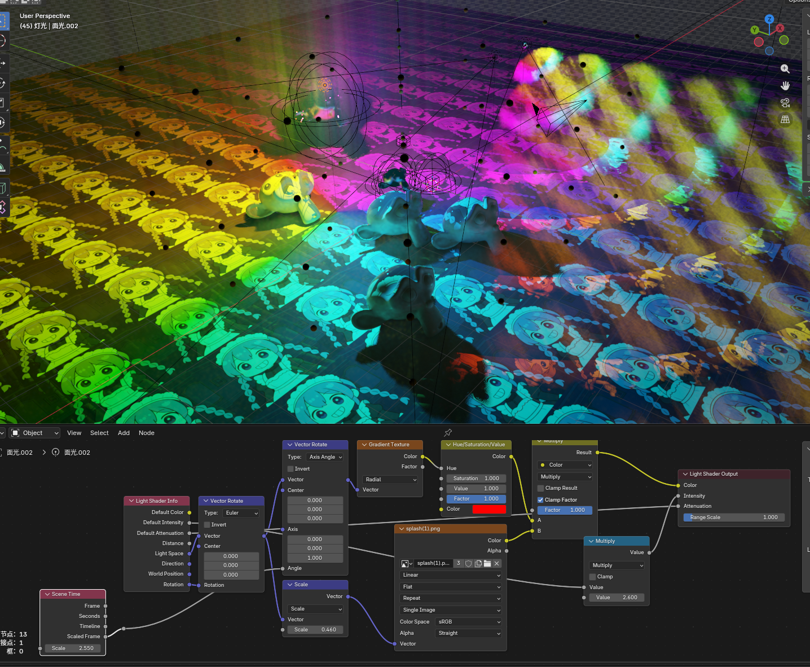
	<br>
	<sub>Example effect of Light Shader Output on light color and attenuation</sub>
</div>

## 5. Built-In Node Enhancements

### OKLab Color Ramp

#### Entry

`Add > Color > OKLab Color Ramp`

<div align="center">
	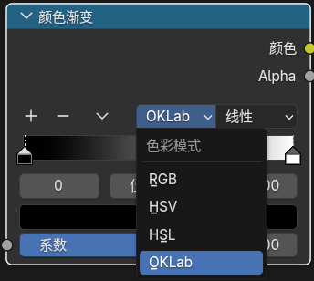
	<br>
</div>

#### Purpose

The standalone `OKLab Color Ramp` node always evaluates the ramp in the OKLab color space, giving more stable and perceptually smoother color transitions.

#### Notes

- Regular `Color Ramp` keeps the existing RGB / HSV / HSL workflow
- `OKLab Color Ramp` uses the same input, output, and stop-editing workflow as regular `Color Ramp`
- Older files saved as `Color Ramp + OKLab` mode are migrated back to the standalone `OKLab Color Ramp` node when opened
- The node is available in Shader, Geometry, Compositor, and Eevee Light Shader supported node trees
