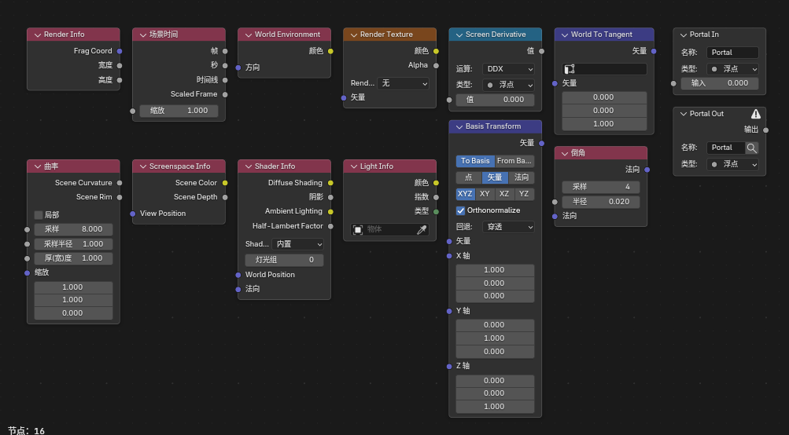
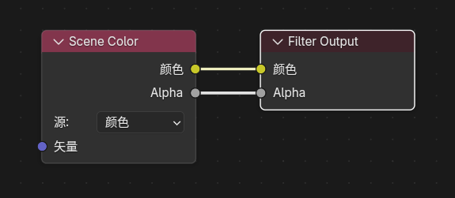

# Blender 5.1 NPR Port - Features and Usage Guide

## Project Introduction

`Blender 5.1 NPR Port` is an NPR-focused `Blender` branch. In addition to integrating characteristic nodes from `Goo Engine` and the `4.4 NPR-prototype`, it adds a set of Eevee-oriented extension nodes, filter workflows, and interface improvements.

Most features are `Eevee`-only and do not support `Cycles`.

## Documentation Scope

This document describes the NPR / Eevee extension features that have been added to the current `Blender 5.1 NPR Port` branch compared with official `Blender 5.1`, together with their basic usage.

## Node Overview

    
     
    Shader Nodes

    
     
    NPR Tree Nodes (some shader nodes can also be used inside NPR Tree)

    
     
    Filter Nodes

- **Scene-Level Extensions**

    ---

    Start with the scene-level Eevee extensions to understand the core features.

    [View Scene-Level Extensions →](scene-extensions.md)

- **Extended Nodes**

    ---

    Dive into the functionality of each newly added node.

    [View Extended Nodes →](extended-nodes.md)

- **NPR Workflow**

    ---

    Learn how the NPR Tree workflow is organized.

    [View NPR Workflow →](npr-workflow.md)

- **Interface & Settings**

    ---

    Check additional interface options and workflow settings.

    [View Interface & Settings →](interface-guide.md)

## Main Feature Categories

### 1. Scene-Level Eevee Extensions

- `Render Textures`
- `Filter Materials`
- `Eevee Outline`
- `AOV Input / AOV Output` in the `Filter` domain

### 2. Shader Nodes

- `Filter Object Info`
- `Filter Mask`
- `Scene Color`
- `Render Info`
- `Scene Time`
- `Screen Derivative`
- `Portal In / Portal Out`
- `Outline Control`
- `Screenspace Info`
- `World Environment`
- `Light Probe Color`
- `World To Tangent`
- `GLSL Function`
- `Image to Closure`
- `Light Shader Info`
- `Light Shader Output`
- `Basis Transform`
- `Twirl`
- `Water Ripples`
- `Hex Grid Texture`
- `SDF Primitive`
- `SDF Operator`
- `SDF Vector Operator`
- `Bevel`
- `Curvature`
- `Shader Info`
- `Light Info`
- `OKLab` mode in `Color Ramp`

### 3. NPR Workflow

- `NPR Input`
- `NPR Refraction`
- `Image Sample`
- `For Each Light`
- Built-in node-group assets

### 4. Interface & Settings

- `Eevee Performance` Outliner view
- Material preview control
- Material face culling
- Material `ZTest / Stencil / Color Write / Depth Write`
- Lightgroup management
- Sun `Shadow Map Scale`
- Splash version tag
- Pose bone Outliner visibility

!!! warning "Eevee Only"
    All NPR Port features require the **Eevee render engine**. `Cycles` is not supported.
