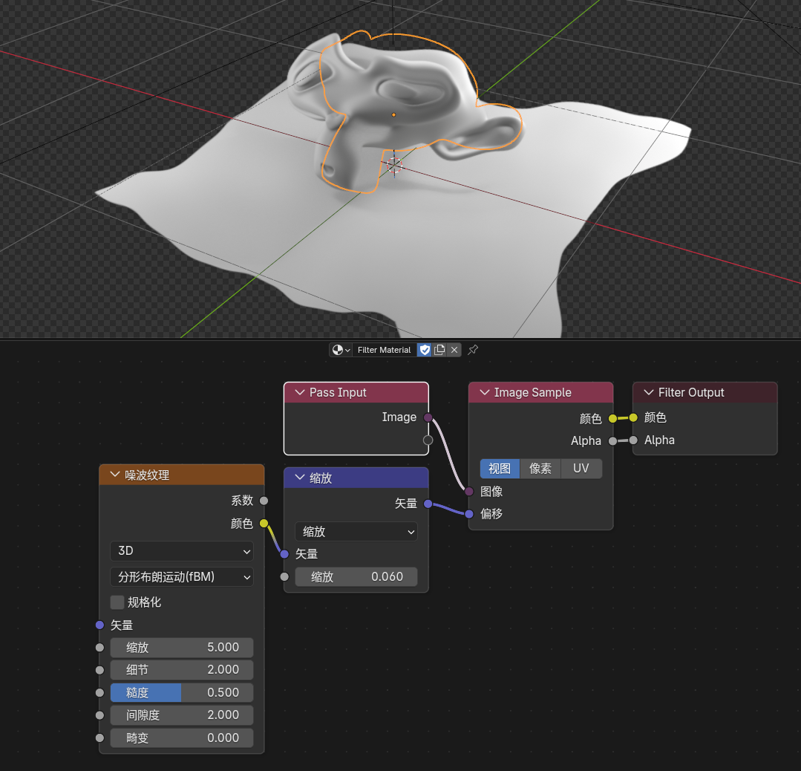
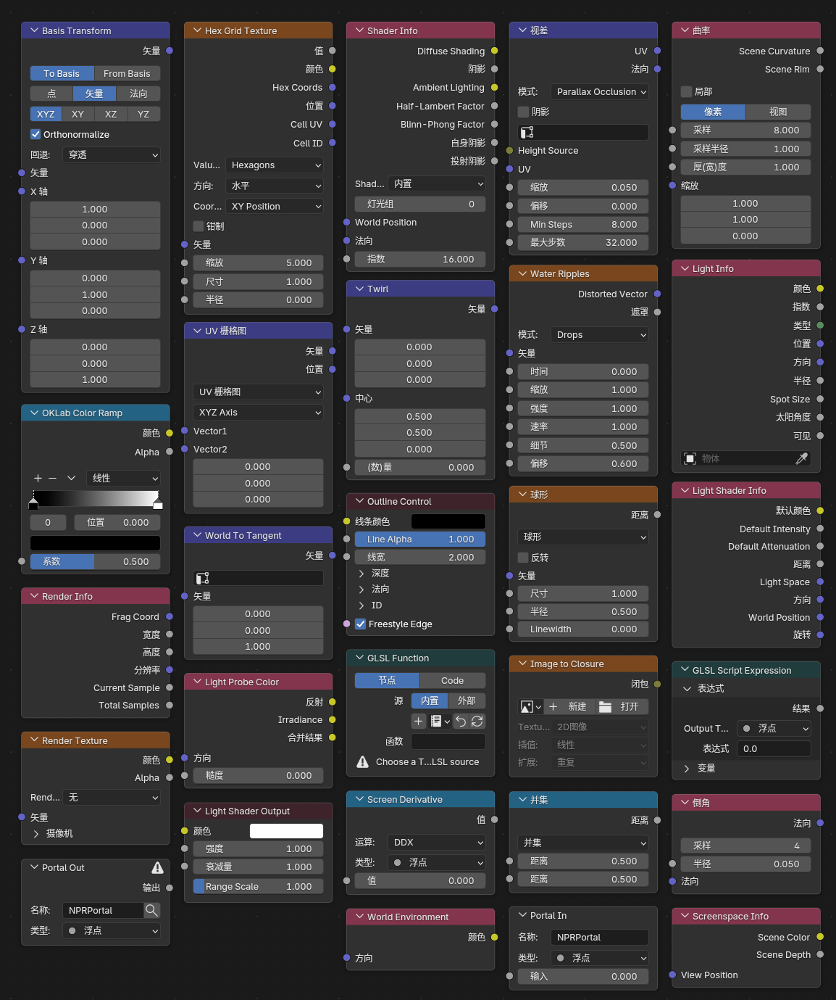
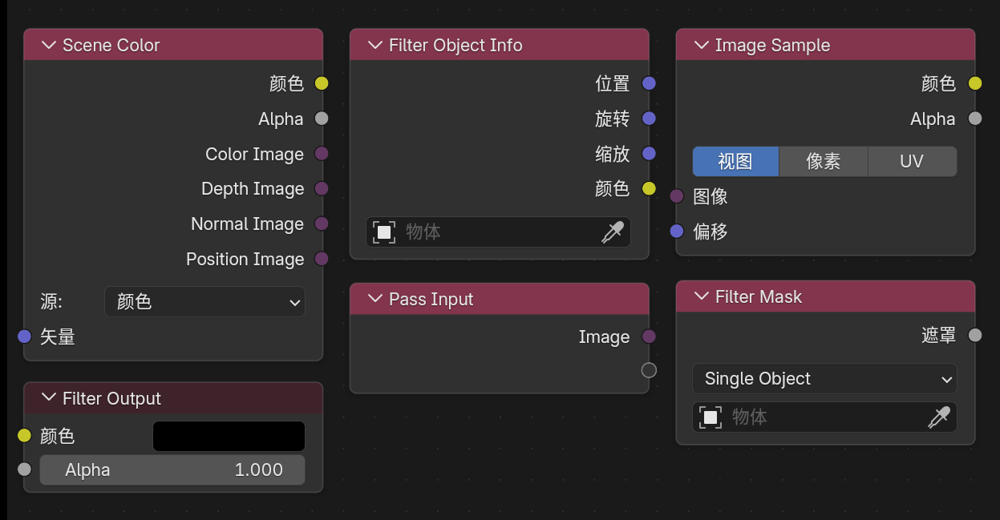

---
hide:
  - navigation
  - toc
---

Blender 5.2.0 LTS · NPR Port · fd9fabb4f531

# Stylized rendering extensions on Eevee

NPR capabilities are grouped into four paths you can start from immediately: Scene pipeline, extended nodes, NPR Tree, and UI controls.
The package includes Cycles; this site documents <strong>Eevee</strong> extensions only.

<a class="npr-btn npr-btn--primary" data-npr-latest-win href="https://github.com/bb-yi/blender/releases/download/v5.2.0-npr-port-win64-fd9fabb4f531-20260811-235604/blender-5.2.0-npr-port-win64-fd9fabb4f531-20260811-235604.zip">Download stable</a>
<a class="npr-btn npr-btn--outline" href="#modules">Modules</a>
<a class="npr-btn npr-btn--outline" href="https://github.com/bb-yi/blender">GitHub</a>

Tests <strong>110/110 · Win</strong>
Date <strong>2026-08-11</strong>
Platforms <strong>Win · Linux · macOS</strong>
Engine <strong>Eevee</strong>

Map

## Pick a working path

Grouped by the Blender entry points you actually open — not a flat feature dump.

<a href="scene-extensions.html">
01 · Scene
Scene pipeline
Render textures, Filter Graph, camera outputs, outline
</a>
<a href="extended-nodes.html">
02 · Nodes
Extended nodes
Filter domain, helpers, GLSL, SDF, material nodes
</a>
<a href="npr-workflow.html">
03 · NPR Tree
NPR workflow
Lighting breakdown, refraction, image sample, per-light loops
</a>
<a href="interface-guide.html">
04 · UI
UI controls
Performance attribution, material state, light groups, shadow scale
</a>

Modules

## Module notes

01 · Scene
### Scene pipeline

Build render textures and post graphs at the scene level, instead of forcing the whole chain into one object material.

- **Render Textures**: scene-level custom render textures
- **Filter Graph**: four-stage graph with reusable Filter Pass materials
- **Camera FX Outputs**: native camera-effect output sources
- **Eevee Outline**: scene-level outline

Render TexturesFilter GraphCamera FXOutline

<a class="npr-btn npr-btn--outline" href="scene-extensions.html">Read Scene docs</a>

Filter Graph · viewport + Filter Material

02 · Nodes
### Extended shader nodes

Nodes for Filter work, screenspace data, object materials, and custom GLSL — from sampling to procedural shaping.

- **Filter domain**: Object Info, Mask, Scene Color
- **General helpers**: Render Info, Scene Time, Screen Derivative, Portal
- **Object materials**: Outline Control, Screenspace Info, World / Probe
- **GLSL / procedural**: Function, Script Expression, SDF, OKLab

Scene ColorGLSL FunctionSDFPortal

<a class="npr-btn npr-btn--outline" href="extended-nodes.html">Read node docs</a>

Extended shader · node catalog

03 · NPR Tree
### NPR Tree workflow

Use a dedicated NPR Tree for lighting breakdown, refraction, sampling, and per-light work, plus built-in node-group assets.

- **NPR Input**: combined / diffuse / specular lighting breakdown
- **NPR Refraction**: refraction path (including volume-approximation fixes)
- **Image Sample**: View / Pixel / UV offset sampling
- **For Each Light**: per-light loops and light info
- **Built-in assets**: drop-in NPR node groups

NPR InputRefractionImage SampleAssets

<a class="npr-btn npr-btn--outline" href="npr-workflow.html">Read NPR workflow</a>

NPR Tree · dedicated nodes

04 · UI
### Interface & production controls

Performance attribution, material render state, and light controls live in everyday panels for stylized production debugging.

- **Eevee Performance**: shadow / probe cost attribution
- **Material state**: preview, culling, ZTest / Stencil / Write
- **Lights**: Lightgroup ID, Sun Shadow Map Scale
- **Production helpers**: splash version tag, IME, pose-bone Outliner visibility

PerformanceStencilLightgroupShadow Scale

<a class="npr-btn npr-btn--outline" href="interface-guide.html">Read interface docs</a>

Eevee Performance · Shadow / Probe

Node catalog

## New nodes at a glance

Relative to stock Blender, this Port adds nodes across shader trees, NPR Tree, and the Filter domain. Full parameters live on the linked pages.

### Extended shader nodes

- Render Info / Screen Derivative / Portal In·Out  
- Outline Control / Render Texture / Screenspace Info  
- World Environment / Light Probe Color / World To Tangent  
- GLSL Function / Script Expression / Image to Closure  
- Basis Transform / Twirl / Water Ripples / Hex Grid / Parallax  
- SDF Primitive·Operator·Vector Op / Bevel / Curvature  
- Shader Info / Light Info / Light Shader Info·Output / OKLab Color Ramp  

[Extended nodes →](extended-nodes.md)

### NPR Tree nodes

- NPR Input / NPR Output / NPR Refraction  
- Image Sample (View / Pixel / UV)  
- For Each Light (paired Input + Output zone)  
- Built-in groups: Cavity / Co-Planar Edge / Curvature / Kuwahara / Shading Models / Surface Curvature  

[NPR workflow →](npr-workflow.md)

### Filter-domain nodes

- Pass Input / Image Sample / Filter Output (default Filter Pass material chain)  
- Filter Object Info / Filter Mask / Scene Color  
- Graph-level: Scene Color · AOV Input · Filter Pass · Stage Output (see Scene docs)  

[Scene / Filter Graph →](scene-extensions.md) · [Filter-domain nodes →](extended-nodes.md#4-filter-domain-nodes)

This build

## Build notes · fd9fabb4f531

This stable package focuses on refraction volume, GLSL matrix helpers, shadow detail, and input comfort.

### New
- EEVEE NPR refraction volume approximation, with sampling/capture isolation and background-leak fixes
- `GLSL Function` draw-view matrix helpers (view / projection / model and inverses; see node docs)
- Viewport Shadow LOD visualization
- Improved IME support (5.2 API adaptation and text-editor cursor metrics)

### Fixed
- Refraction-volume Image Sample offset black holes, background misses, depth mapping
- Sun `Shadow Map Scale` correctly applied to tilemaps
- White fallback for unconnected GLSL samplers
- Restored NPR Tree AOV output
- Stabilized Render Texture resource lifetime

<a class="npr-btn npr-btn--outline" href="release.html">Download & integrity info</a>
<a class="npr-btn npr-btn--outline" href="https://github.com/bb-yi/blender/blob/main/blender-npr-release-changelog.md">Full changelog</a>

!!! warning "Eevee only"
    The package can run Cycles, but the NPR Port extensions documented here require **Eevee**.

Release

## Windows x64 stable package

Windows is the fully validated baseline (110/110). Linux / macOS companion builds ship in the same release with SHA256.

<a class="npr-btn npr-btn--primary" href="release.html">Open download page</a>
<a class="npr-btn npr-btn--outline" href="https://github.com/bb-yi/blender/releases">All releases</a>

