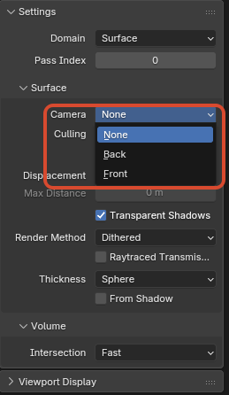
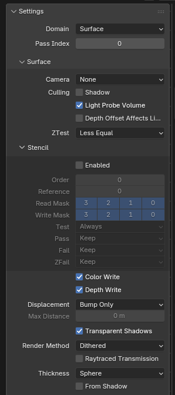
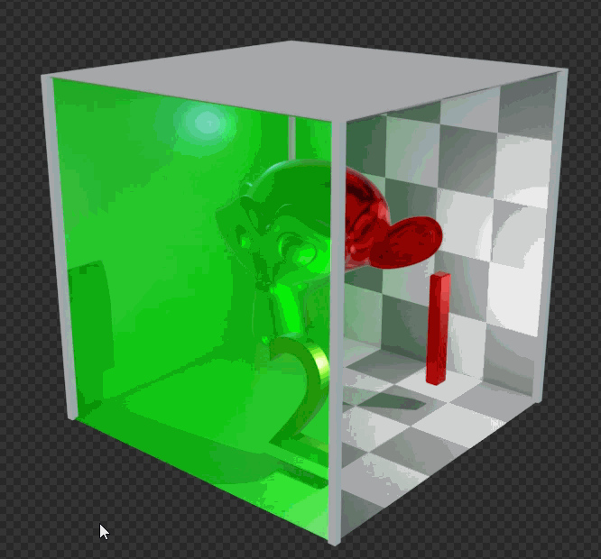
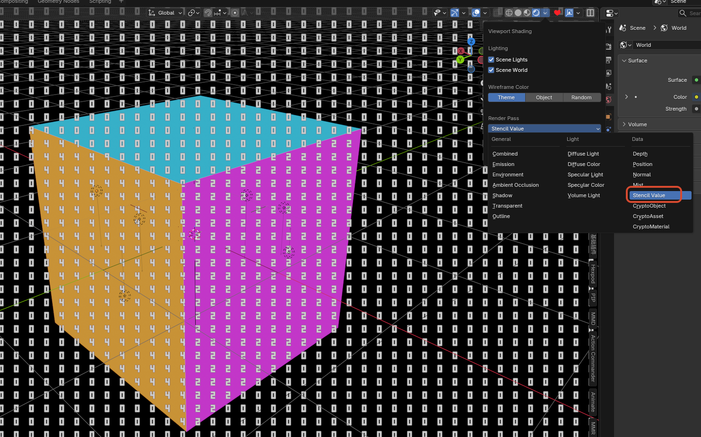

# Interface and Workflow Additions

## 1. Eevee Performance

### Purpose

Shows Eevee viewport / final-render performance statistics, stage breakdowns, and hints directly in the `Outliner`, making it easier to locate heavy parts of the pipeline.

	
	 

### Entry

- `Outliner > Display Mode > Eevee Performance`
- `Profiler` / `Pause` / `Sort by Time` in the `Outliner` header
- The `Eevee Performance` popover in the `Outliner` header

### Behavior

- Enabling `Profiler` starts collecting performance statistics and displays them in the `Outliner`
- `Pause` freezes live updates so the current result can be inspected
- `Sort by Time` sorts the stage list by CPU cost instead of fixed pipeline order
- `Average Window` sets the frame window used for smoothing statistics
- The tree currently includes groups such as `Viewport`, `Final Render`, `Metadata`, `Features`, `Stages`, `Shadow Contexts`, `Shadow Lights`, `Probe Costs`, and `Hints`

### Shadow and Probe Attribution

- `Shadow Contexts` breaks shadow CPU cost down by render context, such as `MainView`, `PlanarProbe`, `CaptureProbe`, `Bake`, and `Other`
- `Shadow Contexts` shows `cpu`, `calls`, `loops`, `ms/call`, `ms/loop`, and `share`, making it easier to tell whether shadow cost comes from the main view, probe updates, baking, or other paths
- `Shadow Lights` lists shadow tilemap load per light, including `type`, `tilemaps`, `estimated_views`, `sync_dirty_tilemaps`, `tilemap_view_share`, and `level`
- `Probe Costs` lists per-probe update cost, including `updated`, `total`, `rendered_views`, `resolution`, `estimated_work`, `work_share`, and `level`
- These groups are attribution aids, not a per-GPU-draw-call profiler; sorting and shares are meant for hotspot discovery, and exact values change with viewport state, sampling, and probe update frequency

### Current Scope

- This is mainly a CPU-side Eevee stage profiler and hint view, not a full GPU profiler
- It is meaningful only for `Eevee`, not for `Cycles`

## 2. Material Selector Previews

### Purpose

Controls whether material previews are rendered in material drop-downs and search lists.

This is mainly useful when many materials exist and expanding the selector would otherwise trigger too many preview renders.

### Entry

`Edit > Preferences > Editing > Objects > Materials > Material Selector Previews`

	
	 

### Behavior

- When enabled: the selector shows material previews as usual
- When disabled: the selector falls back to normal material icons and no longer triggers preview renders in the drop-down list
- Default value: enabled

### Current Scope

- When disabled, this prevents material selectors, material drop-down / search lists, and automatic material preview panels from starting new material preview renders
- Disabling the option also clears running material preview jobs so old preview renders do not keep occupying Eevee
- Does not affect the 3D Viewport `Material Preview` / `Rendered` shading modes
- Does not affect the actual material render result

## 3. Material Face Culling

### Purpose

Adds clearer face-culling control for materials. In addition to the usual back-face culling, the NPR Port also supports `Front` culling.

	
	 

### Entry

`Material Properties > Settings > Culling > Camera`

### Available Modes

- `None`: render both front and back faces
- `Back`: hide back-facing faces
- `Front`: hide front-facing faces

### Notes

- `Front` is useful for shell-style effects, inside-view setups, or some inverted-outline style tricks
- `Shadow` and `Light Probe Volume` still keep their own culling controls

## 4. Material Surface Render State

### Purpose

Provides direct Eevee Surface material controls for depth test, color write, depth write, and stencil test / write state. These are useful for masks, portals, special outline layers, hidden writer materials, and other effects that need explicit render-state control.

### Entry

`Material Properties > Settings > Surface`

	
	 
	ZTest, Stencil, Color Write, and Depth Write in Material Properties > Settings > Surface

### ZTest

`ZTest` controls how a fragment compares against the stored depth:

- `Less`
- `Greater`
- `Less Equal`
- `Greater Equal`
- `Equal`
- `Not Equal`
- `Always`
- `Never`

The default should usually stay `Less Equal`. `ZTest Never` rejects the whole fragment, including stencil writes. For stencil writer materials, usually keep `Less Equal` and disable `Color Write` / `Depth Write` when needed.

### Color Write / Depth Write

- `Color Write`: controls whether the Surface material writes Eevee color output
- `Depth Write`: controls whether the Surface material writes Eevee depth output

These toggles control writes only; they do not disable node-tree evaluation. Transparent, outline, AOV, and stencil paths should still be interpreted through the current material and pipeline rules.

### Stencil

The `Stencil` panel contains:

- `Enabled`
- `Order`
- `Reference`
- `Read Mask`
- `Write Mask`
- `Test`
- `Pass`
- `Fail`
- `ZFail`

`Test` options: `Always`, `Never`, `Equal`, `Not Equal`, `Less`, `Less Equal`, `Greater`, `Greater Equal`.

`Pass / Fail / ZFail` options: `Keep`, `Zero`, `Replace`, `Increment Clamp`, `Decrement Clamp`, `Invert`, `Increment Wrap`, `Decrement Wrap`.

### Notes

- `Order` controls submission order inside the Eevee stencil pass; lower values are submitted first
- `Reference`, `Read Mask`, and `Write Mask` currently use a 4-bit user stencil range
- A common writer setup enables `Stencil`, uses `Pass = Replace`, and disables `Color Write` / `Depth Write`
- A common reader setup enables `Stencil`, uses `Test = Equal` or `Not Equal`, and matches the same `Reference` / mask combination
- If one material both participates in depth occlusion and writes stencil, check the `ZTest` and `Depth Write` combination carefully so fragments are not rejected before stencil writes happen
- To inspect the stencil buffer in the viewport, choose `Stencil Value` from `Viewport Shading > Render Pass`

	
	 
	Stencil writer and reader mask example

	
	 
	Previewing stencil values with Viewport Shading > Stencil Value

## 5. Eevee Lightgroup ID

### Purpose

Assigns an integer light-group ID to Eevee lights so the `Shader Info` node and `GLSL Function` `GLSLLight.lightgroup_id` can filter direct-light evaluation by group.

### Entry

`Light Data > Light > Lightgroup ID`

### Behavior

- Default value: `0`
- When `Shader Info` also uses `Lightgroup = 0`, only lights with `Lightgroup ID = 0` are evaluated
- If a `Shader Info` node uses another integer value, only lights with the same ID are included
- In `GLSL Function`, `glsl_light_get(i).lightgroup_id` returns this integer and can be used for custom per-light include / exclude logic
- This grouping does not automatically modify the default Eevee material lighting path; it only affects `Shader Info` or custom `GLSL Function` logic that explicitly uses it

## 6. Sun Shadow Map Scale

### Purpose

Adds a separate coverage-scale control for Eevee Sun shadow maps, making it possible to adjust the coverage range and effective detail distribution of the Sun clipmap shadow.

### Entry

`Light Data > Shadow > Shadow Map Scale`

This option is shown only for `Sun` lights.

	
	 
	Shadow Map Scale setting on a Sun light

### Behavior

- Default value: `1`
- Higher values expand the Sun shadow-map coverage scale and usually reduce effective detail per area
- Lower values concentrate the shadow map into a smaller range and can improve nearby detail, but can expose insufficient coverage or boundary issues more easily
- This setting affects only Eevee Sun shadow-map sampling / coverage behavior; it does not change light color, energy, direction, or material-side shading

## 7. Splash Version Tag

### Purpose

Appends the current NPR build tag and build date to the version text in the top-right corner of the splash screen, so custom builds are easier to distinguish at a glance.

### Current Format

- `version + npr post + build date`
- Example: `5.1.0 npr post 2026-03-27`

## 8. Pose Bone Outliner Visibility

### Purpose

Adds a dedicated Outliner visibility flag to each `Pose Bone`, making it easier to organize complex rigs without changing rig behavior itself.

### Entry

- `Bone Properties > Viewport Display > Hide in Outliner`
- `Outliner > Filter > Hidden PoseBones`

### Behavior

- Every `Pose Bone` has its own `Hide in Outliner` toggle
- The toggle is enabled by default
- The `Hidden PoseBones` filter in the `Outliner` is also enabled by default, so existing rigs do not immediately change appearance
- After disabling `Outliner > Filter > Hidden PoseBones`, bones with `Hide in Outliner` enabled are hidden from the tree
- If a hidden parent still has visible child bones, those visible children remain in the tree instead of removing the whole hierarchy

### Current Scope

- Affects `Pose Bone` only
- Does not affect `Edit Bone`
- Changes only the Outliner hierarchy display, not transforms, animation, drivers, or rendering
