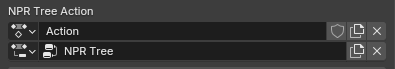
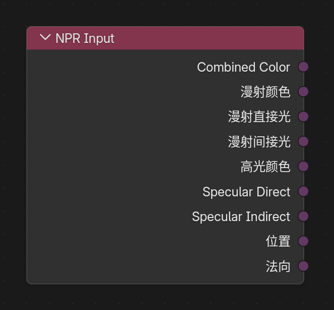
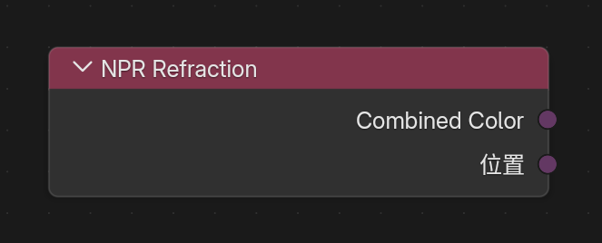
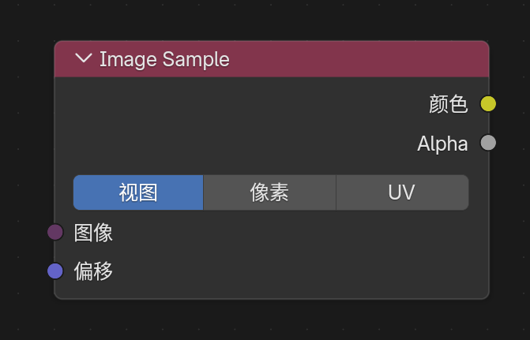
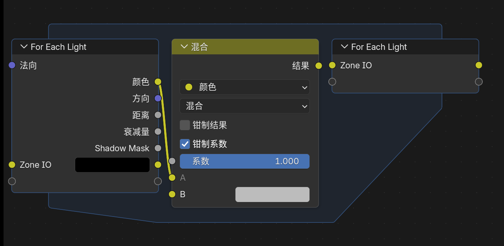
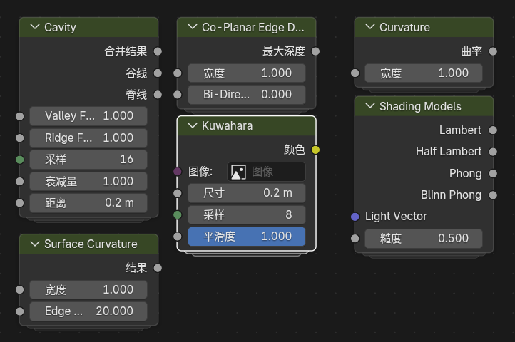

# NPR Tree Workflow

## 1. Basic Concept

`NPR Tree` is a second shading graph attached to a regular object material. It is used to reorganize and stylize Eevee material results in an NPR-oriented way.

The regular object material still handles the base surface shading, while the `NPR Tree` adds an extra NPR presentation layer on top.

## 2. How to Attach It

1. Keep the normal `Material Output` and base shading in the regular object material.
2. Select the `Material Output` node.
3. Create or assign a node group in its `NPR Tree` property.

	
	 

4. To edit this tree, switch the Shader Editor top `Shader Type` to `NPR`.

	
	 

## 3. Notes

- The material render mode needs to be set to `Dithered (Deferred)`
- `Ctrl + Tab` can be used to switch quickly between the regular object material and the NPR tree
- `NPR Tree` keyframes and drivers use a dedicated `NPR Tree Action`, which can be viewed, switched, or created in `Material Properties > Animation > NPR Tree Action`

	
	 

## 4. Main NPR Nodes

In addition to the dedicated NPR nodes below, `Curvature`, `Raycast`, `GLSL Function`, and `GLSL Script Expression` can also be used directly inside `NPR Tree`.

### NPR Input

	
	 

#### Purpose

Reads the input buffers provided by the NPR rendering stage.

#### Outputs

- `Combined Color`
- `Diffuse Color`
- `Diffuse Direct`
- `Diffuse Indirect`
- `Specular Color`
- `Specular Direct`
- `Specular Indirect`
- `Position`
- `Normal`

These outputs are closer to image / texture handles than ordinary scalar values, so they are typically passed to `Image Sample` or other NPR-aware nodes for further processing.

### NPR Refraction

	
	 

#### Purpose

Reads refraction-related buffers, similar in spirit to `Screenspace Info`. The current stable build also includes the EEVEE NPR **refraction volume** approximation: when volumes are present, refraction background sampling/capture is isolated from volume compositing to reduce background leaks, depth mismatches, and black-hole artifacts after `Image Sample` offsets.

#### Outputs

- `Combined Color`
- `Position`

#### Notes

- Refraction outputs behave like image handles and are usually passed to `Image Sample`.
- With volume fog / volume objects, validate viewport and final render consistency on `fd9fabb4f531` or newer packages.
- Both `View` and `Pixel` offsets on `Image Sample` should affect the refraction buffer; solid black results often indicate an older build.

### Image Sample

#### Entry

`Add > Utilities > Image Sample`

	
	 

#### Inputs / Outputs

- Inputs: `Image`, `Offset`
- Outputs: `Color`, `Alpha`

#### Purpose

Samples image-style handles from `NPR Input`, `NPR Refraction`, Filter `Pass Input`, and similar sources.

#### Offset Modes

The node panel exposes three offset interpretations:

- `View`: offset the sample position in view space
- `Pixel`: offset in screen pixels (resolution-dependent)
- `UV`: treat `Offset` as a UV / screen-coordinate delta for texture-space displacement sampling

With `Offset` unconnected, sampling uses the current pixel / UV location.

### For Each Light

#### Entry

`Add > Utilities > For Each Light`

	
	 

#### Notes

This node runs its internal logic once for every light affecting the current surface and outputs per-light information during each iteration.

#### Built-In Data

`For Each Light Input` currently provides:

- Input: `Normal`
- Outputs: `Color`, `Direction`, `Distance`, `Attenuation`, `Shadow Mask`

It also supports custom area input / output sockets so intermediate values can be passed through the per-light loop.

## 5. Built-In NPR Node Group Assets

This version ports a group of commonly used node groups from the Blender 4.4 NPR branch and repackages them as Blender 5.2.0 LTS-compatible assets.

### Main Built-In Assets

- `Cavity`
- `Co-Planar Edge Detection`
- `Curvature`
- `Kuwahara`
- `Shading Models`
- `Surface Curvature`

	
	 
	Main NPR node groups migrated to Blender 5.2.0 LTS

### Asset Notes

- These node groups have been migrated to the Blender 5.2.0 LTS format
- Because repeat-zone node names changed, old Blender 4.4 NPR Prototype files may need to reconnect region-related nodes manually

!!! warning "Eevee Only"
    `NPR Tree` currently supports only `Eevee`, not `Cycles`.
