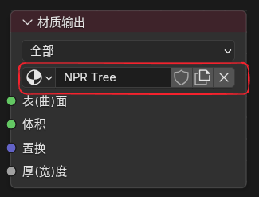

# NPR Tree Workflow

## 1. Core Concept

`NPR Tree` is a node tree attached after a regular object material to perform color post-processing, allowing shader output to be stylized in color form.

## 2. How to Attach It

1. Keep the normal `Material Output` node and the base surface shading in a regular object material.

2. Select the `Material Output` node.

3. Create or assign a node group in its `NPR Tree` property.

	
	 

4. To edit that tree, switch `Shader Type` to `NPR` at the top of the Shader Editor.

	
	 

## 3. Notes

- The material render mode needs to be set to `Dithered (Deferred)`

- You can use `Ctrl + Tab` to quickly switch between the object shader and the NPR tree

- The action used by the current `NPR Tree` can be viewed, switched, or created in `Material Properties > Animation > NPR Tree Action`; this slot is separate from the regular material action

	
	 

## 4. Main NPR Nodes

In addition to the dedicated NPR nodes below, `Curvature` and `Raycast` can now also be used directly inside `NPR Tree`.

### NPR Input

	
	 

#### Purpose

Reads the input buffers provided by the NPR rendering stage.

#### Outputs

- `Combined Color`: Final combined color after shading

- `Diffuse Color`: Diffuse color

- `Diffuse Direct`: Direct diffuse lighting

- `Diffuse Indirect`: Indirect diffuse lighting from ray tracing and probes

- `Specular Color`: Specular color

- `Specular Direct`: Direct specular lighting

- `Specular Indirect`: Indirect reflection

- `Position`: World-space position

- `Normal`: Surface normal

These outputs behave more like image handles / texture handles, which makes them suitable for neighborhood sampling through `Image Sample` or for feeding into NPR nodes that accept this kind of input.

### NPR Refraction

	
	 

#### Purpose

Reads refraction-related buffers, similar to `Screenspace Info`.

See the usage notes of `Screenspace Info` for setup requirements.

#### Outputs

- `Combined Color`: Final color at the refraction event

- `Position`: World-space position of the refraction hit

### Image Sample

#### Entry

`Add > Utilities > Image Sample`

	
	 

#### Inputs / Outputs

- Input: `Image` (image handle), `Offset` (sample offset)

- Output: `Color` (sampled color)

#### Purpose

Samples image handles produced by nodes such as `NPR Input` or `NPR Refraction`.

#### Offset Modes

- `View`: Offset in view space

- `Pixel`: Offset in pixel space

### For Each Light

#### Entry

`Add > Utilities > For Each Light`

	
	 

#### Notes

Executes its internal logic once for each light affecting the current surface, outputting information for one light on each iteration.

	
	 
	Reference setup

#### Built-In Available Data

`For Each Light Input` currently provides:

- Input: `Normal` (surface normal)

- Outputs: `Color` (light color), `Direction` (light direction), `Distance` (light distance), `Attenuation` (light attenuation), `Shadow Mask` (shadow mask)

## Built-In NPR Node Group Assets

The current version already ports and organizes a set of commonly used node groups from the Blender 4.4 NPR build into assets that can be used in 5.1.

### Main Built-In Node Groups

- `Cavity`

- `Co-Planar Edge Detection`

- `Curvature`

- `Kuwahara`

- `Shading Models`

- `Surface Curvature`

### Asset Notes

- These node groups have already been migrated to Blender 5.1 format.

- Because some repeat-zone node names changed, projects from the 4.4 NPR Prototype may require manual reconnection of the related zone nodes.

!!! warning "Eevee Only"
    `NPR Tree` is currently supported only in `Eevee`, not in `Cycles`.
