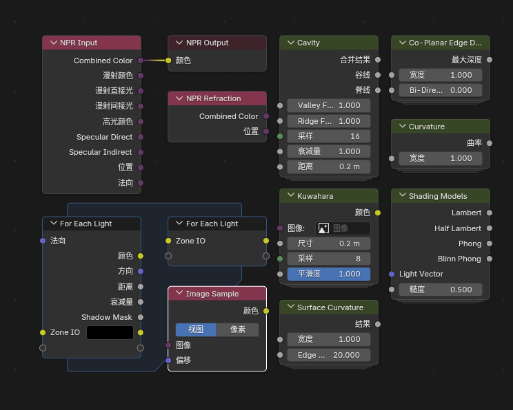

# Blender 5.1 NPR Port 新增功能与使用说明

## 项目介绍

`Blender 5.1 NPR Port` 是一个NPR特化的Blender分支，在融合了 `Goo Engine` 和 `4.4 NPR-prototype` 特色节点之外还额外添加一些实用特色节点。

大部分功能是 `Eevee` 专用，不支持 `Cycles`。

## 文档范围

这份文档说明当前 `Blender 5.1 NPR Port` 相比官方 `Blender 5.1` 已经加入、并且当前分支内实际存在的 NPR / Eevee 扩展功能，以及它们的基本使用方法。

## 节点一览

### 着色器节点

### NPR Tree 节点

*部分着色器节点也可以在NPR Tree中使用*

### 滤镜节点

## 主要功能分类

### 1. Scene 级 Eevee 扩展

- **Render Textures** - 场景级额外渲染纹理系统
- **Filter Materials** - 全屏滤镜栈

### 2. Eevee 新着色器节点

- Render Info
- Scene Time  
- Screen Derivative
- World Environment
- World To Tangent
- Bevel

### 3. Goo Engine 移植节点

- Screenspace Info
- Curvature
- Shader Info
- Light Info

### 4. NPR Tree 工作流与配套节点

- NPR Input / Output
- NPR Refraction
- Image Sample
- For Each Light
- 内置的 NPR 节点组资产包

### 5. 特殊功能

- Portal In / Portal Out（界面整理节点）
- 材质选择器预览开关
- 世界环境排除

## 快速导航

- :fontawesome-solid-rocket:{ .lg .middle } **快速开始**

    ---

    从Scene级扩展开始了解基础功能

    [查看 Scene 级 Eevee 扩展 →](1_scene_level_extension.md)

- :fontawesome-solid-cube:{ .lg .middle } **节点详解**

    ---

    深入了解各个新增节点的功能

    [查看 主要扩展节点 →](2_extended_nodes.md)

- :fontawesome-solid-code-branch:{ .lg .middle } **工作流指南**

    ---

    学习 NPR Tree 的工作方式

    [查看 NPR Tree 工作流 →](3_npr_tree_workflow.md)

- :fontawesome-solid-toolbox:{ .lg .middle } **进阶配置**

    ---

    探索更多界面和工作流选项

    [查看 界面与工作流补充 →](4_interface_workflow.md)

## 版本信息

- **Blender 版本**: 5.1
- **NPR Port 版本**: 2026-03-27
- **文档更新**: 2026-03-28

## 特别说明

!!! warning "重要"
    大部分功能是 Eevee 专用，不支持 Cycles 渲染引擎。

!!! tip "提示"
    本文档包含节点的详细参数说明和使用示例，建议按顺序阅读。
