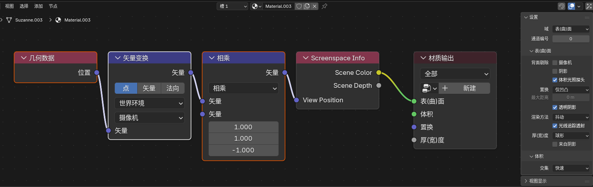
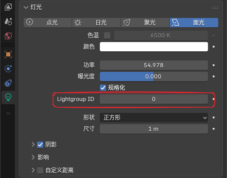

# 主要扩展节点

**1. Eevee 通用辅助节点**

### Render Info

#### 入口

`Add > Input > Render Info`

	
	 

#### 输出

- `Frag Coord`：屏幕空间坐标（xy 归一化到 0-1，z 为深度）

- `Width`：渲染区域宽度

- `Height`：渲染区域高度

#### 作用

提供当前 Eevee 渲染窗口的坐标和像素尺寸。

### Scene Time

#### 入口

`Add > Input > Scene Time`

	
	 

#### 输入

- `Scale`：用于缩放帧数的数值

#### 输出

- `Frame`：当前帧数

- `Seconds`：当前帧对应的秒数

- `Timeline`：0-1 映射的场景时间（从开始帧到结束帧）

- `Scaled Frame`：当前帧除以 `Scale` 后的结果

### Screen Derivative

#### 入口

`Add > Utilities > Math > Screen Derivative`

	
	 

#### 功能

获得屏幕之间相邻像素之间的差异：

- `DDX`：X 方向的屏幕空间导数

- `DDY`：Y 方向的屏幕空间导数

- `DDXY`：`DDX` 和 `DDY` 的组合（`DDX + DDY`）

其中 `DDXY` 表示 `DDX + DDY`。

### Portal In / Portal Out

#### 入口

- `Add > Layout > Portal In`

- `Add > Layout > Portal Out`

	
	 

#### 功能说明

这是一组用来整理节点连线的“传送门”节点。

工作方式可以理解为：

- `Portal In`：在当前节点树里存一个有名字、有类型的值

- `Portal Out`：在同一节点树内按名字把这个值取出来继续使用

#### 其他

- 新建 `Portal In` 时会自动生成唯一名称。

- `Portal Out` 上带有放大镜按钮，可快速跳转到对应的 `Portal In` 位置。

#### 限制

- 只在同一个 shader node tree 内识别。

- 不支持跨节点树。

- 不支持跨节点组自动穿透。

- 同名输入应只保留一个来源。

**2. Eevee 物体材质节点**

### Render Texture

#### 入口

`Add > Texture > Render Texture`

	
	 

#### 作用

读取前面在场景里配置好的 `Render Textures` 条目。

#### 输入输出

- 输入：`Vector`

- 输出：`Color`、`Alpha`

### Screenspace Info

#### 入口

`Add > Input > Screenspace Info`

	
	 

#### 输入输出

- 输入：`View Position`（摄像机空间位置）

- 输出：`Scene Color`（场景颜色）、`Scene Depth`（场景深度值）

#### 作用

获得当前的渲染缓冲颜色或深度的内容。

	
	 

#### 使用说明

- 渲染设置中需要打开 `Raytracing`

- 材质选项 `Render Method` 选择 `Dithered`

- 材质选项打开 `Raytraced Transmission`

- `View Position` 默认输入为 `position` 变换到摄像机空间，再反转 z 轴

	
	 

### World Environment

#### 入口

`Add > Input > World Environment`

	
	 

#### 输入输出

- 输入：`Direction`（采样方向）

- 输出：`Color`（环境颜色）

#### 作用

直接采样 `Eevee` 的世界环境颜色，不依赖屏幕后方是否还有几何。

#### 说明

- 读取世界环境光照探头颜色，可在世界环境中调整分辨率

	
	 

- `Direction` 不连接时，默认使用当前表面的视线方向

- `Direction` 连接后，可以按指定方向采样世界环境

### World To Tangent

#### 入口

`Add > Utilities > Vector > World To Tangent`

	
	 

#### 输入输出

- 输入：`Vector`（世界空间方向）

- 输出：`Vector`（切线空间方向）

#### 作用

把一个世界空间方向向量转换到当前表面的切线空间。

#### 说明

- 节点面板中可指定 `UV Map`，该 UV 的切线会作为转换基底。

### Basis Transform

#### 入口

`Add > Utilities > Vector > Basis Transform`

	
	 

#### 输入输出

- 输入：`Vector`（待变换的点、方向或法线）

- 输入：`Origin`（自定义基底的原点，仅 `Point` 模式使用）

- 输入：`X Axis`、`Y Axis`、`Z Axis`（自定义坐标基轴）

- 输出：`Vector`（变换后的结果）

#### 作用

在材质节点里用 `原点 + 三根基轴` 来完成自定义坐标系变换，适合在没有矩阵输入类型的情况下处理点、方向向量和法线。

#### 面板选项

- `Direction`

    - `To Basis`：把输入从世界 / 当前坐标解释为自定义基底下的坐标

    - `From Basis`：把输入从自定义基底坐标还原回外部坐标

- `Type`

    - `Point`：会参与 `Origin` 平移

    - `Vector`：只做方向 / 长度变换，不参与平移

    - `Normal`：按法线规则变换，并在输出前归一化

- `Basis Input`

    - `XYZ`：直接使用三根输入轴

    - `XY` / `XZ` / `YZ`：只使用两根轴，第三根轴由叉积自动补出

- `Orthonormalize`

    - 开启后会把输入轴正交化并归一化，更适合做切线空间、局部朝向这类纯方向基底

    - 关闭后会保留输入轴长度，可用于带缩放的基底变换

- `Fallback`

    - `Pass Through`：当基底退化时直接输出原始输入

    - `Zero`：当基底退化时输出 `0, 0, 0`

### SDF Primitive

#### 入口

`Add > Texture > SDF Primitive`

	
	 

#### 输出

- `Distance`

#### 作用

在材质节点里直接生成符号距离场（SDF）基础形体，适合做程序遮罩、轮廓、形体过渡，以及后续布尔组合的基础输入。

#### 主要模式

- 3D 形体：`Sphere`、`Box`、`Torus`、`Cone`、`Point Cone`、`Cylinder`、`Point Cylinder`、`Capsule / Line`、`Octahedron`、`Hex Prism`、`Hex Prism Incircle`、`Plane`、`Solid Angle`、`Pyramid`、`Disc`、`3D Circle`
- 2D 形体：`Circle`、`Rectangle`、`Ellipse`、`Triangle`、`Pentagon`、`Hexagon`、`Isosceles Triangle`、`Trapezoid`、`Rhombus`
- 风格化 2D：`Star`、`Heart`、`Pie`、`Arc`、`Moon`、`Vesica`、`Cross`、`Rounded X`、`Horseshoe`、`Round Joint`、`Flat Joint`
- 曲线 / 片段：`Line`、`Corner`、`Quadratic Bezier`、`Point Triangle`、`Quad`、`Parabola`、`Parabola Segment`、`Uneven Capsule`

#### 输入说明

- 固定基础输入为 `Vector`
- 其余插口会按模式动态显示并重命名，常见参数有 `Size`、`Radius`、`Angle`、`Roundness`、`Linewidth`、`Point` 到 `Point_003`、`Value1` 到 `Value4`
- 节点面板提供 `Mode` 和 `Invert`

#### 使用说明

- 输出的是距离值，不是颜色
- 通常配合 `Math`、`ColorRamp`、`Map Range`、`SDF Operator` 等节点，把距离场转换成遮罩或最终图形
- `Invert` 可直接翻转内外关系，方便把同一形体改成“孔”或“壳”

### SDF Operator

#### 入口

`Add > Converter > SDF Operator`

	
	 

#### 输出

- `Distance`

#### 作用

对一个或两个 SDF 距离场做组合、裁切和轮廓变形，用来把多个基础形体继续拼成更复杂的结果。

#### 主要运算

- 单输入：`Dilate`、`Onion`、`Annular`、`Mask`、`Flatten`、`Invert`、`Hermite Pulse`
- 双输入：`Blend`、`Exclusion XOR`、`Divide`、`Pipe`、`Engrave`、`Groove`、`Tongue`
- 并集：`Union`、`Smooth Union`、`Round Union`、`Columns Union`、`Stairs Union`、`Chamfer Union`
- 交集：`Intersect`、`Smooth Intersect`、`Round Intersect`、`Columns Intersect`、`Stairs Intersect`、`Chamfer Intersect`
- 差集：`Difference`、`Smooth Difference`、`Round Difference`、`Columns Difference`、`Stairs Difference`、`Chamfer Difference`

#### 输入说明

- 基础输入包含 `Distance`、`Distance_001`、`Value`、`Value_001`、`Count`
- 实际显示的插口名称和数量会随 `Operation` 自动变化
- `Mask` 模式会额外显示 `Invert`

#### 使用说明

- 常见流程是先用多个 `SDF Primitive` 生成距离场，再通过 `SDF Operator` 做并集、交集或差集
- `Smooth`、`Round`、`Chamfer`、`Stairs`、`Columns` 这类模式适合做更有风格化过渡的布尔边界
- 最终依然输出距离值，通常还需要再接阈值、颜色映射或透明度控制节点

### SDF Vector Operator

#### 入口

`Add > Utilities > Vector > SDF Vector Operator`

	
	 

#### 输出

- `Vector`

- `Position`

- `Value`

#### 作用

对 SDF 工作流使用的坐标域、UV 域或向量域做预处理。它可以在真正进入 `SDF Primitive` 之前，先把空间做镜像、重复、旋转、扭曲、分块和平铺映射。

这类节点不会直接生成距离场，而是先把“采样空间”改写掉，所以很适合放在：

- `Texture Coordinate / Object`
- `SDF Vector Operator`
- `SDF Primitive`
- `SDF Operator`

这样的链路中间。

#### 主要模式分类

- `Plane Reflect`、`Mirror`、`Polar`、`Repeat Infinite`、`Repeat Infinite Mirror`、`Repeat Finite`、`Octant`
  - 这组模式主要负责镜像、分段、循环重复和对称化空间

- `Swizzle`、`Rotate`、`Spin`、`Extrude`、`Twist`、`Swirl`、`Pinch Inflate`、`Radial Shear`、`Bend`
  - 这组模式主要负责坐标重排、旋转和各种变形

- `UV Rotate`、`UV Scale`、`UV Grid`、`UV Random Rotate`、`UV Random Flip`、`UV Tileset`
  - 这组模式主要负责 UV 的平铺、打散、旋转和子块映射

- `Map -1-1`、`Map -0.5-0.5`、`Map 0-1`
  - 这组模式主要负责 UV 与常见 SDF 坐标范围之间的快速映射

#### 主要模式说明

- `Plane Reflect`
  - 按给定法线和偏移对空间做平面反射
  - `Value` 可作为平面两侧的辅助遮罩值

- `Mirror`
  - 按当前 `Axis` 指定的平面方向做镜像
  - `Spacing` 控制镜像参考间距
  - `Position` 会给出镜像 / 分块后的辅助位置

- `Polar`
  - 把平面空间改写成环形重复的扇区结构
  - 适合做放射状图案、花瓣、齿轮、徽章类重复

- `Repeat Infinite`
  - 以给定 `Spacing` 无限重复空间

- `Repeat Infinite Mirror`
  - 无限重复空间，但交替镜像每个单元，适合让边界方向衔接得更自然

- `Repeat Finite`
  - 和无限重复类似，但会额外用 `Count` 限制重复次数

- `Octant`
  - 把空间折叠到八分体 / 象限对称区域，适合快速制作对称形体

- `Swizzle`
  - 重新排列坐标轴顺序，例如 `XYZ`、`XZY`、`YZX`

- `Rotate`
  - 按 `Axis` 选择的主轴旋转空间

- `Spin`
  - 围绕主轴做旋转式坐标偏移
  - 常用于制造旋转花纹或沿轴偏转的形体

- `Extrude`
  - 把二维距离域向第三维拉伸成厚度
  - `Value` 输出内部距离辅助值

- `Twist`
  - 沿主轴对空间施加扭转

- `Swirl`
  - 围绕中心点做旋涡式扭曲
  - `Center`、`Offset`、`Strength`、`Radius` 会共同控制旋涡范围和力度

- `Pinch Inflate`
  - 以中心区域为核心做收缩 / 膨胀
  - 适合把形体向内夹紧或向外鼓起

- `Radial Shear`
  - 做环向剪切，适合做旋转扭折感更强的图案变形

- `Bend`
  - 沿主轴弯折空间

- `UV Rotate`
  - 围绕 `Center` 旋转 UV

- `UV Scale`
  - 围绕 UV 中心缩放

- `UV Grid`
  - 把 0-1 UV 切成规则网格
  - `Vector` 输出当前格子内的局部 UV
  - `Position` 输出格子坐标，适合继续做随机变化或索引

- `UV Random Rotate`
  - 根据输入的 `Position`，为每个格子随机选择 90 度旋转方向

- `UV Random Flip`
  - 根据输入的 `Position`，为每个格子随机翻转或旋转

- `UV Tileset`
  - 把当前 UV 映射到一张大图中的某个子块
  - `Index` 选择块编号，`Padding` 控制边缘留白，`Scale` 控制块内缩放

- `Map -1-1`
  - 把 `0-1` UV 映射到 `-1 到 1`

- `Map -0.5-0.5`
  - 把 `0-1` UV 映射到 `-0.5 到 0.5`

- `Map 0-1`
  - 把常见的 SDF 中心坐标范围重新映射回标准 UV

### Bevel

#### 入口

`Add > Input > Bevel`

	
	 

#### 输入输出

- 输入：`Radius`（倒角半径）、`Normal`（表面法线提示）

- 输出：`Normal`（倒角后的近似法线）

#### 面板选项

- `Samples`（采样次数越高质量越好，性能消耗越大）

#### 作用

在 `Eevee` 中生成近似的倒角法线，用来让硬边看起来更圆润。

#### 说明

- `Cycles` 仍然使用官方原本的真实几何倒角算法

- `Eevee` 这里使用的是同物体屏幕空间近似

- 结果依赖当前视角、深度缓冲和可见邻域，不等同于 `Cycles` 的真实 `Bevel`

### Curvature

#### 入口

`Add > Input > Curvature`

	
	 

#### 输入

- `Samples`

- `Sample Radius`

- `Thickness`

- `Scale`

#### 输出

- `Scene Curvature`：根据屏幕空间提取的曲率值

- `Scene Rim`：边缘光

#### 面板选项

- `Local`：忽略其他物体深度

#### 说明

移植自 Goo Engine 的曲率节点，提供曲率和边缘光输出。

### Shader Info

#### 入口

`Add > Input > Shader Info`

	
	 

#### 输入

- `World Position`：世界空间位置（默认使用当前位置）

- `Normal`：表面法线（默认使用当前平滑法线）

#### 输出

- `Diffuse Shading`：兰伯特光照

- `Shadow`：遮蔽阴影

- `Ambient Lighting`：环境间接光（来自世界环境 + 光照探针）

- `Half-Lambert Factor`：半兰伯特光照

#### 说明

- `Shadow`

    - 可切换阴影模式

    - `Built-in`：默认模式，使用 Eevee 原本的阴影计算

    - `Soft Filtered`：把黑白抖动阴影变成更平滑的灰度半影

- 节点面板新增 `Lightgroup`

    - 只有 `Lightgroup ID` 相同的灯光，才会参与这个 `Shader Info` 节点的直接光照与阴影计算

	
	 

- 当前实现会排除 world sun 对这些输出的干扰，避免 HDRI 或世界环境里的“太阳光”混入直接结果。

### Light Info

#### 入口

`Add > Input > Light Info`

	
	 

#### 功能说明

读取指定灯光信息。

#### 固定输出

- `Color`：灯光颜色

- `Power`：灯光强度

- `Type`：灯光类型

    - `-1`：没有指定灯光

    - `0`：Point

    - `1`：Sun

    - `2`：Spot

    - `3`：Area

#### 按灯光类型自动出现的输出

- `Position`：灯光世界位置

- `Direction`：灯光方向

- `Radius`：灯光半径

- `Spot Size`：灯光尺寸

- `Sun Angle`：太阳角度

#### 说明

- 如果你要做逐灯处理，应该使用 `NPR Tree` 里的 `For Each Light`。

### Filter Object Info

#### 入口

`Add > Input > Filter Object Info`

	
	 

仅在 `Filter` 域下可用。

#### 作用

读取指定对象的世界空间变换和视口显示颜色，让滤镜材质可以跟随控制物体或场景辅助物体变化。

它适合用来做基于对象驱动的遮罩、方向渐变、移动焦点特效，或者把一个对象颜色直接传给全屏滤镜。

#### 节点设置

- `Object`：指定要读取的对象

#### 输出

- `Location`：所选对象的世界空间位置

- `Rotation`：所选对象的世界空间欧拉旋转，单位为弧度

- `Scale`：所选对象的世界空间缩放

- `Color`：所选对象的视口显示颜色

#### 说明

- 这里读取的是明确指定的对象，不是当前屏幕上正在被滤镜处理的对象

- 如果没有指定对象，节点会回退到默认值：位置 / 旋转 / 颜色为 `0`，缩放为 `1`

### Scene Color

#### 入口

`Add > Input > Scene Color`

	
	 

仅在 `Filter` 域下可用。

#### 作用

读取 Eevee 当前场景缓冲，可在节点面板中切换 `Source`：

- `Color`：读取渲染的最终场景颜色

- `Depth`：读取线性深度值

- `Normal`：读取渲染法线

- `Position`：读取世界空间坐标

#### 输入输出

- 输入：`Vector`

- 输出：`Color`、`Alpha`
