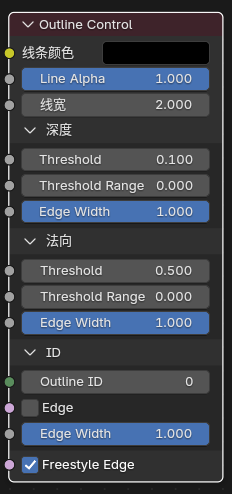
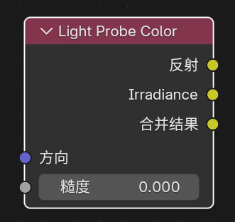
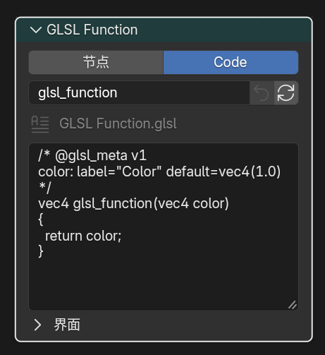
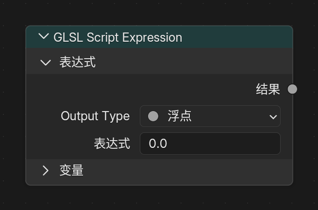
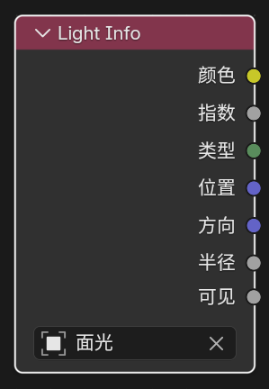
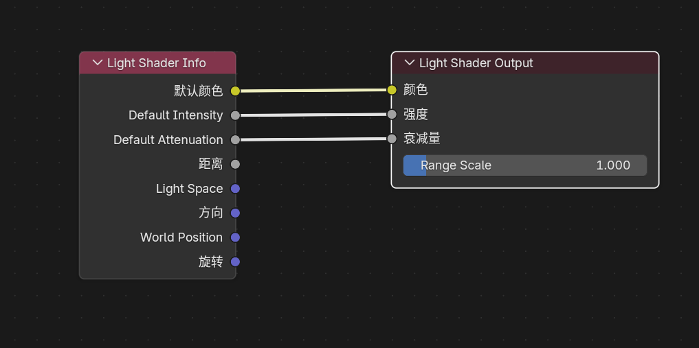

# 主要扩展节点

## 1. Filter 域节点

### Filter Object Info

#### 入口

`Add > Input > Filter Object Info`

仅在 `Filter` 域下可用。

<div align="center">
	
	<br>
</div>

#### 作用

读取指定对象的世界空间变换和视口显示颜色，方便在 Filter Graph 的 `Filter Pass` 材质中做基于对象状态的全屏滤镜控制。

#### 节点设置

- `Object`

#### 输出

- `Location`
- `Rotation`
- `Scale`
- `Color`

#### 说明

- `Location`：所选对象的世界空间位置
- `Rotation`：所选对象的世界空间欧拉旋转，单位为弧度
- `Scale`：所选对象的世界空间缩放
- `Color`：所选对象的视口显示颜色
- 如果没有指定对象，会输出默认值：位置 / 旋转 / 颜色为 `0`，缩放为 `1`

### Filter Mask

#### 入口

`Add > Input > Filter Mask`

仅在 `Filter` 域下可用。

<div align="center">
	
	<br>
</div>

#### 作用

使用 Eevee `Cryptomatte` 对象信息，为滤镜材质快速生成对象遮罩。

#### 输出

- `Mask`

#### 面板选项

- `Mode`
  - `Single Object`
  - `Object List`
  - `Collection`

#### 说明

- `Single Object` 适合快速指定单个控制对象
- `Object List` 适合手动维护一组对象，也可以用 `Use Selection` / `Append Selection` 从当前选择批量填充
- `Collection` 适合按集合层级统一管理遮罩对象
- 输出是 `0-1` 浮点遮罩，可直接接到 `Mix`、阈值、AOV 写出或其他滤镜控制链路中
- 只对可渲染的几何对象有效

### Scene Color

#### 入口

`Add > Input > Scene Color`

仅在 `Filter` 域下可用。

<div align="center">
	
	<br>
</div>

#### 作用

读取 Eevee 当前场景缓冲，可在节点面板中切换 `Source`：

- `Color`
- `Depth`
- `Normal`
- `Position`

#### 输入输出

- 输入：`Vector`
- 输出：`Color`、`Alpha`

#### 说明

- `Color`：读取最终场景颜色
- `Depth`：读取线性深度
- `Normal`：读取场景法线
- `Position`：读取世界空间位置
- 不连接 `Vector` 时，默认按 `Texture Coordinate` 的 `Window` 坐标采样
- 连接 `Vector` 时，`Color / Depth / Normal / Position` 都按同一套屏幕 UV 偏移采样；`Position` 会从偏移后的深度和屏幕坐标重建对应像素的世界坐标

## 2. Eevee 通用辅助节点

### Render Info

#### 入口

`Add > Input > Render Info`

<div align="center">
	
	<br>
</div>

#### 输出

- `Frag Coord`
- `Width`
- `Height`

#### 作用

提供当前 Eevee 渲染窗口的坐标和像素尺寸。

#### 说明

- `Frag Coord.xy` 为归一化到 `0-1` 的屏幕 UV
- `Frag Coord.z` 为当前片元深度
- `Width` / `Height` 为当前渲染区域的像素尺寸

### Scene Time

#### 入口

`Add > Input > Scene Time`

<div align="center">
	
	<br>
</div>

#### 输入

- `Scale`

#### 输出

- `Frame`
- `Seconds`
- `Timeline`
- `Scaled Frame`

#### 作用

提供当前场景时间相关的数值输出。

### Screen Derivative

#### 入口

`Add > Utilities > Math > Screen Derivative`

<div align="center">
	
	<br>
</div>

#### 功能

获得屏幕相邻像素之间的差异：

- `DDX`
- `DDY`
- `DDXY`

其中 `DDXY` 表示 `DDX + DDY`。

### Portal In / Portal Out

#### 入口

- `Add > Layout > Portal In`
- `Add > Layout > Portal Out`

<div align="center">
	
	<br>
</div>

#### 功能说明

这是一组用来整理节点连线的“传送门”节点。

#### 说明

- `Portal In`：在当前节点树里存一个有名字、有类型的值
- `Portal Out`：在同一节点树内按名字把这个值取出来继续使用
- 新建 `Portal In` 时会自动生成唯一名称
- `Portal Out` 上带有放大镜按钮，可快速跳转到对应的 `Portal In`
- 只在同一个 shader node tree 内识别，不支持跨节点树和跨节点组自动穿透

## 3. Eevee 物体材质节点

### Outline Control

#### 入口

`Add > Output > Outline Control`

在 `Eevee` 物体材质和 `NPR Tree` 中可用。

<div align="center">
	
	<br>
</div>

#### 输入

- `Line Color`
- `Line Alpha`
- `Line Width`
- `Depth Threshold`
- `Depth Threshold Range`
- `Depth Edge Width`
- `Normal Threshold`
- `Normal Threshold Range`
- `Normal Edge Width`
- `Outline ID`
- `ID Edge`
- `ID Edge Width`
- `Freestyle Edge`

#### 作用

为 Eevee 内置屏幕空间描边系统写入描边参数。

#### 使用方法

1. 在需要产生描边的材质里添加 `Outline Control` 节点。
2. 通过 `Line Color`、`Line Alpha` 和 `Line Width` 控制描边颜色、透明度和宽度。
3. 在 `Depth` 与 `Normal` 面板中分别调整阈值、过渡范围和边宽倍率。
4. 在 `ID` 面板中控制 ID 边界及其宽度，并按需启用 `Freestyle Edge`。
5. 在 `Render Properties > Outline` 中保持全局描边开关开启。
6. 如果需要单独输出描边结果，在 `View Layer Properties > Passes > Data` 中开启 `Outline` Render Pass。

#### 说明

- 这是一个辅助输出节点，不替代 `Material Output`，可与普通表面输出同时存在
- `Line Alpha` 会与 `Line Color.a` 相乘，最终共同决定描边透明度
- `Line Width <= 0` 或最终 alpha 为 `0` 时，不会写出描边
- `Outline ID = 0` 时，系统会按对象资源 ID 自动分配描边分组
- `Outline ID > 0` 时，可以手动把多个对象或多个材质表面并到同一个描边分组里
- `Depth Threshold` 更偏向控制深度断层轮廓，`Normal Threshold` 更偏向控制法线夹角造成的内部边
- `Threshold Range = 0` 时阈值为硬切换；增大范围可让边宽在越过阈值后平滑增长
- `Depth / Normal / ID Edge Width` 分别控制三类边的宽度倍率
- `ID Edge` 控制不同 Outline ID 之间的边界，`Freestyle Edge` 控制标记边是否参与描边
- 位于 Holdout 集合中的物体不会继续写出 `Outline Control` 参数，也不会贡献 Freestyle / marked-edge 描边种子

### Render Texture

#### 入口

`Add > Texture > Render Texture`

<div align="center">
	
	<br>
</div>

#### 作用

读取前面在场景里配置好的 `Render Textures` 条目。

#### 输入输出

- 输入：`Vector`
- 输出：`Color`、`Alpha`

### Screenspace Info

#### 入口

`Add > Input > Screenspace Info`

<div align="center">
	
	<br>
</div>

#### 输入输出

- 输入：`View Position`
- 输出：`Scene Color`、`Scene Depth`

#### 作用

获得当前渲染缓冲中的颜色或深度内容。

#### 使用说明

- 渲染设置中需要打开 `Raytracing`
- 材质选项 `Render Method` 选择 `Dithered`
- 材质选项打开 `Raytraced Transmission`
- `View Position` 默认输入为把当前位置变换到摄像机空间后再反转 `Z` 轴

### World Environment

#### 入口

`Add > Input > World Environment`

<div align="center">
	
	<br>
</div>

#### 输入输出

- 输入：`Direction`
- 输出：`Color`

#### 作用

直接采样 Eevee 的世界环境颜色，不依赖屏幕后方是否还有几何。

#### 说明

- `Direction` 不连接时，默认使用当前表面的视线方向
- `Direction` 连接后，可以按指定方向采样世界环境
- 输出更接近 Eevee 的环境 / probe 结果，而不是屏幕空间缓冲

### Light Probe Color

#### 入口

`Add > Input > Light Probe Color`

<div align="center">
	
	<br>
</div>

#### 输入输出

- 输入：`Direction`、`Roughness`
- 输出：`Reflection`、`Irradiance`、`Combined`

#### 作用

直接读取 Eevee 当前可用的光照探针结果，分别输出反射探针颜色、环境谐波漫反射颜色，以及两者叠加后的结果。

#### 说明

- `Reflection` 更接近反射探针 / 世界环境方向采样结果
- `Irradiance` 更接近体积光照探针或环境谐波的漫反射光照结果
- `Combined` 为 `Reflection + Irradiance`
- `Roughness` 控制反射探针的模糊程度，`0` 接近镜面，`1` 为最粗糙

### World To Tangent

#### 入口

`Add > Utilities > Vector > World To Tangent`

<div align="center">
	
	<br>
</div>

#### 输入输出

- 输入：`Vector`
- 输出：`Vector`

#### 作用

把一个世界空间方向向量转换到当前表面的切线空间。

#### 说明

- 节点面板中可指定 `UV Map`，该 UV 的切线会作为转换基底
- 适合拿来做各向异性方向控制、切线空间流向、局部扫描方向等效果

### GLSL Function

#### 入口

`Add > Script > GLSL Function`

在 `Eevee` 物体材质、`Filter` 材质和 `NPR Tree` 中可用；当前不在 `World` 域开放。

<div align="center">
	
	<br>
</div>

#### 作用

把一段用户编写的 `GLSL` 函数接入当前 Eevee 物体、Filter 或 NPR 材质编译流程，适合做自定义数学节点、程序纹理、SDF、屏幕效果封装，以及移植一部分外部 GLSL / HLSL 逻辑。

#### 基本使用方法

1. 添加 `GLSL Function` 节点。
2. 选择内部 `Text` 数据块，或者指定一个外部 `.glsl` 文件。
3. 在 `Function` 中显式选择真正要导出的函数名。
4. 使用节点顶部的 `Node / Code` 分段按钮切换普通节点控制和内联代码编辑。
5. 源码或函数选择发生变化后，点击刷新按钮解析、验证并更新节点接口。

<div align="center">
	
	<br>
	<sub>Node 模式中的源码、函数和参数接口</sub>
</div>

#### Node / Code 编辑模式

- `Node` 模式用于选择源码、函数和调整 socket；`Code` 模式可直接在节点中编辑内部 Text 的源码与目标函数名。
- 在 `Code` 模式输入内容只会更新节点的 draft，不会立即覆盖 Text、替换现有 socket 或改变正在运行的材质。
- draft 处于 dirty 状态时，刷新按钮执行原子 Apply：候选源码必须先通过解析和 GPU 编译验证，成功后才会写回 Text 并刷新接口；失败时继续保留旧 Text、旧 socket 和旧材质结果。
- 回退按钮执行 Discard，放弃尚未 Apply 的源码和函数名修改。
- 多个 `GLSL Function` 节点共享同一个 Text 时，Apply 会先验证所有用户，再一起刷新。其他用户存在未应用 draft、Text 被外部修改或存在不可编辑的链接用户时，Apply 会拒绝并保留当前状态。
- 外部 `.glsl` 在 `Code` 模式中只读；使用 `Make Internal` 可把当前外部源码复制为内部 Text 后再编辑。
- 未应用的 draft 会随 `.blend` 文件保存并在重新打开后恢复。

<div align="center">
	
	<br>
	<sub>外部源码在 Code 模式中只读，可通过 Make Internal 转为内部 Text</sub>
</div>

#### 示例工程

- `GLSL Function` 示例 `.blend` 工程：
  [Google Drive](https://drive.google.com/file/d/1dHtj8ZHMT9s2rPHAzfXm7gE7SbQqj-GT/view?usp=sharing)
- 这个文件可作为当前 `GLSL Function` 工作流和节点接线的现成参考场景。

#### 当前支持的函数边界类型

- 输入参数：`float`、`int`、`bool`、`vec2`、`vec3`、`vec4`、`mat2`、`mat3`、`mat4`、`sampler2D`
- 输出参数：`out float`、`out int`、`out bool`、`out vec2`、`out vec3`、`out vec4`、`out mat2`、`out mat3`、`out mat4`
- 返回值：`void`、`float`、`int`、`bool`、`vec2`、`vec3`、`vec4`、`mat2`、`mat3`、`mat4`

#### 重要说明

- `Function` 不会自动选第一个函数，需要手动指定
- `sampler2D` 会显示为 `Closure` 输入口
- `sampler2D` 可连接 `Image to Closure` 或符合约定的 `Closure Output`
- `Closure Output -> sampler2D` 当前只保证 `texture(tex, uv)` 这种直接采样形式
- 如果函数依赖 `textureLod`、`textureGrad`、`textureSize`、`texelFetch` 这类图像专用能力，应优先配合 `Image to Closure`
- `@glsl_meta` 支持 `default`、`min`、`max`、`hide_value`、`subtype`、`label`、`description` 和一级折叠面板分组
- `float` 当前支持的 `subtype`：`none`、`unsigned`、`percentage`、`factor`、`mass`、`angle`、`time`、`time_absolute`、`distance`、`wavelength`
- `vec2 / vec3 / vec4` 当前支持的 `subtype`：`none`、`factor`、`percentage`、`translation`、`direction`、`velocity`、`acceleration`、`euler`、`xyz`
- `subtype=color` 额外只支持 `vec3` 和 `vec4`
- `@glsl_meta default=` 除了 literal 以外，也支持 `glsl_position()`、`normalize(glsl_normal())`、`glsl_ambient_lighting()` 这类表达式默认值
- 当 `@glsl_meta default=` 使用表达式时，socket 未连接就取表达式，连接后就取连线值，并自动隐藏这个输入的数值编辑框
- 表达式默认值当前只建议用于输入参数 `float / vec2 / vec3 / vec4`，并且不要直接引用同函数其他参数名
- `label="..."` 可以给 socket 设置节点界面的显示名，支持中文和带空格的单行引号字符串；它不改变 GLSL 参数名或 socket identifier
- `description="..."` 可以给输入 socket 写 tooltip 注释，支持带空格的单行引号字符串
- `@panel "Name" closed=true|false` 可以把后续输入放到节点上的一级折叠面板里，必须用 `@end_panel` 显式关闭
- 面板只支持一级，不支持嵌套；面板内可以写 `param:` 空属性行，只做分组不改默认值
- `sampler2D` 可写 `label`、`description` 并放进 panel，但不支持 `default / min / max / hide_value / subtype`
- 只有显式写了 `subtype=color` 的 `vec3 / vec4` 输入，才会显示成颜色插口
- `vec3 + subtype=color` 进入 GLSL 时按 `rgb` 使用，`alpha` 固定为 `1.0`
- `vec4 + subtype=color` 会保留完整 `rgba`
- 刷新或重新编译节点时，`vec4` 输入会保留 `w` 分量，不会退化成 `vec3 / rgb`
- `mat2 / mat3 / mat4` 边界会在节点上拆分为矩阵列 socket，并在生成的 GLSL 包装函数中重新组合
- 矩阵输入的 Meta 目前只建议使用 `label`、`description` 和 `panel`；不要为矩阵写 `default / min / max / subtype`
- 当前不支持把 `struct / array` 作为导出函数边界类型
- 导出函数边界当前已经支持 `int / bool`，适合直接写模式开关、枚举值、`lightgroup_id` 这类参数
- 内置了几何 helper，可在函数体里直接读取：`glsl_position()`、`glsl_normal()`、`glsl_true_normal()`、`glsl_incoming()`
- 内置了环境光 helper：`glsl_ambient_lighting()`
- 内置了 Eevee 直接光辅助 helper，可在函数体里使用：`GLSLLight`、`glsl_light_count()`、`glsl_light_get(light_index)`、`glsl_light_shadow(light_index, shading_normal)`
- `GLSLLight.lightgroup_id` 直接对应灯光数据面板里的 `Lightgroup ID`
- `GLSLLight.attenuation` 只是自定义逐灯模型的基础衰减项，不包含 `NdotL`、toon ramp、Blinn-Phong、GGX、shadow 或材质侧 Fresnel / metallic / roughness
- 如果灯光节点树使用了 `Light Shader Output`，`glsl_light_get(i).diffuse_color`、`glsl_light_get(i).specular_color` 和 `glsl_light_get(i).attenuation` 会读取 Light Shader 评估后的颜色与衰减
- `Light Shader Output` 只影响这三个颜色 / 衰减字段；`type`、`index`、`lightgroup_id`、`vector`、`position`、`direction`、`distance` 仍来自 Eevee 原始灯光数据
- 没有 Light Shader 输出时，`GLSLLight` 保持普通 Eevee 灯光访问行为
- 这套直接光 helper 面向 Eevee 物体材质和 `NPR Tree` 的 Surface/Fragment 路径；`Filter`、`World`、体积、probe / indirect lighting 不作为稳定公共语义
- 推荐写法：`light.diffuse_color * light.attenuation * max(dot(N, light.vector), 0.0) * glsl_light_shadow(...)`
- 推荐写法：`light.specular_color * light.attenuation * custom_spec_term * glsl_light_shadow(...)`

#### 示例：带注释和面板的参数 Meta

`label="..."` 会显示为 socket 名称；`description="..."` 会显示为输入 socket 的 tooltip；`@panel` 可以把大量输入分组到节点上的一级折叠面板里。

```glsl
/* @glsl_meta v1
base_color: label="基础色" default=vec3(1.0) subtype=color description="Base surface color"

@panel Specular closed=true
specular: label="高光强度" default=0.5 min=0.0 max=1.0 subtype=factor description="Specular strength"
roughness: label="粗糙度" default=0.45 min=0.0 max=1.0 subtype=factor description="Highlight roughness"
@end_panel

@panel Texture closed=true
tex: label="贴图" description="Texture closure used by texture(tex, uv)"
uv: label="坐标" default=vec2(0.0) description="Texture coordinates"
@end_panel
*/
vec4 annotated_shader(vec3 base_color, float specular, float roughness, sampler2D tex, vec2 uv)
{
  vec3 tex_color = texture(tex, uv).rgb;
  vec3 color = mix(base_color, tex_color, specular * (1.0 - roughness));
  return vec4(color, 1.0);
}
```

- `label` 和 `description` 只影响 UI，不改变 socket identifier、默认值同步规则或 GLSL 调用方式
- `out` 参数只支持 `label`；其他 Meta 仍只支持输入参数
- `sampler2D` 可写 `label`、`description` 并放进 panel，但不支持 `default / min / max / hide_value / subtype`
- 面板只支持一级，不支持嵌套，且必须用 `@end_panel` 显式关闭

#### 示例：`mode` 对照调试 helper

如果你想在一个 `GLSL Function` 节点里按 `mode` 切换并读取这组 helper，下面这张表可以直接作为对照：

| `mode` | 对应 helper / 字段 |
| --- | --- |
| `0` | `glsl_position()` |
| `1` | `glsl_normal()` |
| `2` | `glsl_true_normal()` |
| `3` | `glsl_incoming()` |
| `4` | `glsl_ambient_lighting()` |
| `5` | `glsl_light_count()` |
| `6` | `light.valid` |
| `7` | `light.type` |
| `8` | `light.lightgroup_id` |
| `9` | `light.vector` |
| `10` | `light.position` |
| `11` | `light.direction` |
| `12` | `light.distance` |
| `13` | `light.diffuse_color` |
| `14` | `light.specular_color` |
| `15` | `light.attenuation` |
| `16` | `glsl_light_shadow(i, N)` |

#### 示例：按 `lightgroup_id` 过滤灯光

如果你想在 `GLSL Function` 里只接收某一个灯光组，可以直接读取 `GLSLLight.lightgroup_id`。下面这个版本同时展示 `subtype=color`、`int / bool` 默认值、`description`、`min / max`、`subtype=factor` 和 `@panel`：

```glsl
/* @glsl_meta v1
albedo: default=vec3(1.0) subtype=color description="Diffuse albedo for the selected light group"
target_lightgroup_id: default=0 description="Only lights with this Lightgroup ID are included"

@panel Shading closed=false
use_shadow: default=true description="Apply glsl_light_shadow to selected lights"
shadow_strength: default=1.0 min=0.0 max=1.0 subtype=factor description="Blend from unshadowed to fully shadowed direct light"
ambient_floor: default=0.0 min=0.0 max=1.0 subtype=factor description="Small constant fill after lightgroup filtering"
@end_panel
*/
vec4 lightgroup_lambert(vec3 albedo,
                        int target_lightgroup_id,
                        bool use_shadow,
                        float shadow_strength,
                        float ambient_floor)
{
  vec3 N = normalize(glsl_normal());
  vec3 result = vec3(0.0);
  float shadow_mix = clamp(shadow_strength, 0.0, 1.0);

  for (int i = 0; i < glsl_light_count(); i++) {
    GLSLLight light = glsl_light_get(i);
    if (!light.valid || light.lightgroup_id != target_lightgroup_id) {
      continue;
    }

    float NdotL = max(dot(N, light.vector), 0.0);
    if (NdotL <= 0.0) {
      continue;
    }

    float shadow = use_shadow ? glsl_light_shadow(i, N) : 1.0;
    shadow = mix(1.0, shadow, shadow_mix);
    result += albedo * light.diffuse_color * light.attenuation * NdotL * shadow;
  }

  result += albedo * clamp(ambient_floor, 0.0, 1.0);
  return vec4(result, 1.0);
}
```

#### 示例：PBR 风格直光 + 环境光

下面这段示例演示当前 `GLSL Function` 如何直接同时使用：

- 几何 helper：`glsl_normal()`、`glsl_true_normal()`、`glsl_incoming()`
- 环境光 helper：`glsl_ambient_lighting()`
- 逐灯 helper：`glsl_light_count()`、`glsl_light_get(i)`、`glsl_light_shadow(i, N)`

函数名可设为 `pbr_lit`。这个版本把常用表面参数放进 `Surface` 面板，并把内置 helper 作为 expression default 暴露成可选覆盖输入：

```glsl
/* @glsl_meta v1
base_color: default=vec3(0.8, 0.72, 0.6) subtype=color description="Base surface albedo"

@panel Surface closed=false
roughness: default=0.45 min=0.04 max=1.0 subtype=factor description="Microfacet roughness"
metallic: default=0.0 min=0.0 max=1.0 subtype=factor description="Metallic blend amount"
ao: default=1.0 min=0.0 max=1.0 subtype=factor description="Ambient occlusion multiplier"
@end_panel

@panel Builtin Helpers closed=true
normal_ws: default=normalize(glsl_normal()) hide_value=true description="Optional world-space shading normal override"
view_ws: default=normalize(glsl_incoming()) hide_value=true description="Optional world-space view direction override"
ambient_light: default=glsl_ambient_lighting() subtype=color hide_value=true description="Optional ambient lighting override"
@end_panel
*/
float saturate1(float x)
{
  return clamp(x, 0.0, 1.0);
}

float pow5(float x)
{
  float x2 = x * x;
  return x2 * x2 * x;
}

vec3 fresnel_schlick(float cos_theta, vec3 F0)
{
  return F0 + (vec3(1.0) - F0) * pow5(1.0 - saturate1(cos_theta));
}

float distribution_ggx(float NdotH, float roughness)
{
  float a = roughness * roughness;
  float a2 = a * a;
  float nh2 = NdotH * NdotH;
  float denom = nh2 * (a2 - 1.0) + 1.0;
  return a2 / max(3.14159265 * denom * denom, 1e-6);
}

float geometry_schlick_ggx(float NdotV, float roughness)
{
  float r = roughness + 1.0;
  float k = (r * r) / 8.0;
  return NdotV / max(NdotV * (1.0 - k) + k, 1e-6);
}

float geometry_smith(float NdotV, float NdotL, float roughness)
{
  return geometry_schlick_ggx(NdotV, roughness) *
         geometry_schlick_ggx(NdotL, roughness);
}

vec4 pbr_lit(vec3 base_color,
             float roughness,
             float metallic,
             float ao,
             vec3 normal_ws,
             vec3 view_ws,
             vec3 ambient_light)
{
  vec3 N = normalize(normal_ws);
  vec3 Ng = normalize(glsl_true_normal());
  vec3 V = normalize(view_ws);

  if (dot(N, Ng) < 0.0) {
    N = Ng;
  }

  roughness = clamp(roughness, 0.04, 1.0);
  metallic = clamp(metallic, 0.0, 1.0);
  ao = clamp(ao, 0.0, 1.0);

  vec3 F0 = mix(vec3(0.04), base_color, metallic);

  vec3 direct_diffuse = vec3(0.0);
  vec3 direct_specular = vec3(0.0);

  for (int i = 0; i < glsl_light_count(); i++) {
    GLSLLight light = glsl_light_get(i);
    vec3 L = normalize(light.vector);
    vec3 H = normalize(V + L);

    float NdotL = saturate1(dot(N, L));
    float NdotV = saturate1(dot(N, V));
    float NdotH = saturate1(dot(N, H));
    float VdotH = saturate1(dot(V, H));

    if (NdotL <= 1e-5 || NdotV <= 1e-5) {
      continue;
    }

    float shadow = glsl_light_shadow(i, N);

    vec3 F = fresnel_schlick(VdotH, F0);
    float D = distribution_ggx(NdotH, roughness);
    float G = geometry_smith(NdotV, NdotL, roughness);

    vec3 specular_brdf = (D * G * F) / max(4.0 * NdotV * NdotL, 1e-5);
    vec3 kd = (vec3(1.0) - F) * (1.0 - metallic);
    vec3 diffuse_brdf = kd * base_color / 3.14159265;

    direct_diffuse += diffuse_brdf *
                      light.diffuse_color *
                      light.attenuation *
                      NdotL *
                      shadow;

    direct_specular += specular_brdf *
                       light.specular_color *
                       light.attenuation *
                       NdotL *
                       shadow;
  }

  vec3 ambient = ambient_light * base_color * (1.0 - metallic) * ao;
  vec3 color = ambient + direct_diffuse + direct_specular;
  return vec4(max(color, vec3(0.0)), 1.0);
}
```

补充说明：

- `normal_ws`、`view_ws`、`ambient_light` 都有表达式默认值；socket 未连接时会自动调用对应内置 helper，连接后则使用外部输入
- `hide_value=true` 用于这类 helper 覆盖输入，避免节点上显示一个容易误解的静态默认数值

### GLSL Script Expression

#### 入口

`Add > Script > GLSL Script Expression`

在 `Eevee` 物体材质和 `NPR Tree` 中可用。

<div align="center">
	
	<br>
</div>

#### 作用

用一条单行 GLSL 表达式生成一个 `Result` 输出，适合把简单数学、颜色混合、向量重组和调试公式直接放进节点树，而不必创建单独的 Text 数据块或外部 `.glsl` 文件。

#### 节点设置

- `Output Type`
  - `Float`
  - `Vector`
  - `Color`
- `Expression`：赋值给 `Result` 的单条 GLSL 表达式
- `Variables`：手动维护输入变量列表，每个变量都会生成同名输入 socket
- 每个变量的类型支持 `Float`、`Vector`、`Color`

#### 使用方法

1. 添加 `GLSL Script Expression` 节点。
2. 设置 `Output Type`。
3. 在 `Variables` 面板中添加需要暴露到节点树的变量，并设置变量名与类型。
4. 在 `Expression` 中直接引用这些变量名。
5. 把 `Result` 接到后续节点。

#### 示例

```glsl
mix(base_color, tint_color, clamp(mask, 0.0, 1.0))
```

对应变量：

- `base_color`：`Color`
- `tint_color`：`Color`
- `mask`：`Float`
- `Output Type`：`Color`

#### 限制

- 只允许单条表达式，不允许 `;`、`{}`、预处理指令或多语句代码块
- 不允许赋值、递增递减、控制流、声明语句和注释
- 表达式只面向数值 GLSL；不支持字符串、采样器、贴图采样函数、image load/store
- 不能直接调用 `glsl_position()`、`glsl_normal()`、`glsl_light_get()` 这类 `GLSL Function` helper
- 变量名会被整理成合法 GLSL 标识符；保留字、`gl_` 前缀和内部 helper 名称会被自动避让
- 如果需要函数、纹理、直接光 helper、`sampler2D` 或复杂控制流，应改用 `GLSL Function`

### Image to Closure

#### 入口

`Add > Texture > Image to Closure`

在 `Eevee` 物体材质和 `NPR Tree` 中可用。

<div align="center">
	
	<br>
</div>

#### 输出

- `Closure`

#### 作用

把一张普通图片包装成 `sampler2D` 可消费的 `Closure` 源，主要用于给 `GLSL Function(sampler2D)` 提供图像输入，同时保持和程序化 `Closure Output` 相同的接线形式。

#### 节点设置

- `Image`
- `Interpolation`
- `Extension`

#### 使用说明

- 这个节点没有普通贴图插口，图片是在节点面板里直接选择
- 它主要是 `sampler2D` 工作流的图像适配节点，不是普通 `Image Texture` 的替代品
- 当函数需要图像资源专用采样能力时，应优先使用这个节点

### Basis Transform

#### 入口

`Add > Utilities > Vector > Basis Transform`

<div align="center">
	
	<br>
</div>

#### 作用

基于 `Origin + 轴向输入` 在材质节点里完成自定义基底变换，可用于处理点、方向向量和法线。

#### 输入输出

- 输入：`Vector`
- 输入：`Origin`
- 输入：`X Axis`
- 输入：`Y Axis`
- 输入：`Z Axis`
- 输出：`Vector`

#### 面板选项

- `Direction`
  - `To Basis`
  - `From Basis`
- `Vector Type`
  - `Point`
  - `Vector`
  - `Normal`
- `Basis Input`
  - `XY`
  - `XZ`
  - `YZ`
  - `XYZ`
- `Orthonormalize`
- `Fallback`

#### 说明

- `Point` 模式会把 `Origin` 当作平移参考；`Vector` 和 `Normal` 模式只做方向变换
- `Basis Input` 可以只提供两根轴，由节点补出第三根轴；也可以显式输入 `XYZ`
- `Orthonormalize` 适合在输入轴不完全正交时做稳定化，减少基底误差
- `Fallback` 用于控制基底退化或长度异常时的回退行为
- 适合做局部坐标投影、程序贴图定向、各向异性方向控制和自定义法线空间转换

### Twirl

#### 入口

`Add > Utilities > Vector > Twirl`

<div align="center">
	
	<br>
</div>

#### 输入输出

- 输入：`Vector`
- 输入：`Center`
- 输入：`Amount`
- 输出：`Vector`

#### 作用

围绕指定中心对输入坐标做旋扭，适合做 Goo Engine 风格的旋涡、扭曲 UV 和极坐标变形。

### Water Ripples

#### 入口

`Add > Texture > Water Ripples`

<div align="center">
	
	<br>
</div>

#### 输入输出

- 输入：`Vector`
- 输入：`Time`
- 输入：`Scale`
- 输入：`Intensity`
- 输入：`Speed`
- 输入：`Detail`
- 输入：`Bias`
- 输出：`Distorted Vector`
- 输出：`Mask`

#### 面板选项

- `Mode`
  - `Drops`
  - `Ripples`
  - `Flow`
  - `Caustic`

#### 作用

生成程序化水波扰动和强度遮罩。

### Hex Grid Texture

#### 入口

`Add > Texture > Hex Grid Texture`

<div align="center">
	
	<br>
</div>

#### 输入

- `Vector`
- `Scale`
- `Size`
- `Radius`
- `Roundness`

#### 输出

- `Value`
- `Color`
- `Hex Coords`
- `Position`
- `Cell UV`
- `Cell ID`

#### 面板选项

- `Coordinate Mode`
  - `XY Position`
  - `Hex Position`
- `Value Mode`
  - `Hexagons`
  - `SDF Hexagons`
  - `Dots`
- `Direction`
  - `Horizontal`
  - `Vertical`
  - `Horizontal Tiled`
  - `Vertical Tiled`
- `Clamp`

#### 作用

生成六边形网格纹理，可用于蜂窝图案、格子分块、SDF 遮罩和六边形坐标分区。

### SDF Primitive

#### 入口

`Add > Texture > SDF Primitive`

<div align="center">
	
	<br>
</div>

#### 输出

- `Distance`

#### 作用

在材质节点里直接生成符号距离场（SDF）基础形体。

### SDF Operator

#### 入口

`Add > Converter > SDF Operator`

<div align="center">
	
	<br>
</div>

#### 输出

- `Distance`

#### 作用

对一个或两个 SDF 距离场做组合、裁切和软边变形。

### SDF Vector Operator

#### 入口

`Add > Utilities > Vector > SDF Vector Operator`

<div align="center">
	
	<br>
</div>

#### 输出

- `Vector`
- `Position`
- `Value`

#### 作用

在进入 `SDF Primitive` 之前，先对采样坐标、UV 或向量域做重复、镜像、旋转、扭曲、平铺和范围映射等处理。

## 4. Goo Engine / NPR 相关输入节点

### Bevel

#### 入口

`Add > Input > Bevel`

<div align="center">
	
	<br>
</div>

#### 输入输出

- 输入：`Radius`、`Normal`
- 输出：`Normal`

#### 作用

在 `Eevee` 中生成近似的倒角法线，让硬边看起来更圆润。

### Curvature

#### 入口

`Add > Input > Curvature`

<div align="center">
	
	<br>
</div>

#### 输入

- `Samples`
- `Sample Radius`
- `Thickness`
- `Scale`

#### 输出

- `Scene Curvature`
- `Scene Rim`

#### 面板选项

- `Local`
- `Sample Radius`
  - `Pixel`
  - `View`

#### 说明

- `Local` 开启后，会尽量只按当前物体自身的信息计算
- `Pixel` 模式下，`Sample Radius` 以像素为单位，效果会随分辨率变化
- `View` 模式下，`Sample Radius` 会按视图相对尺度解释，更适合保持视图和最终渲染中的 rim 宽度一致
- 这是屏幕空间节点，结果会受到当前视角、屏幕分辨率和采样半径影响

### Shader Info

#### 入口

`Add > Input > Shader Info`

<div align="center">
	
	<br>
</div>

#### 输入

- `World Position`
- `Normal`
- `Exponent`

#### 输出

- `Diffuse Shading`
- `Shadow`
- `Ambient Lighting`
- `Half-Lambert Factor`
- `Blinn-Phong Factor`

#### 各输出的含义

- `Diffuse Shading`
  - 每个灯光的兰伯特光照之和，再钳制到 `0-1`
- `Shadow`
  - 可切换阴影模式
  - `Built-in`：使用 Eevee 原本的阴影计算
  - `Soft Filtered`：对当前表面附近的一像素邻域做额外采样和平均，把黑白抖动阴影重建成更平滑的灰度半影
- `Ambient Lighting`
  - 来自探针 / 环境间接光的环境照明信息
- `Half-Lambert Factor`
  - 每个灯光的半兰伯特光照之和，再钳制到 `0-1`
- `Blinn-Phong Factor`
  - 每个灯光的布林冯高光因子按镜面通道加权求平均，再钳制到 `0-1`
  - 默认不直接乘阴影，需要时请与 `Shadow` 输出自行组合

#### 额外说明

- `Shadow Mode`
  - `Built-in`
  - `Soft Filtered`
- `Exponent`
  - 控制布林冯高光的锐度，数值越高高光越集中
  - 默认值为 `16`
- 当 `Shadow Mode = Soft Filtered` 时，可用 `Stable Samples` 提高阴影质量
- 节点面板新增 `Lightgroup`
  - 只有 `Lightgroup ID` 相同的灯光，才会参与这个 `Shader Info` 节点的直接光照与阴影计算
- 当前实现会排除 world sun 对这些输出的干扰，避免 HDRI 或世界环境里的“太阳光”混入直接结果

### Light Info

#### 入口

`Add > Input > Light Info`

<div align="center">
	
	<br>
</div>

#### 功能说明

读取指定灯光信息。

#### 固定输出

- `Color`
- `Power`
- `Type`
- `Visible`

`Visible` 在所选灯光对象未隐藏时输出 `1`，隐藏时输出 `0`。

其中 `Type` 是整数插槽，含义为：

- `-1`：没有指定灯光
- `0`：Point
- `1`：Sun
- `2`：Spot
- `3`：Area

#### 按灯光类型自动出现的输出

- `Position`
- `Direction`
- `Radius`
- `Spot Size`
- `Sun Angle`

当前版本会根据灯光类型自动隐藏 / 显示相关接口：

- `Point`：`Position`、`Radius`
- `Sun`：`Direction`、`Sun Angle`
- `Spot`：`Position`、`Direction`、`Radius`、`Spot Size`
- `Area`：`Position`、`Direction`、`Radius`

#### 说明

- 如果你要做逐灯处理，应该使用 `NPR Tree` 里的 `For Each Light`

### Light Shader Info / Light Shader Output

#### 入口

在灯光的 Eevee Light Shader 节点树中使用：

- `Add > Input > Light Shader Info`
- `Add > Output > Light Shader Output`

#### 功能说明

`Light Shader Output` 用来为单盏 Eevee 灯光输出自定义的直接光颜色、强度和衰减。它只用于灯光节点树，不是普通物体材质输出节点。

<div align="center">
	
	<br>
	<sub>灯光节点树中的 Light Shader Info 与 Light Shader Output</sub>
</div>

#### Light Shader Info 输出

- `Default Color`
- `Default Intensity`
- `Default Attenuation`
- `Distance`
- `Light Space`
- `Direction`
- `World Position`
- `Rotation`

这些输出读取当前被评估灯光在当前采样点上的默认数据，适合作为自定义灯光 shader 的原始输入。

#### Light Shader Output 输入和设置

- `Color`：输出灯光颜色
- `Intensity`：乘到 `Color` 上的非负强度
- `Attenuation`：输出到 Light Shader 缓存 alpha 的非负衰减值
- `Range Scale`：缩放 Eevee 参与剔除和阴影使用的灯光影响范围；默认 `1` 保持原始灯光范围

最终写出的 Light Shader 结果语义为：

```glsl
vec4(Color.rgb * max(Intensity, 0.0), max(Attenuation, 0.0))
```

#### 行为说明

- 如果灯光没有自定义 Light Shader 输出，会保持普通 Eevee 灯光行为
- Light Shader 结果会参与 Eevee surface、deferred / NPR、forward、volume、probe capture 等已接入路径的直接光评估
- `GLSL Function` 的 `glsl_light_get(i)` 在 Surface 材质路径中会读取已评估的 Light Shader 颜色和衰减
- `GLSL Function` 只把 Light Shader 结果应用到 `diffuse_color`、`specular_color` 和 `attenuation`；灯光类型、位置、方向、距离和 `lightgroup_id` 保持 raw 灯光数据
- 体积、probe bake、surfel 等路径会使用 Light Shader Output 参与 Eevee 自身光照，但不扩展 `GLSL Function` 灯光 helper 的公共语义

<div align="center">
	
	<br>
	<sub>Light Shader Output 对灯光颜色与衰减的影响示例</sub>
</div>

## 5. 内置节点增强

### OKLab Color Ramp

#### 入口

`Add > Color > OKLab Color Ramp`

<div align="center">
	
	<br>
</div>

#### 作用

独立的 `OKLab Color Ramp` 节点会固定使用 OKLab 颜色空间评价色带，可在颜色过渡时得到更稳定、更接近感知均匀的渐变结果。

#### 说明

- 普通 `Color Ramp` 保持原有 RGB / HSV / HSL 工作流
- `OKLab Color Ramp` 的输入、输出和 stop 编辑方式与普通 `Color Ramp` 一致
- 旧版 `Color Ramp + OKLab` 模式文件会在打开时迁移回独立 `OKLab Color Ramp` 节点
- 该节点可用于 Shader、Geometry、Compositor 以及 Eevee Light Shader 支持的节点树
