# 主要扩展节点

## 1. Filter 域节点

### Filter Object Info

#### 入口

`Add > Input > Filter Object Info`

仅在 `Filter` 域下可用。

<div align="center">
	
	<br>
</div>

#### 作用

读取指定对象的世界空间变换和视口显示颜色，方便在 `Filter Materials` 中做基于对象状态的全屏滤镜控制。

#### 节点设置

- `Object`

#### 输出

- `Location`
- `Rotation`
- `Scale`
- `Color`

#### 说明

- `Location`：所选对象的世界空间位置
- `Rotation`：所选对象的世界空间欧拉旋转，单位为弧度
- `Scale`：所选对象的世界空间缩放
- `Color`：所选对象的视口显示颜色
- 如果没有指定对象，会输出默认值：位置 / 旋转 / 颜色为 `0`，缩放为 `1`

### Filter Mask

#### 入口

`Add > Input > Filter Mask`

仅在 `Filter` 域下可用。

<div align="center">
	
	<br>
</div>

#### 作用

使用 Eevee `Cryptomatte` 对象信息，为滤镜材质快速生成对象遮罩。

#### 输出

- `Mask`

#### 面板选项

- `Mode`
  - `Single Object`
  - `Object List`
  - `Collection`

#### 说明

- `Single Object` 适合快速指定单个控制对象
- `Object List` 适合手动维护一组对象，也可以用 `Use Selection` / `Append Selection` 从当前选择批量填充
- `Collection` 适合按集合层级统一管理遮罩对象
- 输出是 `0-1` 浮点遮罩，可直接接到 `Mix`、阈值、AOV 写出或其他滤镜控制链路中
- 只对可渲染的几何对象有效

### Scene Color

#### 入口

`Add > Input > Scene Color`

仅在 `Filter` 域下可用。

<div align="center">
	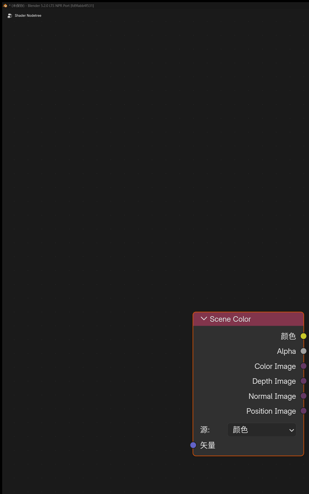
	<br>
</div>

#### 作用

读取 Eevee 当前场景缓冲，可在节点面板中切换 `Source`：

- `Color`
- `Depth`
- `Normal`
- `Position`

#### 输入输出

- 输入：`Vector`
- 输出：`Color`、`Alpha`

#### 说明

- `Color`：读取最终场景颜色
- `Depth`：读取线性深度
- `Normal`：读取场景法线
- `Position`：读取世界空间位置
- 不连接 `Vector` 时，默认按 `Texture Coordinate` 的 `Window` 坐标采样

## 2. Eevee 通用辅助节点

### Render Info

#### 入口

`Add > Input > Render Info`

<div align="center">
	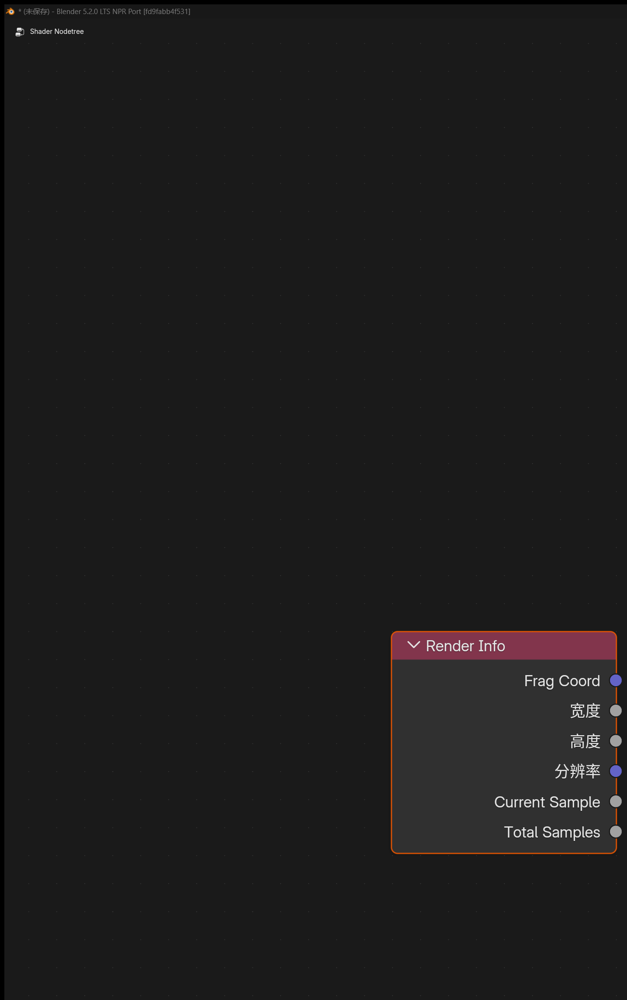
	<br>
</div>

#### 输出

- `Frag Coord`
- `Width`
- `Height`

#### 作用

提供当前 Eevee 渲染窗口的坐标和像素尺寸。

#### 说明

- `Frag Coord.xy` 为归一化到 `0-1` 的屏幕 UV
- `Frag Coord.z` 为当前片元深度
- `Width` / `Height` 为当前渲染区域的像素尺寸

### Scene Time

#### 入口

`Add > Input > Scene Time`

<div align="center">
	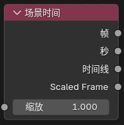
	<br>
</div>

#### 输入

- `Scale`

#### 输出

- `Frame`
- `Seconds`
- `Timeline`
- `Scaled Frame`

#### 作用

提供当前场景时间相关的数值输出。

### Screen Derivative

#### 入口

`Add > Utilities > Math > Screen Derivative`

<div align="center">
	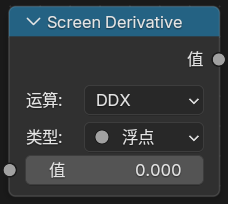
	<br>
</div>

#### 功能

获得屏幕相邻像素之间的差异：

- `DDX`
- `DDY`
- `DDXY`

其中 `DDXY` 表示 `DDX + DDY`。

### Portal In / Portal Out

#### 入口

- `Add > Layout > Portal In`
- `Add > Layout > Portal Out`

<div align="center">
	
	<br>
</div>

#### 功能说明

这是一组用来整理节点连线的“传送门”节点。

#### 说明

- `Portal In`：在当前节点树里存一个有名字、有类型的值
- `Portal Out`：在同一节点树内按名字把这个值取出来继续使用
- 新建 `Portal In` 时会自动生成唯一名称
- `Portal Out` 上带有放大镜按钮，可快速跳转到对应的 `Portal In`
- 只在同一个 shader node tree 内识别，不支持跨节点树和跨节点组自动穿透

## 3. Eevee 物体材质节点

### Render Texture

#### 入口

`Add > Texture > Render Texture`

<div align="center">
	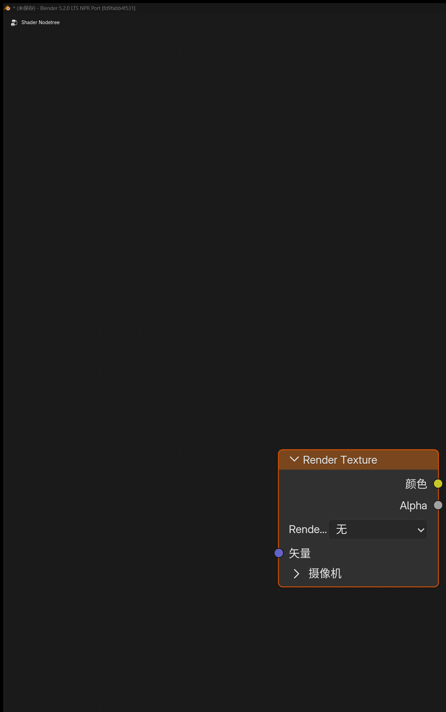
	<br>
</div>

#### 作用

读取前面在场景里配置好的 `Render Textures` 条目。

#### 输入输出

- 输入：`Vector`
- 输出：`Color`、`Alpha`

### Screenspace Info

#### 入口

`Add > Input > Screenspace Info`

<div align="center">
	
	<br>
</div>

#### 输入输出

- 输入：`View Position`
- 输出：`Scene Color`、`Scene Depth`

#### 作用

获得当前渲染缓冲中的颜色或深度内容。

#### 使用说明

- 渲染设置中需要打开 `Raytracing`
- 材质选项 `Render Method` 选择 `Dithered`
- 材质选项打开 `Raytraced Transmission`
- `View Position` 默认输入为把当前位置变换到摄像机空间后再反转 `Z` 轴

### World Environment

#### 入口

`Add > Input > World Environment`

<div align="center">
	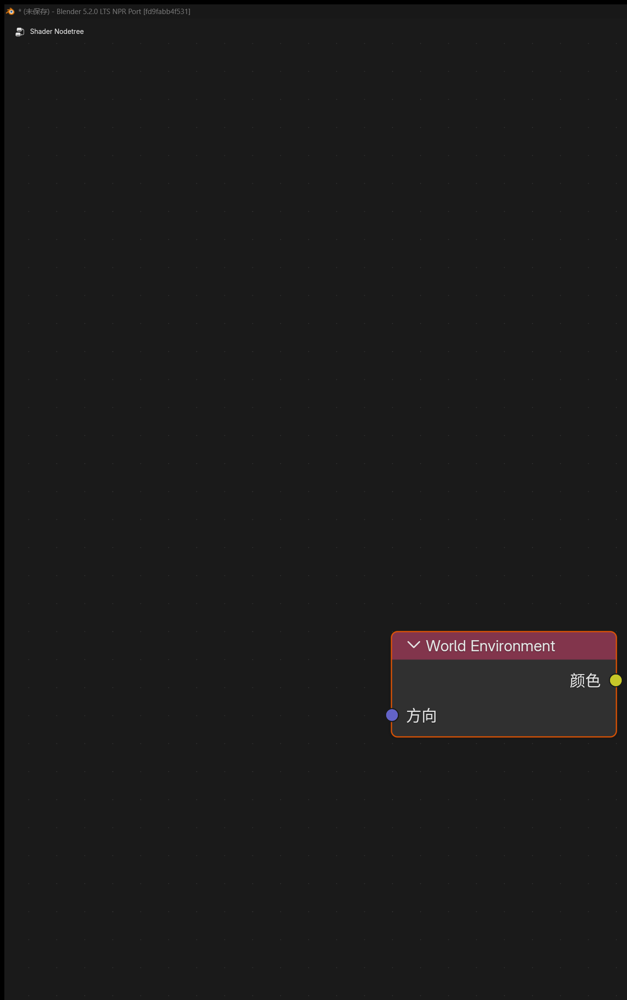
	<br>
</div>

#### 输入输出

- 输入：`Direction`
- 输出：`Color`

#### 作用

直接采样 Eevee 的世界环境颜色，不依赖屏幕后方是否还有几何。

#### 说明

- `Direction` 不连接时，默认使用当前表面的视线方向
- `Direction` 连接后，可以按指定方向采样世界环境
- 输出更接近 Eevee 的环境 / probe 结果，而不是屏幕空间缓冲

### Light Probe Color

#### 入口

`Add > Input > Light Probe Color`

#### 输入输出

- 输入：`Direction`
- 输出：`Reflection`、`Irradiance`、`Combined`

#### 作用

直接读取 Eevee 当前可用的光照探针结果，分别输出反射探针颜色、环境谐波漫反射颜色，以及两者叠加后的结果。

#### 说明

- `Reflection` 更接近反射探针 / 世界环境方向采样结果
- `Irradiance` 更接近体积光照探针或环境谐波的漫反射光照结果
- `Combined` 为 `Reflection + Irradiance`

### World To Tangent

#### 入口

`Add > Utilities > Vector > World To Tangent`

<div align="center">
	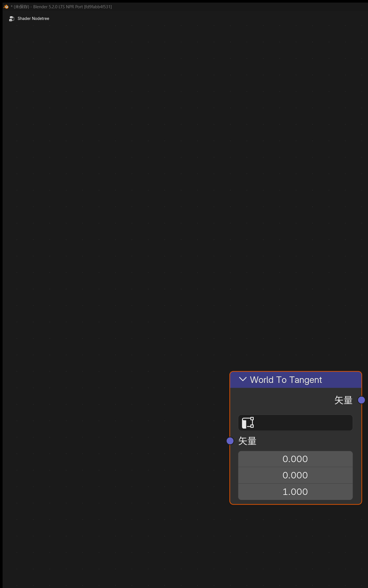
	<br>
</div>

#### 输入输出

- 输入：`Vector`
- 输出：`Vector`

#### 作用

把一个世界空间方向向量转换到当前表面的切线空间。

#### 说明

- 节点面板中可指定 `UV Map`，该 UV 的切线会作为转换基底
- 适合拿来做各向异性方向控制、切线空间流向、局部扫描方向等效果

### GLSL Function

#### 入口

`Add > Script > GLSL Function`

在 `Eevee` 物体材质和 `NPR Tree` 中可用。

<div align="center">
	
	<br>
</div>

#### 作用

把一段用户编写的 `GLSL` 函数接入当前 `Eevee / NPR` 材质编译流程，适合做自定义数学节点、程序纹理、SDF、屏幕效果封装，以及移植一部分外部 GLSL / HLSL 逻辑。

#### 基本使用方法

1. 在 `Text Editor` 中准备一段 `GLSL` 函数源码，或者指定一个外部 `.glsl` 文件。
2. 添加 `GLSL Function` 节点。
3. 在节点面板中选择源码来源和目标函数。
4. 如果修改了源码，可点击节点上的刷新按钮重新解析。
5. 在 `Function` 中显式选择真正要导出的函数名。

#### 当前支持的函数边界类型

- 输入参数：`float`、`int`、`bool`、`vec2`、`vec3`、`vec4`、`sampler2D`
- 输出参数：`out float`、`out int`、`out bool`、`out vec2`、`out vec3`、`out vec4`
- 返回值：`void`、`float`、`int`、`bool`、`vec2`、`vec3`、`vec4`

#### 重要说明

- `Function` 不会自动选第一个函数，需要手动指定
- `sampler2D` 会显示为 `Closure` 输入口
- `sampler2D` 可连接 `Image to Closure` 或符合约定的 `Closure Output`
- `Closure Output -> sampler2D` 当前只保证 `texture(tex, uv)` 这种直接采样形式
- 如果函数依赖 `textureLod`、`textureGrad`、`textureSize`、`texelFetch` 这类图像专用能力，应优先配合 `Image to Closure`
- `@glsl_meta` 支持 `default`、`min`、`max`、`hide_value` 和 `subtype`
- `@glsl_meta default=` 除了 literal 以外，也支持 `glsl_position()`、`normalize(glsl_normal())`、`glsl_ambient_lighting()` 这类表达式默认值
- 表达式默认值当前只建议用于输入参数 `float / vec2 / vec3 / vec4`，并且不要直接引用同函数其他参数名
- 只有显式写了 `subtype=color` 的 `vec3 / vec4` 输入，才会显示成颜色插口
- `vec3 + subtype=color` 进入 GLSL 时按 `rgb` 使用，`alpha` 固定为 `1.0`
- `vec4 + subtype=color` 会保留完整 `rgba`
- 当前不支持把 `mat* / struct / array` 作为导出函数边界类型
- 导出函数边界当前已经支持 `int / bool`，适合直接写模式开关、枚举值、`lightgroup_id` 这类参数
- 内置了几何 helper，可在函数体里直接读取：`glsl_position()`、`glsl_normal()`、`glsl_true_normal()`、`glsl_incoming()`
- 内置了环境光 helper：`glsl_ambient_lighting()`
- 内置了 Eevee 直接光辅助 helper，可在函数体里使用：`GLSLLight`、`glsl_light_count()`、`glsl_light_get(light_index)`、`glsl_light_shadow(light_index, shading_normal)`
- `GLSLLight.lightgroup_id` 直接对应灯光数据面板里的 `Lightgroup ID`
- `GLSLLight.attenuation` 只是自定义逐灯模型的基础衰减项，不包含 `NdotL`、toon ramp、Blinn-Phong、GGX、shadow 或材质侧 Fresnel / metallic / roughness
- 推荐写法：`light.diffuse_color * light.attenuation * max(dot(N, light.vector), 0.0) * glsl_light_shadow(...)`
- 推荐写法：`light.specular_color * light.attenuation * custom_spec_term * glsl_light_shadow(...)`

#### 示例：`mode` 对照调试 helper

如果你想在一个 `GLSL Function` 节点里按 `mode` 切换并读取这组 helper，下面这张表可以直接作为对照：

| `mode` | 对应 helper / 字段 |
| --- | --- |
| `0` | `glsl_position()` |
| `1` | `glsl_normal()` |
| `2` | `glsl_true_normal()` |
| `3` | `glsl_incoming()` |
| `4` | `glsl_ambient_lighting()` |
| `5` | `glsl_light_count()` |
| `6` | `light.valid` |
| `7` | `light.type` |
| `8` | `light.lightgroup_id` |
| `9` | `light.vector` |
| `10` | `light.position` |
| `11` | `light.direction` |
| `12` | `light.distance` |
| `13` | `light.diffuse_color` |
| `14` | `light.specular_color` |
| `15` | `light.attenuation` |
| `16` | `glsl_light_shadow(i, N)` |

#### 示例：按 `lightgroup_id` 过滤灯光

如果你想在 `GLSL Function` 里只接收某一个灯光组，可以直接读取 `GLSLLight.lightgroup_id`：

```glsl
vec4 lightgroup_lambert(vec3 albedo, int target_lightgroup_id)
{
  vec3 N = normalize(glsl_normal());
  vec3 result = vec3(0.0);

  for (int i = 0; i < glsl_light_count(); i++) {
    GLSLLight light = glsl_light_get(i);
    if (!light.valid || light.lightgroup_id != target_lightgroup_id) {
      continue;
    }

    float NdotL = max(dot(N, light.vector), 0.0);
    if (NdotL <= 0.0) {
      continue;
    }

    float shadow = glsl_light_shadow(i, N);
    result += albedo * light.diffuse_color * light.attenuation * NdotL * shadow;
  }

  return vec4(result, 1.0);
}
```

### Image to Closure

#### 入口

`Add > Texture > Image to Closure`

在 `Eevee` 物体材质和 `NPR Tree` 中可用。

<div align="center">
	
	<br>
</div>

#### 输出

- `Closure`

#### 作用

把一张普通图片包装成 `sample2D` 可消费的 `Closure` 源。

#### 节点设置

- `Image`
- `Interpolation`
- `Extension`

#### 使用说明

- 这个节点没有普通贴图插口，图片是在节点面板里直接选择
- 它主要是 `sampler2D` 工作流的图像适配节点，不是普通 `Image Texture` 的替代品
- 当函数需要图像资源专用采样能力时，应优先使用这个节点

### Basis Transform

#### 入口

`Add > Utilities > Vector > Basis Transform`

<div align="center">
	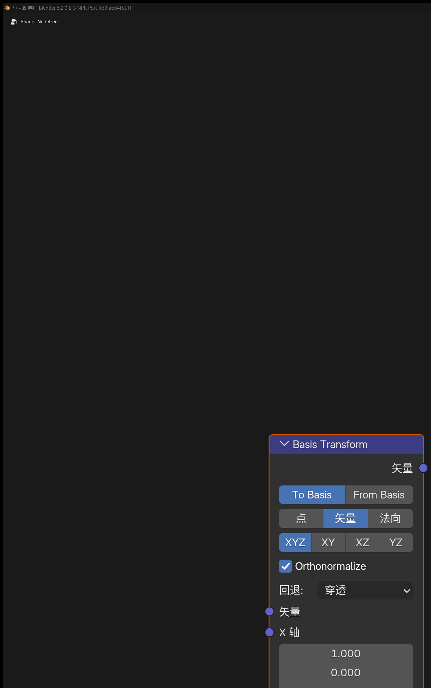
	<br>
</div>

#### 作用

基于 `Origin + 轴向输入` 在材质节点里完成自定义基底变换，可用于处理点、方向向量和法线。

#### 输入输出

- 输入：`Vector`
- 输入：`Origin`
- 输入：`X Axis`
- 输入：`Y Axis`
- 输入：`Z Axis`
- 输出：`Vector`

#### 面板选项

- `Direction`
  - `To Basis`
  - `From Basis`
- `Vector Type`
  - `Point`
  - `Vector`
  - `Normal`
- `Basis Input`
  - `XY`
  - `XZ`
  - `YZ`
  - `XYZ`
- `Orthonormalize`
- `Fallback`

#### 说明

- `Point` 模式会把 `Origin` 当作平移参考；`Vector` 和 `Normal` 模式只做方向变换
- `Basis Input` 可以只提供两根轴，由节点补出第三根轴；也可以显式输入 `XYZ`
- `Orthonormalize` 适合在输入轴不完全正交时做稳定化，减少基底误差
- `Fallback` 用于控制基底退化或长度异常时的回退行为
- 适合做局部坐标投影、程序贴图定向、各向异性方向控制和自定义法线空间转换

### Twirl

#### 入口

`Add > Utilities > Vector > Twirl`

<div align="center">
	
	<br>
</div>

#### 输入输出

- 输入：`Vector`
- 输入：`Center`
- 输入：`Amount`
- 输出：`Vector`

#### 作用

围绕指定中心对输入坐标做旋扭，适合做 Goo Engine 风格的旋涡、扭曲 UV 和极坐标变形。

### Water Ripples

#### 入口

`Add > Texture > Water Ripples`

<div align="center">
	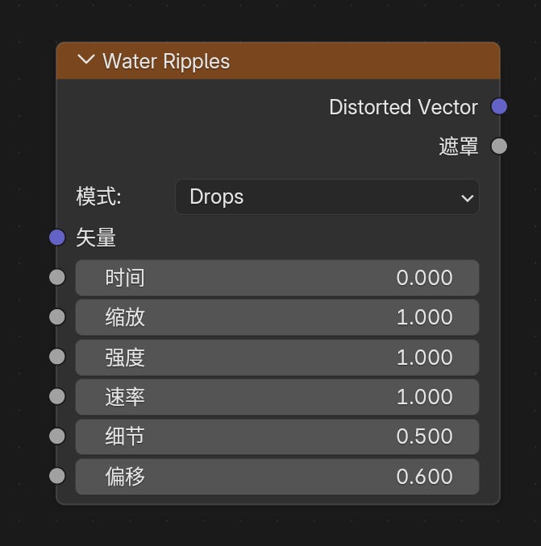
	<br>
</div>

#### 输入输出

- 输入：`Vector`
- 输入：`Time`
- 输入：`Scale`
- 输入：`Intensity`
- 输入：`Speed`
- 输入：`Detail`
- 输入：`Bias`
- 输出：`Distorted Vector`
- 输出：`Mask`

#### 面板选项

- `Mode`
  - `Drops`
  - `Ripples`
  - `Flow`
  - `Caustic`

#### 作用

生成程序化水波扰动和强度遮罩。

### Hex Grid Texture

#### 入口

`Add > Texture > Hex Grid Texture`

<div align="center">
	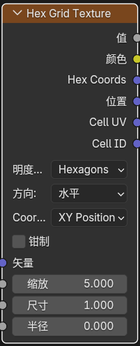
	<br>
</div>

#### 输入

- `Vector`
- `Scale`
- `Size`
- `Radius`
- `Roundness`

#### 输出

- `Value`
- `Color`
- `Hex Coords`
- `Position`
- `Cell UV`
- `Cell ID`

#### 面板选项

- `Coordinate Mode`
  - `XY Position`
  - `Hex Position`
- `Value Mode`
  - `Hexagons`
  - `SDF Hexagons`
  - `Dots`
- `Direction`
  - `Horizontal`
  - `Vertical`
  - `Horizontal Tiled`
  - `Vertical Tiled`
- `Clamp`

#### 作用

生成六边形网格纹理，可用于蜂窝图案、格子分块、SDF 遮罩和六边形坐标分区。

### SDF Primitive

#### 入口

`Add > Texture > SDF Primitive`

<div align="center">
	
	<br>
</div>

#### 输出

- `Distance`

#### 作用

在材质节点里直接生成符号距离场（SDF）基础形体。

### SDF Operator

#### 入口

`Add > Converter > SDF Operator`

<div align="center">
	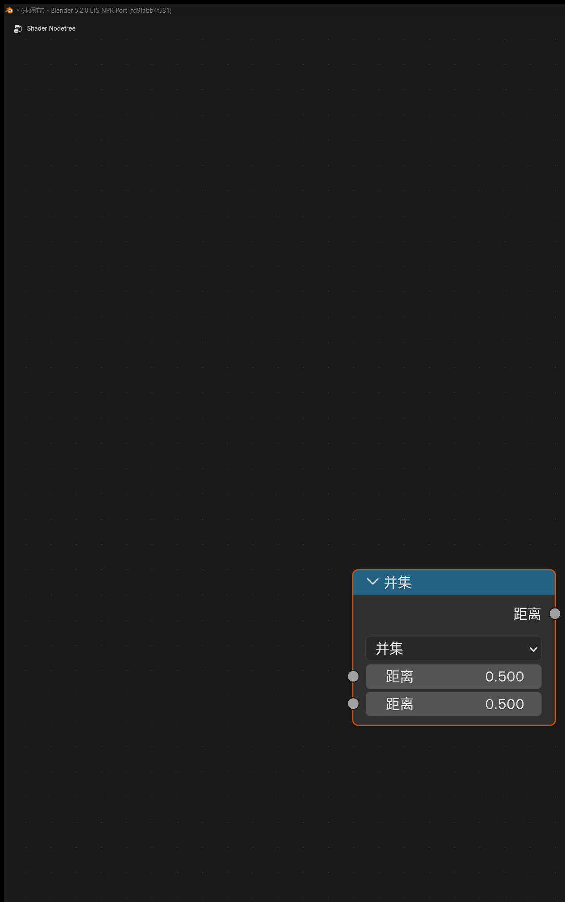
	<br>
</div>

#### 输出

- `Distance`

#### 作用

对一个或两个 SDF 距离场做组合、裁切和软边变形。

### SDF Vector Operator

#### 入口

`Add > Utilities > Vector > SDF Vector Operator`

<div align="center">
	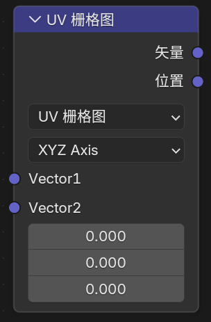
	<br>
</div>

#### 输出

- `Vector`
- `Position`
- `Value`

#### 作用

在进入 `SDF Primitive` 之前，先对采样坐标、UV 或向量域做重复、镜像、旋转、扭曲、平铺和范围映射等处理。

## 4. Goo Engine / NPR 相关输入节点

### Bevel

#### 入口

`Add > Input > Bevel`

<div align="center">
	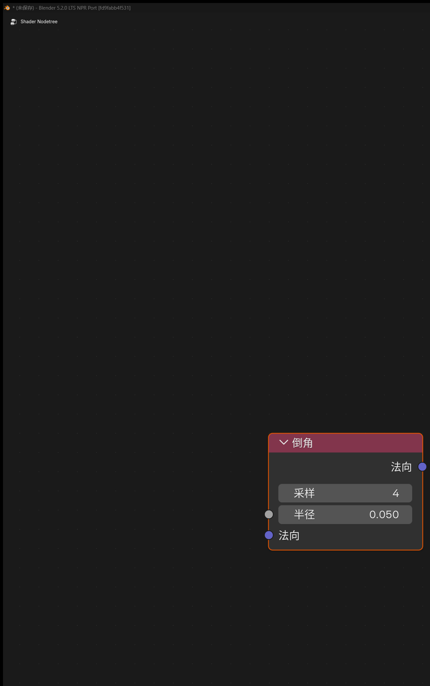
	<br>
</div>

#### 输入输出

- 输入：`Radius`、`Normal`
- 输出：`Normal`

#### 作用

在 `Eevee` 中生成近似的倒角法线，让硬边看起来更圆润。

### Curvature

#### 入口

`Add > Input > Curvature`

<div align="center">
	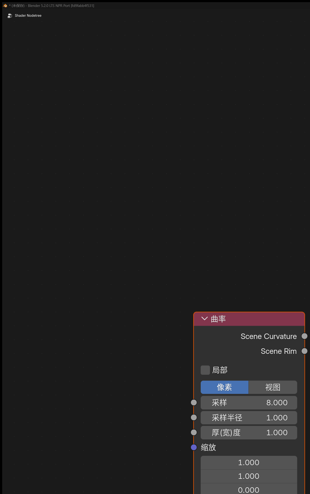
	<br>
</div>

#### 输入

- `Samples`
- `Sample Radius`
- `Thickness`
- `Scale`

#### 输出

- `Scene Curvature`
- `Scene Rim`

#### 面板选项

- `Local`
- `Sample Radius`
  - `Pixel`
  - `View`

#### 说明

- `Local` 开启后，会尽量只按当前物体自身的信息计算
- `Pixel` 模式下，`Sample Radius` 以像素为单位，效果会随分辨率变化
- `View` 模式下，`Sample Radius` 会按视图相对尺度解释，更适合保持视图和最终渲染中的 rim 宽度一致
- 这是屏幕空间节点，结果会受到当前视角、屏幕分辨率和采样半径影响

### Shader Info

#### 入口

`Add > Input > Shader Info`

<div align="center">
	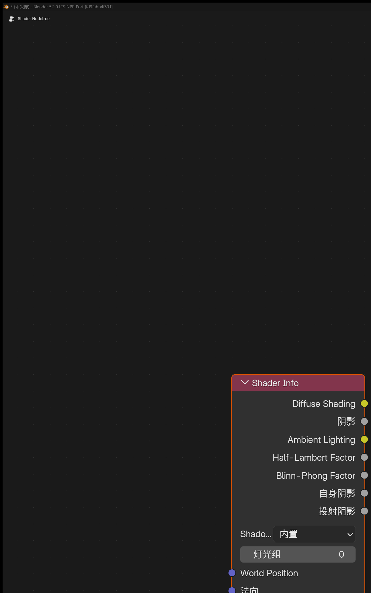
	<br>
</div>

#### 输入

- `World Position`
- `Normal`
- `Exponent`

#### 输出

- `Diffuse Shading`
- `Shadow`
- `Ambient Lighting`
- `Half-Lambert Factor`
- `Blinn-Phong Factor`

#### 各输出的含义

- `Diffuse Shading`
  - 每个灯光的兰伯特光照之和，再钳制到 `0-1`
- `Shadow`
  - 可切换阴影模式
  - `Built-in`：使用 Eevee 原本的阴影计算
  - `Soft Filtered`：对当前表面附近的一像素邻域做额外采样和平均，把黑白抖动阴影重建成更平滑的灰度半影
- `Ambient Lighting`
  - 来自探针 / 环境间接光的环境照明信息
- `Half-Lambert Factor`
  - 每个灯光的半兰伯特光照之和，再钳制到 `0-1`
- `Blinn-Phong Factor`
  - 每个灯光的布林冯高光因子按镜面通道加权求平均，再钳制到 `0-1`
  - 默认不直接乘阴影，需要时请与 `Shadow` 输出自行组合

#### 额外说明

- `Shadow Mode`
  - `Built-in`
  - `Soft Filtered`
- `Exponent`
  - 控制布林冯高光的锐度，数值越高高光越集中
  - 默认值为 `16`
- 当 `Shadow Mode = Soft Filtered` 时，可用 `Stable Samples` 提高阴影质量
- 节点面板新增 `Lightgroup`
  - 只有 `Lightgroup ID` 相同的灯光，才会参与这个 `Shader Info` 节点的直接光照与阴影计算
- 当前实现会排除 world sun 对这些输出的干扰，避免 HDRI 或世界环境里的“太阳光”混入直接结果

### Light Info

#### 入口

`Add > Input > Light Info`

<div align="center">
	
	<br>
</div>

#### 功能说明

读取指定灯光信息。

#### 固定输出

- `Color`
- `Power`
- `Type`

其中 `Type` 是整数插槽，含义为：

- `-1`：没有指定灯光
- `0`：Point
- `1`：Sun
- `2`：Spot
- `3`：Area

#### 按灯光类型自动出现的输出

- `Position`
- `Direction`
- `Radius`
- `Spot Size`
- `Sun Angle`

当前版本会根据灯光类型自动隐藏 / 显示相关接口：

- `Point`：`Position`、`Radius`
- `Sun`：`Direction`、`Sun Angle`
- `Spot`：`Position`、`Direction`、`Radius`、`Spot Size`
- `Area`：`Position`、`Direction`、`Radius`

#### 说明

- 如果你要做逐灯处理，应该使用 `NPR Tree` 里的 `For Each Light`

## 5. 内置节点增强

### Color Ramp（OKLab 模式）

#### 入口

`Add > Converter > Color Ramp`

<div align="center">
	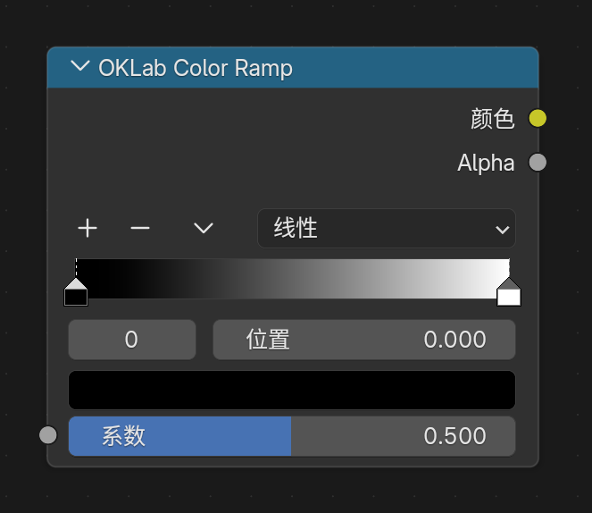
	<br>
</div>

#### 作用

`Color Ramp` 现在支持 `OKLab` 混色模式，可在颜色过渡时得到更稳定、更接近感知均匀的渐变结果。

#### 说明

- 旧的独立 `OKLab Color Ramp` 节点已经合并回 `Color Ramp`
- 如果旧节点树使用过 OKLab 专用版本，当前应统一改用 `Color Ramp` 的 `OKLab` 模式
