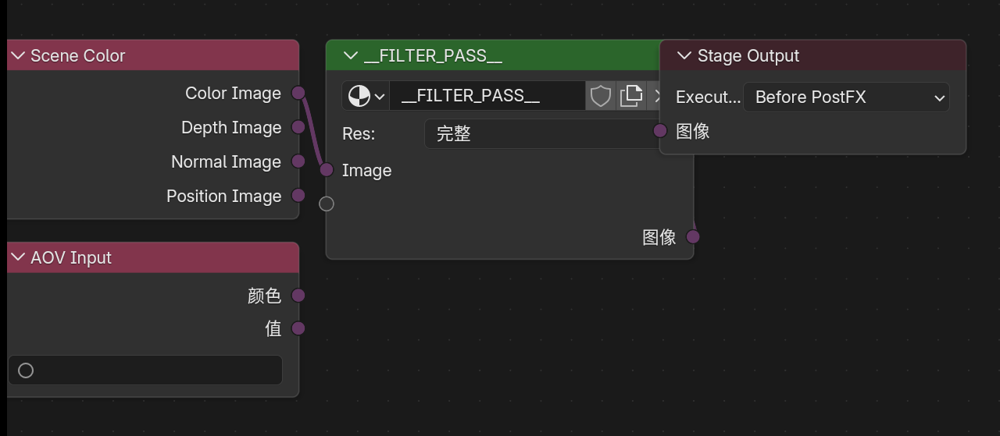
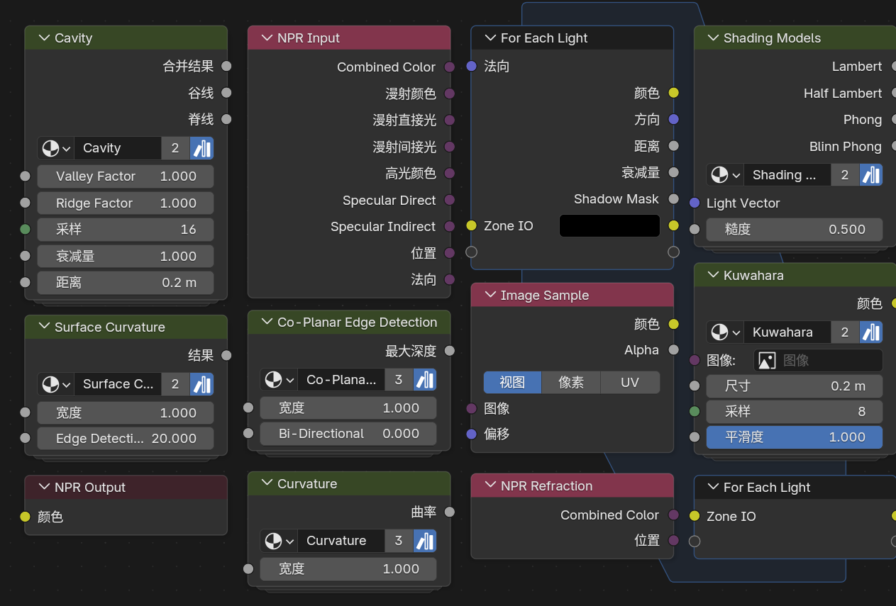
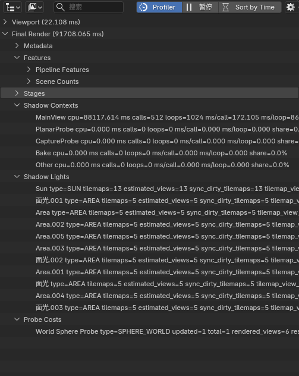

---
hide:
  - navigation
  - toc
---

Blender 5.2.0 LTS · NPR Port · fd9fabb4f531

# Eevee 上的风格化渲染扩展

把 NPR 能力收成四条可直接开工的路径：Scene 管线、扩展节点、NPR Tree、界面控制。
安装包带 Cycles；本站文档只覆盖 <strong>Eevee</strong> 扩展。

<a class="npr-btn npr-btn--primary" href="release.md">下载正式版</a>
<a class="npr-btn npr-btn--outline" href="#modules">功能模块</a>
<a class="npr-btn npr-btn--outline" href="https://github.com/bb-yi/blender">GitHub</a>

测试 <strong>110/110 · Win</strong>
日期 <strong>2026-08-11</strong>
平台 <strong>Win · Linux · macOS</strong>
引擎 <strong>Eevee</strong>

Map

## 先选工作路径

按你在 Blender 里会打开的入口分组，而不是平铺功能名。

<a href="scene-extensions.md">
01 · Scene
Scene 管线
渲染纹理、Filter Graph、相机输出、描边
</a>
<a href="extended-nodes.md">
02 · Nodes
扩展节点
Filter 域、辅助信息、GLSL、SDF、材质节点
</a>
<a href="npr-workflow.md">
03 · NPR Tree
NPR 工作流
光照分解、折射、图像采样、逐灯循环
</a>
<a href="interface-guide.md">
04 · UI
界面控制
性能归因、材质状态、灯光组、阴影缩放
</a>

Modules

## 模块说明

01 · Scene
### Scene 管线

在场景层搭渲染纹理与后处理图，而不是把整条链路塞进单个物体材质。

- **Render Textures**：场景级自定义渲染纹理
- **Filter Graph**：四阶段执行图，Filter Pass 可复用
- **Camera FX Outputs**：原生相机特效输出源
- **Eevee Outline**：场景级描边

Render TexturesFilter GraphCamera FXOutline

<a class="npr-btn npr-btn--outline" href="scene-extensions.md">阅读 Scene 文档</a>

Filter Graph · Scene Color / Pass / Stage

02 · Nodes
### 扩展着色器节点

补齐屏幕空间、物体材质和自定义 GLSL 所需节点；Filter 域节点单独成类，见下方节点一览。

- **通用辅助**：Render Info、Scene Time、Screen Derivative、Portal
- **物体材质**：Outline Control、Screenspace Info、World / Probe
- **GLSL / 程序化**：Function、Script Expression、SDF、OKLab、Parallax
- **Filter 域**：Object Info、Mask、Scene Color、Pass I/O

GLSL FunctionSDFPortalOutline

<a class="npr-btn npr-btn--outline" href="extended-nodes.md">阅读节点文档</a>

扩展着色器 · 节点一览

03 · NPR Tree
### NPR Tree 工作流

在专用 NPR Tree 里做光照分解、折射、采样和逐灯处理，并附带可拖用的内置节点组。

- **NPR Input / Output**：合成 / 漫射 / 高光等光照分解与写出
- **NPR Refraction**：折射路径（含体积近似相关修复）
- **Image Sample**：视图 / 像素 / UV 三种偏移采样
- **For Each Light**：逐灯循环与灯光信息
- **内置资产**：常用 NPR 节点组可直接拖入

NPR InputRefractionImage SampleAssets

<a class="npr-btn npr-btn--outline" href="npr-workflow.md">阅读 NPR 工作流</a>

NPR Tree · 专用节点一览

04 · UI
### 界面与生产控制

把性能归因、材质渲染状态和灯光控制放进日常面板，方便风格化项目排错与调参。

- **Eevee Performance**：阴影 / 探针成本归因
- **材质状态**：预览、剔除、ZTest / Stencil / Write
- **灯光**：Lightgroup ID、太阳光 Shadow Map Scale
- **生产辅助**：启动图版本、IME、骨骼 Outliner 显示

PerformanceStencilLightgroupShadow Scale

<a class="npr-btn npr-btn--outline" href="interface-guide.md">阅读界面文档</a>

Eevee Performance · Shadow / Probe

Node catalog

## 新增节点一览

相对官方 Blender，本 Port 在着色器、NPR Tree 与 Filter 域新增的节点分三类集中展示。详细参数见对应文档页。

### 着色器扩展节点

- Render Info / Screen Derivative / Portal In·Out  
- Outline Control / Render Texture / Screenspace Info  
- World Environment / Light Probe Color / World To Tangent  
- GLSL Function / Script Expression / Image to Closure  
- Basis Transform / Twirl / Water Ripples / Hex Grid / Parallax  
- SDF Primitive·Operator·Vector Op / Bevel / Curvature  
- Shader Info / Light Info / Light Shader Info·Output / OKLab Color Ramp  

[扩展节点文档 →](extended-nodes.md)

### NPR Tree 节点

- NPR Input / NPR Output / NPR Refraction  
- Image Sample（视图 / 像素 / UV）  
- For Each Light（Input + Output 成对 Zone）  
- 内置节点组：Cavity / Co-Planar Edge / Curvature / Kuwahara / Shading Models / Surface Curvature  

[NPR 工作流 →](npr-workflow.md)

### Filter 域节点

- Pass Input / Image Sample / Filter Output（Filter Pass 材质默认链）  
- Filter Object Info / Filter Mask / Scene Color  
- 图级节点：Scene Color · AOV Input · Filter Pass · Stage Output（见 Scene 文档）  

[Scene / Filter Graph →](scene-extensions.md) · [Filter 域节点 →](extended-nodes.md#4-filter-域节点)

This build

## 本版变更 · fd9fabb4f531

正式包重点：折射体积、GLSL 矩阵 helper、阴影细节、输入体验。

### 新增
- EEVEE NPR 折射体积近似，并完成采样 / 捕获隔离与背景漏光修复
- `GLSL Function` 提供 draw-view 矩阵 helper（view / projection / model 及 inverse；详见节点文档）
- 视口 Shadow LOD 可视化
- 改进 IME（适配 5.2 API，修正文本编辑器光标度量）

### 修复
- 折射体积下 Image Sample 偏移黑洞、背景 miss、深度映射
- 太阳光 `Shadow Map Scale` 正确作用于 tilemap
- 未连接 GLSL sampler 回退为白色
- 恢复 NPR Tree AOV 输出
- 稳定 Render Texture 资源生命周期

<a class="npr-btn npr-btn--outline" href="release.md">下载与校验信息</a>
<a class="npr-btn npr-btn--outline" href="https://github.com/bb-yi/blender/blob/main/blender-npr-release-changelog.md">完整 changelog</a>

!!! warning "仅支持 Eevee"
    安装包可以跑 Cycles，但本站记录的 NPR Port 扩展只在 **Eevee** 下可用。

Release

## Windows x64 正式包

完整验证基线为 Windows（110/110）；同版本附带 Linux / macOS，含 SHA256。

<a class="npr-btn npr-btn--primary" href="release.md">打开下载页</a>
<a class="npr-btn npr-btn--outline" href="https://github.com/bb-yi/blender/releases">全部 Release</a>

