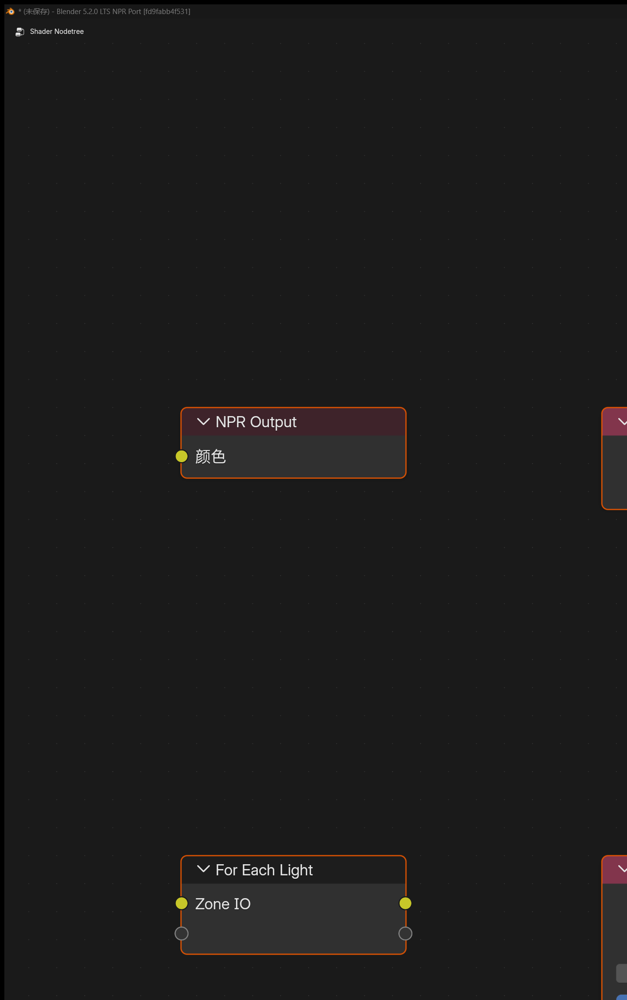

# Blender 5.2.0 LTS NPR Port 新增功能与使用说明

## 项目介绍

`Blender 5.2.0 LTS NPR Port` 是一个 NPR 特化的 `Blender` 分支。在融合 `Goo Engine` 和 `4.4 NPR-prototype` 特色节点之外，还额外加入了一批面向 `Eevee` 的扩展节点、Filter Graph 工作流和界面增强。

发布包包含 `Cycles`，但本文介绍的 NPR 扩展功能是 `Eevee` 专用，不支持在 `Cycles` 中使用。

## 文档范围

这份文档说明当前 `Blender 5.2.0 LTS NPR Port` 相比官方 `Blender 5.2.0 LTS` 已经加入、并且当前分支内实际存在的 NPR / Eevee 扩展功能，以及它们的基本使用方法。

## 5.2.0 LTS 更新重点

- 迁移到官方 `Blender 5.2.0 LTS` 代码基线，并完成 Eevee NPR 渲染路径适配
- 用场景级 `Filter Graph` 取代旧的线性 Filter Materials 列表，支持四个执行阶段和可复用的 Filter Pass 材质
- `GLSL Function` 新增 `Node / Code` 编辑模式，可在节点内编辑内部 Text，并通过原子 Apply / Discard 工作流保护正在运行的材质
- `GLSL Function` 支持 `mat2`、`mat3`、`mat4` 输入、`out` 参数和返回值，并可用于 Eevee 物体材质、Filter 材质和 `NPR Tree`
- `GLSL Function` 新增 draw-view 变换矩阵 helper（视图 / 投影 / 模型，含 overscan 与 TAA jitter）
- EEVEE NPR 折射体积近似，改善体积场景中的折射背景合成与 `Image Sample` 偏移稳定性
- 保留 `GLSL Script Expression`、`Native Camera FX Outputs`、`Eevee Performance` 阴影 / 探针归因和 `OKLab Color Ramp` 等 NPR 扩展
- 修复 5.2 迁移后的 Eevee 着色器、透明 AOV、Scene Color 偏移采样和节点接口兼容问题
- 当前正式包：`fd9fabb4f531`（2026-08-11），Release 测试 `110/110` 通过

## 节点一览

    
     
    着色器节点

    
     
    NPR Tree 节点（部分着色器节点也可在 NPR Tree 中使用）

    
     
    Eevee Filter Graph

- **Scene 级扩展**

    ---

    从场景级 Eevee 扩展开始了解核心功能。

    [查看 Scene 级扩展](scene-extensions.md)

- **扩展节点**

    ---

    深入查看新增节点的用途和接线方式。

    [查看扩展节点](extended-nodes.md)

- **NPR 工作流**

    ---

    了解 NPR Tree 的挂接方式和专用节点。

    [查看 NPR 工作流](npr-workflow.md)

- **界面与设置**

    ---

    查看额外的界面选项与工作流补充。

    [查看界面与设置](interface-guide.md)

## 主要功能分类

### 1. Scene 级 Eevee 扩展

- [`Render Textures`](scene-extensions.md#1-render-textures)
- [`Filter Graph`](scene-extensions.md#2-filter-graph)
- [`Eevee Outline`](scene-extensions.md#4-eevee-outline)
- [`Native Camera FX Outputs`](scene-extensions.md#3-native-camera-fx-outputs)
- [`Scene Color / AOV Input / Filter Pass / Stage Output`](scene-extensions.md#2-filter-graph)

### 2. 着色器节点

- [`Filter Object Info`](extended-nodes.md#filter-object-info)
- [`Filter Mask`](extended-nodes.md#filter-mask)
- [`Scene Color`](extended-nodes.md#scene-color)
- [`Render Info`](extended-nodes.md#render-info)
- [`Scene Time`](extended-nodes.md#scene-time)
- [`Screen Derivative`](extended-nodes.md#screen-derivative)
- [`Portal In / Portal Out`](extended-nodes.md#portal-in-portal-out)
- [`Outline Control`](extended-nodes.md#outline-control)
- [`Screenspace Info`](extended-nodes.md#screenspace-info)
- [`World Environment`](extended-nodes.md#world-environment)
- [`Light Probe Color`](extended-nodes.md#light-probe-color)
- [`World To Tangent`](extended-nodes.md#world-to-tangent)
- [`GLSL Function`](extended-nodes.md#glsl-function)
- [`GLSL Script Expression`](extended-nodes.md#glsl-script-expression)
- [`Image to Closure`](extended-nodes.md#image-to-closure)
- [`Light Shader Info`](extended-nodes.md#light-shader-info-light-shader-output)
- [`Light Shader Output`](extended-nodes.md#light-shader-info-light-shader-output)
- [`Basis Transform`](extended-nodes.md#basis-transform)
- [`Twirl`](extended-nodes.md#twirl)
- [`Water Ripples`](extended-nodes.md#water-ripples)
- [`Hex Grid Texture`](extended-nodes.md#hex-grid-texture)
- [`SDF Primitive`](extended-nodes.md#sdf-primitive)
- [`SDF Operator`](extended-nodes.md#sdf-operator)
- [`SDF Vector Operator`](extended-nodes.md#sdf-vector-operator)
- [`Bevel`](extended-nodes.md#bevel)
- [`Curvature`](extended-nodes.md#curvature)
- [`Shader Info`](extended-nodes.md#shader-info)
- [`Light Info`](extended-nodes.md#light-info)
- [`OKLab Color Ramp`](extended-nodes.md#oklab-color-ramp)

### 3. NPR Tree 工作流

- [`NPR Input`](npr-workflow.md#npr-input)
- [`NPR Refraction`](npr-workflow.md#npr-refraction)
- [`Image Sample`](npr-workflow.md#image-sample)
- [`For Each Light`](npr-workflow.md#for-each-light)
- [内置节点组资产](npr-workflow.md#5-npr)

### 4. 界面与设置

- [`Eevee Performance` Outliner 视图](interface-guide.md#1-eevee-performance)
- [`Eevee Performance` 的阴影 / 探针成本归因](interface-guide.md#1-eevee-performance)
- [材质预览控制](interface-guide.md#2)
- [材质剔除模式](interface-guide.md#3)
- [材质 `ZTest / Stencil / Color Write / Depth Write`](interface-guide.md#4-surface)
- [灯光组管理](interface-guide.md#5-eevee-lightgroup-id)
- [太阳光 `Shadow Map Scale`](interface-guide.md#6-shadow-map-scale)
- [启动图版本标识](interface-guide.md#7)
- [骨骼 Outliner 显示控制](interface-guide.md#9-outliner)

!!! warning "Eevee 专用"
    发布包可以运行 `Cycles`，但本文介绍的 NPR Port 扩展功能需要 **Eevee 渲染引擎**，不支持在 `Cycles` 中使用。
