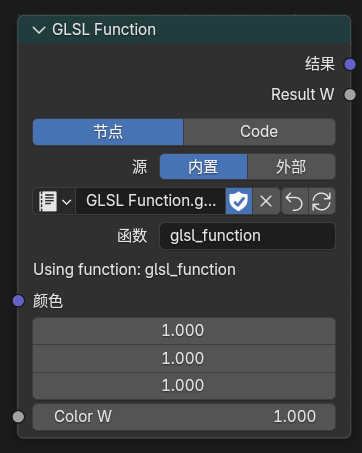

---
hide:
  - navigation
  - toc
---

Blender 5.2.0 LTS · NPR Port · fd9fabb4f531

# Eevee 上的风格化渲染扩展

把 NPR 能力收成四条可直接开工的路径：Scene 管线、扩展节点、NPR Tree、界面控制。
安装包带 Cycles；本站文档只覆盖 <strong>Eevee</strong> 扩展。

<a class="npr-btn npr-btn--primary" href="release.html">下载正式版</a>
<a class="npr-btn npr-btn--outline" href="#modules">功能模块</a>
<a class="npr-btn npr-btn--outline" href="https://github.com/bb-yi/blender">GitHub</a>

测试 <strong>110/110</strong>
日期 <strong>2026-08-11</strong>
平台 <strong>Win x64</strong>
引擎 <strong>Eevee</strong>

Map

## 先选工作路径

按你在 Blender 里会打开的入口分组，而不是平铺功能名。

<a href="scene-extensions.html">
01 · Scene
Scene 管线
渲染纹理、Filter Graph、相机输出、描边
</a>
<a href="extended-nodes.html">
02 · Nodes
扩展节点
Filter 域、辅助信息、GLSL、SDF、材质节点
</a>
<a href="npr-workflow.html">
03 · NPR Tree
NPR 工作流
光照分解、折射、图像采样、逐灯循环
</a>
<a href="interface-guide.html">
04 · UI
界面控制
性能归因、材质状态、灯光组、阴影缩放
</a>

Modules

## 模块说明

01 · Scene
### Scene 管线

在场景层搭渲染纹理与后处理图，而不是把整条链路塞进单个物体材质。

- **Render Textures**：场景级自定义渲染纹理
- **Filter Graph**：四阶段执行图，Filter Pass 可复用
- **Camera FX Outputs**：原生相机特效输出源
- **Eevee Outline**：场景级描边

Render TexturesFilter GraphCamera FXOutline

<a class="npr-btn npr-btn--outline" href="scene-extensions.html">阅读 Scene 文档</a>

Filter Graph · 视口 + Filter Material

02 · Nodes
### 扩展着色器节点

补齐 Filter、屏幕空间、物体材质和自定义 GLSL 所需节点，从采样做到程序化造型。

- **Filter 域**：Object Info、Mask、Scene Color
- **通用辅助**：Render Info、Scene Time、Screen Derivative、Portal
- **物体材质**：Outline Control、Screenspace Info、World / Probe
- **GLSL / 程序化**：Function、Script Expression、SDF、OKLab

Scene ColorGLSL FunctionSDFPortal

<a class="npr-btn npr-btn--outline" href="extended-nodes.html">阅读节点文档</a>

GLSL Function · Node / Code

03 · NPR Tree
### NPR Tree 工作流

在专用 NPR Tree 里做光照分解、折射、采样和逐灯处理，并附带可拖用的内置节点组。

- **NPR Input**：合成 / 漫射 / 高光等光照分解
- **NPR Refraction**：折射路径（含体积近似相关修复）
- **Image Sample**：支持偏移模式的图像采样
- **For Each Light**：逐灯循环与灯光信息
- **内置资产**：常用 NPR 节点组可直接拖入

NPR InputRefractionImage SampleAssets

<a class="npr-btn npr-btn--outline" href="npr-workflow.html">阅读 NPR 工作流</a>

NPR Tree · Input / Refraction / Assets

04 · UI
### 界面与生产控制

把性能归因、材质渲染状态和灯光控制放进日常面板，方便风格化项目排错与调参。

- **Eevee Performance**：阴影 / 探针成本归因
- **材质状态**：预览、剔除、ZTest / Stencil / Write
- **灯光**：Lightgroup ID、太阳光 Shadow Map Scale
- **生产辅助**：启动图版本、IME、骨骼 Outliner 显示

PerformanceStencilLightgroupShadow Scale

<a class="npr-btn npr-btn--outline" href="interface-guide.html">阅读界面文档</a>

Eevee Performance · Shadow / Probe

This build

## 本版变更 · fd9fabb4f531

正式包重点：折射体积、GLSL 矩阵 helper、阴影细节、输入体验。

### 新增
- EEVEE NPR 折射体积近似，并完成采样 / 捕获隔离与背景漏光修复
- `GLSL Function` 提供 draw-view 变换矩阵 helper（视图 / 投影 / 模型）
- 视口 Shadow LOD 可视化
- 改进 IME（适配 5.2 API，修正文本编辑器光标度量）

### 修复
- 折射体积下 Image Sample 偏移黑洞、背景 miss、深度映射
- 太阳光 `Shadow Map Scale` 正确作用于 tilemap
- 未连接 GLSL sampler 回退为白色
- 恢复 NPR Tree AOV 输出
- 稳定 Render Texture 资源生命周期

<a class="npr-btn npr-btn--outline" href="release.html">下载与校验信息</a>
<a class="npr-btn npr-btn--outline" href="https://github.com/bb-yi/blender/blob/main/blender-npr-release-changelog.md">完整 changelog</a>

!!! warning "仅支持 Eevee"
    安装包可以跑 Cycles，但本站记录的 NPR Port 扩展只在 **Eevee** 下可用。

Release

## Windows x64 正式包

完整验证基线，Release 测试 110/110，含 SHA256。

<a class="npr-btn npr-btn--primary" href="release.html">打开下载页</a>
<a class="npr-btn npr-btn--outline" href="https://github.com/bb-yi/blender/releases">全部 Release</a>

