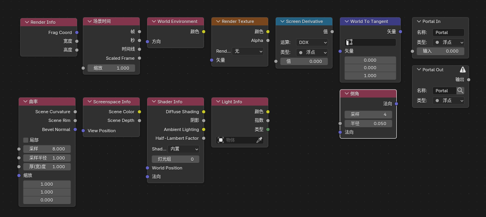

# Blender 5.1 NPR Port 新增功能与使用说明

## 项目介绍

`Blender 5.1 NPR Port`是一个NPR特化的`blender`分支,在融合了`Goo Engine`和`4.4 NPR-prototype`特色节点之外还额外添加一些实用特色节点.

大部分功能是 `Eevee` 专用，不支持 `Cycles`。

## 文档范围

这份文档说明当前 `Blender 5.1 NPR Port` 相比官方 `Blender 5.1` 已经加入、并且当前分支内实际存在的 NPR / Eevee 扩展功能，以及它们的基本使用方法。

## 节点一览

  
   
  着色器节点

  
   
  NPR Tree 节点 (部分着色器节点也可以在NPR Tree中使用)

  
   
  滤镜节点

## 与官方 Blender 5.1 的主要区别

当前这个 5.1 NPR 版本，和官方 Blender 5.1 相比，主要多了四类能力：

1. `Eevee` 的场景级扩展工作流

    - `Render Textures`

    - `Filter Materials`

2. `Eevee` 的新着色器节点

    - `Render Info`

    - `Scene Time`

    - `Screen Derivative`

    - `World Environment`

    - `World To Tangent`

    - `Bevel`

3. `Goo Engine` 移植节点

    - `Screenspace Info`

    - `Curvature`

    - `Shader Info`

    - `Light Info`

4. `NPR Tree` 工作流与配套节点

    - `NPR Input`

    - `NPR Output`

    - `NPR Refraction`

    - `Image Sample`

    - `For Each Light`

    - 内置的 NPR 节点组资产包

      - `Cavity`

      - `Co-Planar Edge Detection`

      - `Curvature`

      - `Kuwahara`

      - `Shading Models`

      - `Surface Curvature`

5. 界面整理节点

    - `Portal In / Portal Out`

6. 界面与工作流补充

    - `材质选择器预览开关`
