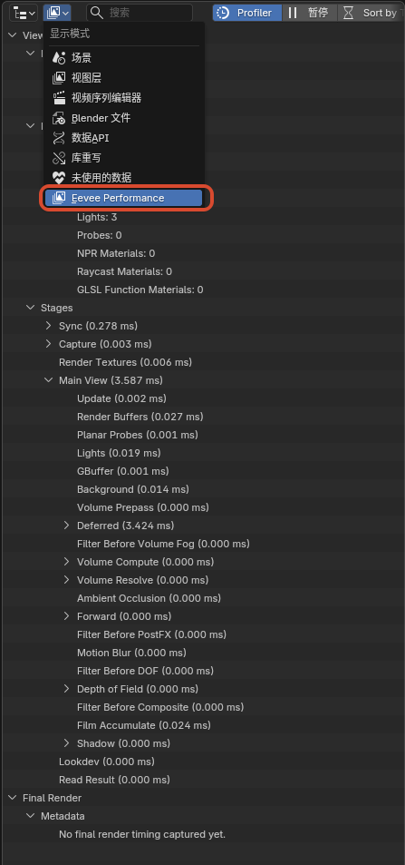

# 界面与工作流补充

## 1. Eevee Performance

### 作用

在 `Outliner` 中查看 Eevee 当前视口 / 最终渲染的性能统计、阶段拆分和功能提示，用来快速定位性能热点。

	
	 

### 入口

- `Outliner > Display Mode > Eevee Performance`
- `Outliner` 头部中的 `Profiler` / `Pause` / `Sort by Time`
- `Outliner` 头部中的设置弹出面板 `Eevee Performance`

### 行为说明

- 开启 `Profiler` 后，Eevee 会开始收集当前性能统计并在 `Outliner` 树中显示
- `Pause` 会暂停视口性能数据的继续刷新，方便查看当前结果
- `Sort by Time` 会按当前 CPU 开销排序阶段列表，而不是固定的管线顺序
- `Average Window` 用于设置平滑统计时使用的帧窗口大小
- 当前树结构会显示 `Viewport`、`Final Render`、`Metadata`、`Features`、`Stages`、`Hints` 等分组

### 当前范围

- 当前主要是 Eevee 的 CPU 侧阶段统计与功能提示，不是完整 GPU profiler
- 只对 `Eevee` 有意义，不支持 `Cycles`

## 2. 材质选择器预览开关

### 作用

控制材质下拉列表 / 搜索列表中是否渲染材质预览图。

这个开关主要用于在材质很多时，减少展开材质选择器时生成预览图的卡顿。

### 入口

`Edit > Preferences > Editing > Objects > Materials > Material Selector Previews`

	
	 

### 行为说明

- 开启时：材质选择器会按当前逻辑显示材质预览图
- 关闭时：材质选择器会退回普通材质图标，不再在下拉列表里触发材质预览渲染
- 默认值为开启

### 当前范围

- 目前只影响 `template_ID(...)` 这类材质选择器下拉列表中的材质预览显示
- 不影响 `Material Properties` 面板中的大预览球
- 不影响材质本身的正常渲染结果

## 3. 材质剔除模式

### 作用

为材质提供更明确的面剔除控制，除了原本常见的背面剔除外，现在还支持 `正面剔除`。

	
	 

### 入口

`Material Properties > Settings > Culling > Camera`

### 可选模式

- `None`：不剔除，正反面都渲染
- `Back`：背面剔除
- `Front`：正面剔除

### 说明

- `Front` 适合做壳体内部观察、双层模型的反向显露，或某些特殊的描边 / 反相表现
- `Shadow` 和 `Light Probe Volume` 仍然保留独立的剔除控制

## 4. Eevee 灯光 Lightgroup ID

### 作用

为 Eevee 灯光指定一个整数灯光组编号，供 `Shader Info` 节点做分组过滤。

### 入口

`Light Data > Light > Lightgroup ID`

### 行为说明

- 默认值为 `0`
- `Shader Info` 节点的 `Lightgroup` 也为 `0` 时，只会计算 `Lightgroup ID = 0` 的灯光
- 如果某个 `Shader Info` 节点设置为其他整数值，则只有相同编号的灯光会参与该节点计算
- 这个分组过滤当前只影响 `Shader Info` 节点，不会改动 Eevee 普通材质主通道的默认灯光结果

## 5. 启动图版本标识

### 作用

在启动图右上角的版本文字后追加当前 NPR 构建标识与构建日期，方便快速区分自定义构建版本。

### 当前显示格式

- `版本号 + npr post + 构建日期`
- 例如：`5.1.0 npr post 2026-03-27`

## 6. 骨骼在 Outliner 隐藏

### 作用

为每个 `Pose Bone` 增加单独的 Outliner 可见性标记，用来在不影响骨骼本身功能的前提下整理复杂绑定的层级显示。

它适合把机制骨、辅助骨或不需要频繁查看的控制层从 Outliner 中隐藏，只保留更重要的骨架结构。

### 入口

- `Bone Properties > Viewport Display > Hide in Outliner`
- `Outliner > Filter > Hidden PoseBones`

### 行为说明

- 每个 `Pose Bone` 都有自己的 `Hide in Outliner` 开关
- 这个开关默认是开启的
- `Outliner` 里的 `Hidden PoseBones` 过滤项默认也是开启的，所以默认不会立刻改变现有骨架的显示结果
- 当关闭 `Outliner > Filter > Hidden PoseBones` 后，勾选了 `Hide in Outliner` 的姿态骨骼会从 Outliner 树中隐藏
- 如果某个被隐藏的父骨骼仍然有可见子骨骼，可见子骨骼会继续保留在树里，不会整支层级一起消失

### 当前范围

- 当前只作用于 `Pose Bone`
- 不作用于 `Edit Bone`
- 只改变 `Outliner` 的层级显示，不影响骨骼的变换、动画、驱动器和渲染结果
