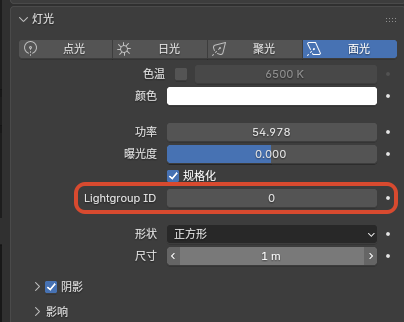
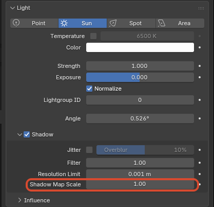

# 界面与工作流补充

## 1. Eevee Performance

### 作用

在 `Outliner` 中查看 Eevee 当前视口 / 最终渲染的性能统计、阶段拆分和功能提示，用来快速定位性能热点。

	
	 

### 入口

- `Outliner > Display Mode > Eevee Performance`
- `Outliner` 头部中的 `Profiler` / `Pause` / `Sort by Time`
- `Outliner` 头部中的设置弹出面板 `Eevee Performance`

### 行为说明

- 开启 `Profiler` 后，Eevee 会开始收集当前性能统计并在 `Outliner` 树中显示
- `Pause` 会暂停视口性能数据的继续刷新，方便查看当前结果
- `Sort by Time` 会按当前 CPU 开销排序阶段列表，而不是固定的管线顺序
- `Average Window` 用于设置平滑统计时使用的帧窗口大小
- 当前树结构会显示 `Viewport`、`Final Render`、`Metadata`、`Features`、`Stages`、`Shadow Contexts`、`Shadow Lights`、`Probe Costs`、`Hints` 等分组

### 阴影与探针归因

- `Shadow Contexts` 按渲染上下文拆分阴影 CPU 开销，例如 `MainView`、`PlanarProbe`、`CaptureProbe`、`Bake`、`Other`
- `Shadow Contexts` 会显示 `cpu`、`calls`、`loops`、`ms/call`、`ms/loop` 和 `share`，用于判断阴影开销来自主视图、探针更新还是烘焙 / 其他路径
- `Shadow Lights` 按灯光列出阴影 tilemap 负载，包含 `type`、`tilemaps`、`estimated_views`、`sync_dirty_tilemaps`、`tilemap_view_share` 和 `level`
- `Probe Costs` 按探针列出更新成本，包含 `updated`、`total`、`rendered_views`、`resolution`、`estimated_work`、`work_share` 和 `level`
- 这些分组是成本定位信息，不等同于逐 GPU draw call profiler；排序和占比用于找热点，具体数值会随视口状态、采样和探针更新频率变化

### 当前范围

- 当前主要是 Eevee 的 CPU 侧阶段统计与功能提示，不是完整 GPU profiler
- 只对 `Eevee` 有意义，不支持 `Cycles`

## 2. 材质选择器预览开关

### 作用

控制材质下拉列表 / 搜索列表中是否渲染材质预览图。

这个开关主要用于在材质很多时，减少展开材质选择器时生成预览图的卡顿。

### 入口

`Edit > Preferences > Editing > Objects > Materials > Material Selector Previews`

	
	 

### 行为说明

- 开启时：材质选择器会按当前逻辑显示材质预览图
- 关闭时：材质选择器会退回普通材质图标，不再在下拉列表里触发材质预览渲染
- 默认值为开启

### 当前范围

- 关闭后会阻止材质选择器、材质下拉 / 搜索列表，以及材质自动预览面板触发新的材质预览图渲染
- 关闭时会清理正在运行的材质预览作业，避免旧作业继续占用 Eevee 预览渲染
- 不影响 3D Viewport 的 `Material Preview` / `Rendered` 视图模式
- 不影响材质本身的正常渲染结果

## 3. 材质剔除模式

### 作用

为材质提供更明确的面剔除控制，除了原本常见的背面剔除外，现在还支持 `正面剔除`。

	
	 

### 入口

`Material Properties > Settings > Culling > Camera`

### 可选模式

- `None`：不剔除，正反面都渲染
- `Back`：背面剔除
- `Front`：正面剔除

### 说明

- `Front` 适合做壳体内部观察、双层模型的反向显露，或某些特殊的描边 / 反相表现
- `Shadow` 和 `Light Probe Volume` 仍然保留独立的剔除控制

## 4. 材质 Surface 渲染状态

### 作用

在 Eevee Surface 材质上直接控制深度测试、颜色写入、深度写入和模板测试 / 写入状态，用于遮罩、门户、特殊描边层、隐藏写入层等需要精确控制渲染状态的效果。

### 入口

`Material Properties > Settings > Surface`

	
	 
	Material Properties > Settings > Surface 中的 ZTest、Stencil、Color Write 与 Depth Write

### ZTest

`ZTest` 决定片元如何和已有深度比较：

- `Less`
- `Greater`
- `Less Equal`
- `Greater Equal`
- `Equal`
- `Not Equal`
- `Always`
- `Never`

默认应保持 `Less Equal`。`ZTest Never` 会拒绝整个片元，包括 stencil 写入；如果材质是模板写入层，通常应保留 `Less Equal`，然后按需要关闭 `Color Write` 和 `Depth Write`。

### Color Write / Depth Write

- `Color Write`：控制该 Surface 材质是否写入 Eevee 颜色输出
- `Depth Write`：控制该 Surface 材质是否写入 Eevee 深度输出

这两个开关只控制写入结果，不等于关闭节点树求值。透明、描边、AOV、模板等路径仍应按当前材质和管线规则理解。

### Stencil

`Stencil` 折叠面板包含：

- `Enabled`
- `Order`
- `Reference`
- `Read Mask`
- `Write Mask`
- `Test`
- `Pass`
- `Fail`
- `ZFail`

`Test` 可选：`Always`、`Never`、`Equal`、`Not Equal`、`Less`、`Less Equal`、`Greater`、`Greater Equal`。

`Pass / Fail / ZFail` 可选：`Keep`、`Zero`、`Replace`、`Increment Clamp`、`Decrement Clamp`、`Invert`、`Increment Wrap`、`Decrement Wrap`。

### 说明

- `Order` 控制 Eevee stencil pass 内部提交顺序，数值小的材质先提交
- `Reference`、`Read Mask`、`Write Mask` 当前使用 4-bit 用户 stencil 范围
- 常见写入层做法是开启 `Stencil`，使用 `Pass = Replace`，并关闭 `Color Write` / `Depth Write`
- 常见读取层做法是开启 `Stencil`，设置 `Test = Equal` 或 `Not Equal`，再使用相同的 `Reference` / mask 组合
- 如果一个材质既要参与深度遮挡又要写 stencil，需要特别检查 `ZTest` 和 `Depth Write` 的组合，避免片元在深度测试阶段被提前拒绝
- 可在 3D Viewport 的 `Viewport Shading > Render Pass` 中选择 `Stencil Value`，直接预览当前视图里的模板值

	
	 
	Stencil 写入与读取的遮罩示例

	
	 
	Viewport Shading 中使用 Stencil Value 预览模板值

## 5. Eevee 灯光 Lightgroup ID

### 作用

为 Eevee 灯光指定一个整数灯光组编号，供 `Shader Info` 节点和 `GLSL Function` 中的 `GLSLLight.lightgroup_id` 做分组过滤。

### 入口

`Light Data > Light > Lightgroup ID`

	
	 
	灯光数据面板中的 Lightgroup ID

### 行为说明

- 默认值为 `0`
- `Shader Info` 节点的 `Lightgroup` 也为 `0` 时，只会计算 `Lightgroup ID = 0` 的灯光
- 如果某个 `Shader Info` 节点设置为其他整数值，则只有相同编号的灯光会参与该节点计算
- 在 `GLSL Function` 里，`glsl_light_get(i).lightgroup_id` 会返回这个整数值，可直接用于自定义逐灯 `continue` / `exclude` 过滤
- 这个分组过滤当前不会自动改动 Eevee 普通材质主通道的默认灯光结果；只有 `Shader Info` 或你自己写的 `GLSL Function` 显式使用时才会生效

## 6. 太阳光 Shadow Map Scale

### 作用

为 Eevee Sun 灯光提供单独的阴影贴图覆盖尺度控制，用来调整太阳光 clipmap shadow 的覆盖范围和有效细节分布。

### 入口

`Light Data > Shadow > Shadow Map Scale`

该选项只在 `Sun` 灯光上显示。

	
	 
	Sun 灯光的 Shadow Map Scale 设置

### 行为说明

- 默认值为 `1`
- 增大数值会扩大 Sun shadow map 的覆盖尺度；当前正式版会把 scale 正确应用到 tilemap，并在扩大覆盖时同步提升有效细节分配
- 减小数值会把阴影贴图集中到更小范围，通常能提高近处细节，但更容易暴露覆盖范围不足或边界问题
- 该设置只影响 Eevee Sun shadow map 的采样 / 覆盖行为，不改变灯光颜色、能量、方向或材质侧着色模型
- 视口可开启 Shadow LOD 可视化，辅助排查 clipmap 细节层级（调试用途，不改变最终材质着色）

## 7. 启动图版本标识

### 作用

在启动图右上角的版本文字后追加当前 NPR 构建标识与构建日期，方便快速区分自定义构建版本。

### 当前显示格式

- `版本号 + npr post + 构建日期`
- 例如：`5.2.0 npr post 2026-08-11`

## 8. IME 输入

### 作用

改进文本编辑与界面输入中的 IME 支持（含 Blender 5.2 API 适配与文本编辑器光标度量），让中文等输入法候选与光标位置更稳定。

### 说明

- 主要影响文本编辑器与需要 IME 的 UI 输入路径
- 不改变材质节点或渲染结果

## 9. 骨骼在 Outliner 隐藏

### 作用

为每个 `Pose Bone` 增加单独的 Outliner 可见性标记，用来在不影响骨骼本身功能的前提下整理复杂绑定的层级显示。

它适合把机制骨、辅助骨或不需要频繁查看的控制层从 Outliner 中隐藏，只保留更重要的骨架结构。

### 入口

- `Bone Properties > Viewport Display > Hide in Outliner`
- `Outliner > Filter > Hidden PoseBones`

### 行为说明

- 每个 `Pose Bone` 都有自己的 `Hide in Outliner` 开关
- 这个开关默认是开启的
- `Outliner` 里的 `Hidden PoseBones` 过滤项默认也是开启的，所以默认不会立刻改变现有骨架的显示结果
- 当关闭 `Outliner > Filter > Hidden PoseBones` 后，勾选了 `Hide in Outliner` 的姿态骨骼会从 Outliner 树中隐藏
- 如果某个被隐藏的父骨骼仍然有可见子骨骼，可见子骨骼会继续保留在树里，不会整支层级一起消失

### 当前范围

- 当前只作用于 `Pose Bone`
- 不作用于 `Edit Bone`
- 只改变 `Outliner` 的层级显示，不影响骨骼的变换、动画、驱动器和渲染结果
