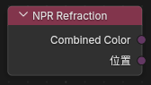

# 三、NPR Tree 工作流

### 1\. 基本概念

`NPR Tree` 是挂在普通物体材质之后进行颜色后处理的节点树,能够以颜色的形式对着色器的输出进行风格化处理.

### 2\. 挂接方式

1. 在普通物体材质中保留正常的 `Material Output` 和基础表面着色。

2. 选中 `Material Output` 节点。

3. 在它的 `NPR Tree` 属性里新建或指定一个节点组。

   
    

4. 需要编辑这棵树时，在 Shader Editor 顶部把 `Shader Type` 切到 `NPR`。

   
    

### 3\. 说明

- 材质的渲染方式需要设置为`抖动(延迟渲染)`

- 可以使用`Ctrl + Tab`在物体和NPR之间快速切换

### 4\. 主要 NPR 节点

除了下面这些专用 NPR 节点以外，`Curvature` 和 `Raycast` 现在也可以直接在 `NPR Tree` 中使用。

### NPR Input

   
    

#### 作用

读取 NPR 渲染阶段提供的输入缓冲。

#### 输出

- `Combined Color`：合成之后的最终颜色

- `Diffuse Color`：漫射颜色

- `Diffuse Direct`：漫射直接光

- `Diffuse Indirect`：漫射间接光(光线追踪,探针)

- `Specular Color`：高光颜色

- `Specular Direct`：高光

- `Specular Indirect`：间接反射

- `Position`：世界空间位置

- `Normal`：法线

这些输出本质上更接近图像句柄 / 纹理句柄，适合继续交给 `Image Sample` 做邻域采样，或接到支持这类输入的 NPR 节点上继续处理。

### NPR Refraction

   
    

#### 作用

读取折射相关缓冲,类似`Screenspace Info`

参考`Screenspace Info`节点的使用说明

#### 输出

- `Combined Color`：折射事件的最终颜色

- `Position`：折射位置的世界坐标

### Image Sample

#### 入口

`Add > Utilities > Image Sample`

   
    

#### 输入输出

- 输入：`Image`（图像句柄）、`Offset`（采样偏移）

- 输出：`Color`（采样结果颜色）

#### 作用

对 `NPR Input` / `NPR Refraction` 之类输出的图像句柄做采样。

#### 偏移模式

- `View`：按视空间偏移

- `Pixel`：按像素偏移

### For Each Light

#### 入口

`Add > Utilities > For Each Light`

   
    

#### 说明

它会按当前影响表面的灯光逐个执行内部逻辑,每次循环输出一个灯光的信息

#### 内置可用信息

`For Each Light Input` 当前提供：

- 输入：`Normal`（表面法线）

- 输出：`Color`（灯光颜色）、`Direction`（灯光方向）、`Distance`（灯光距离）、`Attenuation`（灯光衰减）、`Shadow Mask`（阴影遮罩）

### 内置 NPR 节点组资产

当前版本已经把 Blender 4.4 NPR 版本中的一批常用节点组，迁移并整理成了 5.1 可用的资产包。

### 当前内置的主要节点组

- `Cavity`

- `Co-Planar Edge Detection`

- `Curvature`

- `Kuwahara`

- `Shading Models`

- `Surface Curvature`

### 资产说明

- 这些节点组已经按 Blender 5.1 的格式迁移。

- 由于重复区域节点名称修改了,4.4 npr原型的工程需要自己重新连接重新区域相关的节点
