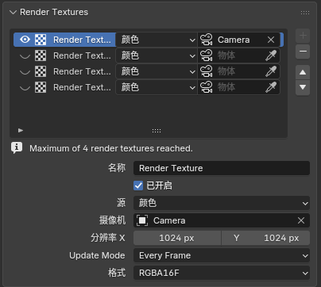
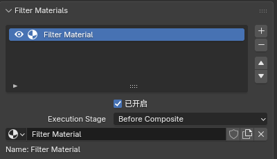
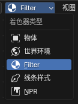

# Scene 级 Eevee 扩展

### 1\. Render Textures

#### 功能说明

`Render Textures` 是场景级的 Eevee 额外渲染纹理系统。

它允许场景预先维护最多 `4` 个 Render Texture 槽位，每个槽位都可以指定一个相机和一个输出类型，把该相机视角下的场景结果先渲染成纹理，再在普通物体材质中通过 `Render Texture` 节点采样。

#### 面板入口

`Scene Properties > Render Textures`

  
   

#### 可配置内容

每个 Render Texture 条目当前支持：

- `Name`：纹理条目的标识名称，用于在节点中引用

- `Enabled`：启用/禁用该纹理的渲染

- `Source`：选择要捕获的内容

  - `Color`：捕获最终 Eevee 颜色

  - `Depth`：捕获线性深度

  - `Normal`：捕获法线

- `Camera`：指定用于渲染该纹理的摄像机

- `Resolution X / Y`：输出纹理的像素尺寸，分辨率越高占用内存越多

- `Update Mode`：控制纹理更新频率

  - `Every Sample`：每次采样时更新

  - `Every Frame`：每帧更新一次

  - `Manual`：手动更新

- `Format`：输出数据的精度

  - `RGBA16F`：16位浮点颜色，平衡质量和性能

  - `RGBA32F`：32位高精度颜色，要求更高显存

  - `R16F`：16位浮点深度值

  - `R32F`：32位高精度深度值

#### 基本使用方法

1. 打开 `Scene Properties > Render Textures`。

2. 新建一个 `Render Texture` 条目。

3. 选择 `Source`、`Camera`、分辨率、刷新模式和格式。

4. 在普通物体材质里添加 `Add > Texture > Render Texture` 节点。

5. 在节点面板中选择对应的 `Render Texture` 条目。

6. 使用节点输出的 `Color` / `Alpha` 参与后续材质计算。

### 2\. Filter Materials

#### 功能说明

它是一套场景级的 Eevee 全屏滤镜栈。每个条目都是一个 `Filter` 域材质，按列表顺序依次对当前帧进行处理。

#### 面板入口

`Scene Properties > Filter Materials`

  
   

节点树入口: 着色器节点编辑器 > 着色器类型 > Filter

  
   

#### 基本使用方法

1. 打开 `Scene Properties > Filter Materials`。

2. 新建一个条目，或者直接点 `New Filter Material`。

3. 选中的材质必须是 `Filter` 域材质。

4. 打开 Shader Editor，把顶部 `Shader Type` 切换到 `Filter`。

5. 在滤镜材质里使用 `Scene Color` 读取场景数据，用 `Filter Output` 输出结果。

6. 通过 `Execution Stage` 选择滤镜执行位置。

#### 重要说明

- `Scene Color` 节点的默认采样坐标为`纹理坐标`节点的`Window`输出

- 支持`AOV`输入

- `Execution Stage` 滤镜插入位置:

  - `Before Volume Fog`：在体积雾处理前执行

  - `Before Depth of Field`：在景深前执行

  - `Before Composite`：在合成器前执行
4. 打开 Shader Editor，把顶部 `Shader Type` 切换到 `Filter`
5. 在滤镜材质里使用 `Scene Color` 读取场景数据，用 `Filter Output` 输出结果
6. 通过 `Execution Stage` 选择滤镜执行位置

### 重要说明

- `Scene Color` 节点的默认采样坐标为 `纹理坐标` 节点的 `Window` 输出

- 支持 `AOV` 输入

- `Execution Stage` 滤镜插入位置：

  - `Before Volume Fog`：在体积雾处理前执行

  - `Before Depth of Field`：在景深前执行

  - `Before Composite`：在合成器前执行

